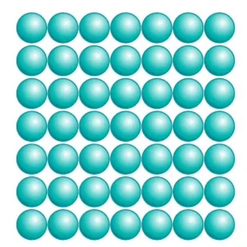
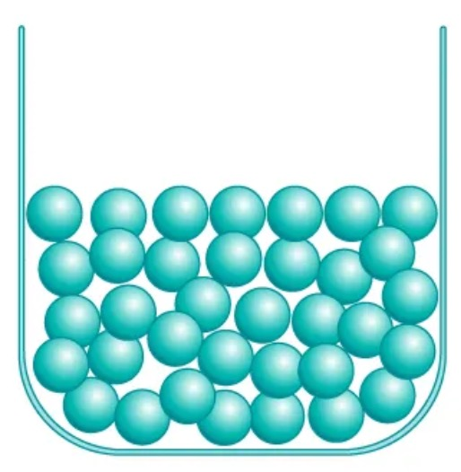
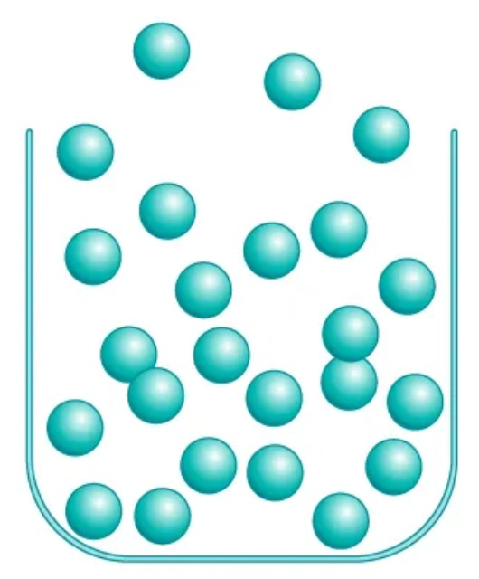
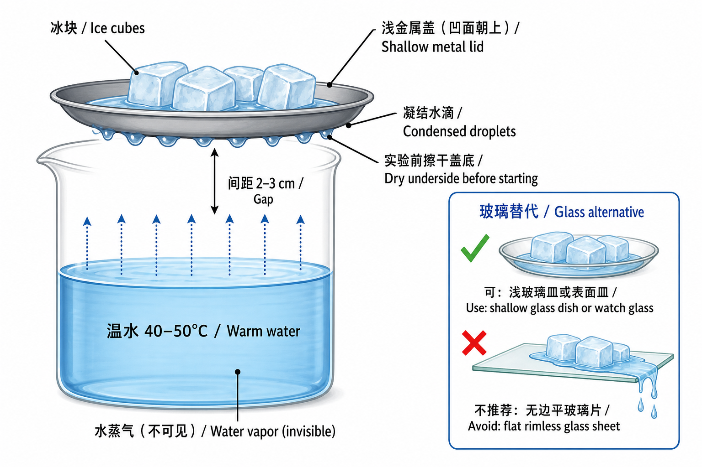

# 实际第 3 节：蜡烛发生了两种变化吗？

**Lesson 3: Did the Candle Undergo Two Different Kinds of Change?**

**授课状态**：待上；计划作为实际授课第 3 节。

## 一、课程定位与学习目标

- **主题**：三态、相变、物理变化与化学变化  
  *States of matter, phase changes, physical changes, and chemical changes*
- **建议课时**：115–120 分钟
- **核心问题**：看到物质发生变化时，怎样判断它只是改变了状态，还是形成了新物质？  
  *How can we tell whether matter has only changed its state or whether new substances have formed?*

从上次的蜡烛现象出发：先讲熔化、凝固、汽化和凝结，再用碳酸钙与白醋讨论化学变化。反应后的滤液直接用于下一实验。

实际第 2 节已经做过粗盐/食盐的溶解、过滤和结晶。本节只调用上次的记录、照片或晶体，**不重复做粗盐溶解实验**。

学生应能：

1. 比较固、液、气三态，并说出六种相变（phase changes）。
2. 用“是否形成新物质”区分物理变化（physical change）和化学变化（chemical change）。
3. 区分观察（observation）、推论（inference）和证据（evidence）。
4. 用粒子模型说明：相变中粒子身份不变；化学反应（chemical reaction）中原子重新组合。
5. 认识原子（atom）、元素（element）、分子（molecule）、化合物（compound）、混合物（mixture）和简单化学式，不要求默写或配平。

### 教师先掌握的核心问答

**问题：怎样判断只是状态改变，还是形成了新物质？**

**参考回答：** 没有新物质，是物理变化；形成新物质，是化学变化。气泡、沉淀等只是线索，要结合对照判断。

**问题：蜡烛发生了两种变化吗？**

**参考回答：** 是。蜡熔化、凝固是物理变化；蜡蒸气燃烧是化学变化。

## 二、材料与课前准备

### 家长只需提前准备

| 材料 Material | 建议准备量 Amount to prepare | 主课预计用量 Expected core use |
|---|---:|---:|
| 普通食品级白醋 vinegar，约 5% 酸度 | 约 40 mL | 约 32 mL |
| 新鲜食用小苏打 baking soda | 约 3 g | 约 1 g |
| 普通冰块 ice cubes | 约 100 g，4–6 块 | 3–4 块 |

不需要家长准备醋酸、醋酸钠、气球或其他实验试剂。

### 实验室直接取用

- 上节使用过的普通蜡烛、稳固烛台、点火器、灭烛罩或小金属盖
- 编号 `59` 碳酸钙约 2.5 g；也可用编号 `89` 的洁净大理石小块
- 透明烧杯、浅金属盖或小金属碗；可选有边沿的浅玻璃皿或表面皿
- 量筒、滴管、药匙、玻璃棒、漏斗、滤纸、反应杯、小塑料杯、反应板或小试管
- 电子秤、温度计、秒表、托盘、护目镜、吸水布、标签纸
- 约 40–50°C 温水，由教师准备
- 彩笔或写有 Ca、C、O、H、Na 的元素符号卡（element-symbol cards）
- 实际第 2 节的结晶照片、记录表或保存的食盐晶体

> **库存限制**：氯化钙已经消耗，本课不使用。现有“无水醋酸钠/乙酸钠”不是醋酸，不能代替白醋。本课不启用任何保存状态不明的试剂。

### 上课前摆放

1. 蜡烛固定在耐热托盘上，旁边放好灭烛罩；清走周围纸张。
2. 把约 100 mL、40–50°C 的温水放在教师操作区，冰块暂不放上金属盖。
3. 将三个反应杯标为 A、B、C；将三个微量反应孔或小试管标为 D、E、F。
4. 备好 1.0 g 小苏打和 20 mL 水，但不必课前配成溶液。
5. 漏斗和滤纸放在 C 组旁边，方便反应后直接过滤 4–6 mL 滤液。

## 三、按时间推进的课堂脚本

### 一眼速查（Quick timeline）

| 时间 | 做什么 | 一句话结论 |
|---:|---|---|
| 0–8 | 点蜡烛，看蜡油 | 熔化是物理变化；燃烧是化学变化 |
| 8–20 | 三态粒子图，等蜡凝固 | 固液靠近，气体粒子远；粒子都在运动 |
| 20–36 | 冰盖 + 水 | 汽化后遇冷凝结；水蒸气不可见 |
| 36–48 | 六种相变图 | 相变不产生新物质 |
| 48–53 | 回看上节食盐 | 溶解不是熔化，仍是物理变化 |
| 53–67 | atom、element 与两类变化 | 化学变化重组原子，不改变元素 |
| 67–98 | 碳酸钙 + 白醋 | 对照支持发生化学变化 |
| 98–110 | 醋酸钙滤液 + 小苏打 | 澄清液可形成白色沉淀 |
| 110–120 | 总结、离堂题、作业 | 物理：身份不变；化学：原子重组 |

### 0–8 分钟：点燃同一支蜡烛，提出核心问题

#### 讲

- **物质（matter）**：组成物体的材料。
- **物质身份（identity of a substance）**：这种物质“是什么”。
- **物理变化（physical change）**：没有形成新物质。
- **化学变化（chemical change）**：形成了新物质。

#### 做：蜡烛上的蜡油

1. 看未点燃蜡烛：蜡是固态。
2. 教师点燃，侧面观察 2–3 分钟。
3. 找到液态蜡油和固液边界。
4. 分开记录“蜡变成蜡油”和“燃烧”。
5. 教师熄灭；蜡烛留在原位，下一时段继续看凝固。

**预期观察**：火焰附近形成液态蜡池；熄灭后蜡油逐渐失去流动性并变硬。

#### 问

- **问题：蜡油是不是另一种物质？**

  **参考回答：** 不是。蜡油是液态蜡，冷却后又变回固态蜡。
- **问题：火焰本身能不能叫“熔化”？**

  **参考回答：** 不能。熔化是固态变液态；火焰处是燃烧。
- **问题：为什么一支蜡烛可以同时发生两类变化？**

  **参考回答：** 热量使蜡熔化；进入火焰的蜡蒸气发生燃烧。

#### 板书

```text
核心问题：只是换了状态，还是形成了新物质？
Did it only change state, or did new substances form?

蜡受热：固态蜡 → 液态蜡油
Wax heated: solid wax → liquid wax

蜡蒸气燃烧：反应物 → 新物质
Wax vapor burns: reactants → new substances
```

#### 记录

| 观察对象 Object | 直接观察 Observation | 是否可能形成新物质? New substance? | 暂时判断 Initial claim |
|---|---|---|---|
| 火焰附近的蜡 |  |  |  |
| 熄灭后的蜡油 |  |  |  |
| 火焰中的燃烧 |  |  |  |

### 8–20 分钟：用粒子动作理解三态，同时等待蜡油凝固

#### 讲

| 状态 State | 形状 Shape | 体积 Volume | 简单粒子模型 Simple particle model |
|---|---|---|---|
| 固态 solid state | 固定 fixed | 固定 fixed | 粒子靠近，在固定位置附近振动 |
| 液态 liquid state | 随容器改变 takes container shape | 较固定 nearly fixed | 粒子仍靠近，但能相互滑动 |
| 气态 gas state | 不固定 not fixed | 不固定 not fixed | 粒子相距较远，独立运动并充满空间 |

#### 学校课堂三态粒子图（Classroom particle diagrams）

<div class="state-particle-grid">
  <figure>
    
    <figcaption><strong>固态（solid）</strong><br />粒子紧密、有序；在固定位置附近振动。<br /><em>Closely packed and ordered; vibrate in place.</em></figcaption>
  </figure>
  <figure>
    
    <figcaption><strong>液态（liquid）</strong><br />粒子仍然靠近，但排列无序并能相互滑动。<br /><em>Still close together; disordered and able to slide past one another.</em></figcaption>
  </figure>
  <figure>
    
    <figcaption><strong>气态（gas）</strong><br />粒子相距很远，独立运动并充满容器。<br /><em>Far apart; move independently and fill the container.</em></figcaption>
  </figure>
</div>

> 学校 Unit 2 第 8–10 页课堂图。圆球是放大的粒子模型（particle model）；重点看**粒子间距（particle spacing）**和排列，不看真实大小。

用身体或圆片模拟：固体靠近并原位振动；液体靠近但可滑动；气体距离大、自由运动。每隔约 1 分钟回看蜡油。

#### 问

- **问题：液态蜡为什么会随蜡池形状改变？**

  **参考回答：** 液体无固定形状，粒子能相互滑动。
- **问题：蜡油变硬时，蜡粒子变成了另一种粒子吗？**

  **参考回答：** 没有。只改变排列、运动和能量，仍是蜡。
- **问题：“粒子不动”能不能用来描述固体？**

  **参考回答：** 不能。固体粒子仍在原位振动。
- **问题：液体粒子是不是已经像气体粒子一样相距很远？**

  **参考回答：** 不是。液体粒子仍靠近；气体粒子距离明显更大。
- **问题：相变时粒子本身会变大或变小吗？**

  **参考回答：** 不会。主要改变的是间距、排列、运动和能量。

#### 板书

```text
固态 solid：固定形状 + 固定体积
液态 liquid：无固定形状 + 较固定体积
气态 gas：无固定形状 + 无固定体积

蜡：固态 --熔化 melting--> 液态
蜡：液态 --凝固 freezing--> 固态
```

把上一张记录表中“熄灭后的蜡油”补完整：液态 → 固态，凝固（freezing / solidification），没有形成新物质，因此是物理变化。

### 20–36 分钟：水的汽化与凝结——冷盖底面的水从哪里来？



#### 装置

- 透明烧杯 1 个
- 常温水或 35–40°C 微温水约 100 mL
- 有浅边沿的金属盖或小金属碗 1 个
- 冰块 3–4 块
- 吸水布 1 块

金属盖凹面朝上装冰，擦干的底面朝向水。只观察**盖底**水滴，别让融冰水流下来。

#### 做

1. 烧杯加水约 100 mL。微温水现象更快；常温水也可。
2. 盖内放冰 3–4 块，彻底擦干盖底。
3. 盖子水平放在杯口，盖底距水面约 2–3 cm，不接触水。
4. 微温水观察 1–3 分钟；常温水可等 5–10 分钟。
5. 先写观察，再写推论。

**预期结果**：水汽化为不可见水蒸气；水蒸气遇冷凝结（condensation）成液滴。冷盖也会凝结室内原有水蒸气，因此本实验说明“遇冷凝结”，不证明水滴全部来自杯中。

#### 玻璃替代

可用有边沿的浅玻璃皿或表面皿（shallow glass dish / watch glass）。不推荐无边平玻璃片：融冰水易流到底面。金属盖仍是首选。

#### 问

- **问题：冷盖底面的水从哪里来？**

  **参考回答：** 空气中的水蒸气遇冷，在盖底凝结成液滴；杯中水的汽化会补充水蒸气。
- **问题：怎么排除水滴是盖子原来残留的水？**

  **参考回答：** 开始前擦干盖底，并确保不接触水面。
- **问题：怎么排除水滴是上方冰块融化后流下来的？**

  **参考回答：** 用有边沿的盖子、保持水平，并检查边缘。
- **问题：我们真的“看见水蒸气上升”了吗？**

  **参考回答：** 没有。看见的是液滴；水蒸气不可见。

#### 板书

```text
观察 observation：原来干燥的冷盖底面出现水滴。
推论 inference：水先汽化为不可见水蒸气，再遇冷凝结。

液态 water --汽化 vaporization--> 气态 water vapor
气态 water vapor --凝结 condensation--> 液态 water
```

#### 记录

| 项目 Item | 学生记录 Student record |
|---|---|
| 盖底实验前 Before |  |
| 1–3 分钟后的直接观察 Observation |  |
| 水的状态方向 State direction |  |
| 根据观察作出的推论 Inference |  |
| 是否形成新物质 New substance? |  |

### 36–48 分钟：把六种相变放到同一张图里

#### 讲

**相变（phase change / change of state）**：同一种物质改变状态；身份不变，所以是物理变化。

| 状态方向 Direction | 中文 | English | 能量方向 Energy transfer | 本课例子 Example |
|---|---|---|---|---|
| 固态 solid → 液态 liquid | 熔化 | melting | 吸收能量 absorbs energy | 蜡受热形成蜡油 |
| 液态 liquid → 固态 solid | 凝固 | freezing / solidification | 释放能量 releases energy | 蜡油冷却变硬 |
| 液态 liquid → 气态 gas | 汽化 | vaporization / evaporation | 吸收能量 absorbs energy | 温水进入空气 |
| 气态 gas → 液态 liquid | 凝结/液化 | condensation | 释放能量 releases energy | 冷盖底面出现水滴 |
| 固态 solid → 气态 gas | 升华 | sublimation | 吸收能量 absorbs energy | 冷冻室中的冰逐渐变小；干冰作生活例子 |
| 气态 gas → 固态 solid | 凝华 | deposition | 释放能量 releases energy | 冰箱霜或冬季霜花 |

#### 问

- **问题：六种相变都形成新物质了吗？**

  **参考回答：** 没有。物质身份不变。
- **问题：水蒸气变成液滴叫凝固吗？**

  **参考回答：** 不叫。气→液是凝结；液→固才是凝固。
- **问题：“凝华”和“凝结”有什么不同？**

  **参考回答：** 凝华是气态直接变固态；凝结是气态变液态。
- **问题：干冰升华以后还是二氧化碳吗？**

  **参考回答：** 是。只是固态 CO₂ 变成气态 CO₂。

#### 板书与记录

```text
固态 solid ──melting──→ 液态 liquid ──vaporization──→ 气态 gas
固态 solid ←─freezing── 液态 liquid ←─condensation──── 气态 gas
固态 solid ─────────────sublimation──────────────────→ 气态 gas
固态 solid ←────────────deposition──────────────────── 气态 gas

相变 phase change = 物理变化 physical change
原因 reason：物质身份不变 identity stays the same
```

学生在上表中圈出本课直接观察到的四种相变：熔化、凝固、汽化和凝结；升华与凝华只用例子说明。

### 48–53 分钟：调用上节的食盐证据，不重复实验

展示实际第 2 节的结晶照片、记录或食盐晶体。

#### 问

- **问题：食盐溶解是物理变化吗？**

  **参考回答：** 是。食盐分散到水中，蒸发水后仍能得到食盐。
- **问题：食盐溶解是不是熔化？**

  **参考回答：** 不是。溶解需要溶剂；熔化是固体本身变液体。
- **问题：“很难恢复”能不能作为化学变化的定义？**

  **参考回答：** 不能。玻璃破碎难恢复，但仍是物理变化。

#### 板书

```text
溶解 dissolving ≠ 熔化 melting
能否恢复 reversibility ≠ 判断本质 definition
判断标准：是否形成新物质?
Criterion: Did new substances form?
```

### 53–67 分钟：对齐学校 notes——atom、element 与两类变化

#### 讲

- **物质（matter）**的基本单位是**原子（atom）**。
- 不同种类的原子叫不同**元素（element）**，如 Ca、C、O、H、Na。
- 原子结合可形成**分子（molecule）**；不同元素组成的纯物质可叫**化合物（compound）**。
- **混合物（mixture）**含多种物质，比例可变；白醋和蜡烛蜡都是混合物。
- **物理变化（physical change）**：物质身份不变，不形成新物质。
- **化学变化（chemical change）**：原子重新组合，形成新物质；元素种类不变。

> 以上对应学校 Unit 2《Phases of Matter》课堂内容。主课到此为止；酸、碱、盐移到可选拓展。

#### 桌面速看

| 物质 Substance | Formula | 元素 Elements | 只看什么 Key point |
|---|---|---|---|
| 白醋 vinegar | 无单一化学式 | 多种 | mixture |
| 碳酸钙 calcium carbonate | CaCO₃ | Ca、C、O | compound |
| 二氧化碳 carbon dioxide | CO₂ | C、O | compound |
| 水 water | H₂O | H、O | compound |

#### 问

- **问题：atom 和 element 有什么关系？**

  **参考回答：** atom 是物质的基本单位；不同类别的 atom 是不同 element。
- **问题：物理变化会改变 element 吗？**

  **参考回答：** 不会，也不会形成新物质。
- **问题：化学变化会产生新的 element 吗？**

  **参考回答：** 不会。原子只是重新组合，形成新的物质。
- **问题：气泡或温度变化能单独证明化学变化吗？**

  **参考回答：** 不能。它们只是线索，还要看对照和是否形成新物质。

#### 板书

```text
物质 matter → 原子 atoms
不同类别的 atom = 不同元素 elements

物理变化 physical change：无新物质
化学变化 chemical change：atoms rearrange → 新物质

化学变化不改变元素种类。
A chemical change does not change one element into another.
```

### 67–98 分钟：碳酸钙和白醋——怎样把多条证据连起来？

#### 对照

| 组别 Group | 固体 Solid | 液体 Liquid | 用途 Purpose |
|---|---:|---:|---|
| A | 1.0 g 碳酸钙 | 15 mL 水 | 判断碳酸钙遇水是否自行持续冒泡 |
| B | 无 | 15 mL 白醋 | 判断白醋单独放置是否持续冒泡 |
| C | 1.0 g 碳酸钙 | 15 mL 白醋 | 实验组；滤液留给下一实验 |

另备反应杯、小塑料量杯、电子秤、秒表、漏斗、滤纸、玻璃棒和吸水布。

#### 做

1. 预测哪组持续冒泡。
2. 做 A、B，观察 60 秒。
3. C 组：反应杯装 1.0 g CaCO₃；小杯量 15 mL 白醋。
4. 两杯一起称量，记 `t = 0`。
5. 倒入白醋，空杯放回秤盘；每 30 秒记录，共 3–5 分钟。
6. 比较气泡、固体和质量。
7. 等待时配小苏打溶液：1.0 g + 20 mL 水；不清则取上层液。
8. 冒泡减弱后确保略有 CaCO₃ 剩余；否则补少量。
9. 过滤 4–6 mL：滤液含醋酸钙，留给下一实验。

**预期结果**：只有 C 持续冒泡，CaCO₃ 减少；开放系统（open system）质量可能下降；过滤得到含醋酸钙的滤液。

#### 记录 1：现象与对照

| 组别 Group | 持续气泡 Continuous bubbles? | 固体变化 Solid change? | 排除的解释 Explanation ruled out | 初步结论 Initial claim |
|---|---|---|---|---|
| A：碳酸钙 + 水 |  |  |  |  |
| B：白醋 |  |  |  |  |
| C：碳酸钙 + 白醋 |  |  |  |  |

#### 记录 2：开放系统质量

| 时间 Time/s | C 组质量 Open-system mass/g | 直接观察 Observation |
|---:|---:|---|
| 0 |  | 混合前总质量 |
| 30 |  |  |
| 60 |  |  |
| 90 |  |  |
| 120 |  |  |
| 180 |  |  |

#### 问

- **问题：仅凭气泡能否立即断定发生化学变化？**

  **参考回答：** 不能。气泡只说明有气体；还要看对照、固体变化和后续滤液。
- **问题：A、B 对照分别排除了什么？**

  **参考回答：** A 排除“遇水就冒泡”；B 排除“白醋自己冒泡”。
- **问题：秤上质量下降说明物质消失了吗？**

  **参考回答：** 没有。生成的气体离开了称量系统。
- **问题：我们有没有用本装置独立确认气体就是二氧化碳？**

  **参考回答：** 没有。气泡只说明有气体；根据“碳酸盐 + 酸”的已知规律，把主要气体写作 CO₂。
- **问题：能不能用熄灭火焰或指示剂变色来确认二氧化碳？**

  **参考回答：** 不能。它们都不是 CO₂ 的专一证据。

#### 讲：化学反应中发生了什么？

```text
反应物 Reactants:
碳酸钙 calcium carbonate + 醋酸 acetic acid

生成物 Products:
醋酸钙 calcium acetate + 水 water + 二氧化碳 carbon dioxide

CaCO₃ + 2 CH₃COOH → Ca(CH₃COO)₂ + H₂O + CO₂↑
```

- 左边是**反应物（reactants）**，右边是**生成物（products）**。
- 化学反应让原子重新组合（rearrangement of atoms），不制造新元素。
- 同色圈出两边的 Ca、C、O、H。
- 只读方程式，不要求配平。

#### 板书

```text
观察 observation：持续气泡、固体减少、质量可能下降
对照 control：CaCO₃ + water / vinegar alone
推论 inference：两种反应物相互作用并产生气体

开放系统 open system：物质可穿过系统边界

化学反应 chemical reaction：
反应物 reactants → 原子重新组合 → 生成物 products
```

### 98–110 分钟：让刚生成的醋酸钙继续反应

#### 对照

使用上一时段的醋酸钙滤液和小苏打溶液。

| 组别 Group | 液体 1 Liquid 1 | 液体 2 Liquid 2 | 用途与预期 Purpose and prediction |
|---|---|---|---|
| D | 2 mL 醋酸钙滤液 | 2 mL 水 | 水对照；保持较澄清 |
| E | 2 mL 小苏打溶液 | 2 mL 水 | 水对照；保持较澄清 |
| F | 2 mL 醋酸钙滤液 | 2 mL 小苏打溶液 | 实验组；可能形成白色浑浊或固体 |

#### 做

1. 看两种溶液是否澄清，预测 D、E、F。
2. 用专属滴管完成三组，观察 2–3 分钟。
3. 记录澄清、白色固体、气泡和沉降。
4. 固体够多才过滤；分两份，一份滴水，一份滴 1–2 mL 白醋。
5. 现象不清楚就如实记录，不换试剂。

**预期结果**：F 形成白色碳酸钙沉淀（precipitate）；D、E 保持较澄清。固体遇白醋可能再次冒泡。

教师参考净变化：

```text
Ca²⁺ + 2 HCO₃⁻ → CaCO₃↓ + CO₂↑ + H₂O
```

#### 问

- **问题：两种澄清溶液能形成新的白色固体吗？**

  **参考回答：** 可以。钙离子与碳酸氢根相关粒子反应，形成难溶 CaCO₃。
- **问题：为什么需要 D、E 两个水对照？**

  **参考回答：** 排除“原液已有粉末”或“加任何液体都会浑浊”。
- **问题：白色浑浊为什么比单纯气泡更有帮助？**

  **参考回答：** 它显示两个较澄清液体中形成了可沉降、可过滤的固体。
- **问题：如果没有明显白色固体，是不是整节课失败了？**

  **参考回答：** 不是。如实记录；前面的实验仍有证据。

#### 记录

| 组别 Group | 保持澄清 Remains clear? | 白色固体 White solid? | 气泡 Bubbles? | 结论 Conclusion |
|---|---|---|---|---|
| D：醋酸钙滤液 + 水 |  |  |  |  |
| E：小苏打溶液 + 水 |  |  |  |  |
| F：醋酸钙滤液 + 小苏打溶液 |  |  |  |  |

#### 板书

```text
沉淀 precipitate：溶液中形成的难溶固体

clear solution + clear solution → white solid
澄清溶液 + 澄清溶液 → 白色固体

新性质 different properties → 支持形成新物质
```

### 110–120 分钟：回到蜡烛，完成全课结论

#### 收束

1. 蜡相变：粒子身份不变，只改排列与运动。
2. 化学反应：Ca、C、O、H 卡片重新组合。
3. **原子守恒（conservation of atoms）**：原子不凭空产生或消失。

#### 问

- **问题：相变为什么是物理变化？**

  **参考回答：** 只改变状态和粒子排列，没有新物质。
- **问题：蜡烛上哪一部分是物理变化？**

  **参考回答：** 固态蜡熔化为蜡油、蜡油冷却凝固。
- **问题：哪一部分是化学变化？**

  **参考回答：** 蜡蒸气在火焰中燃烧。
- **问题：为什么“有气泡”不是化学变化的定义？**

  **参考回答：** 汽化和沸腾也有气泡；要继续判断是否有新物质。
- **问题：新物质是不是新元素？**

  **参考回答：** 不是。只是原子重新组合，元素种类不变。

#### 板书

```text
物理变化 physical change：没有形成新物质
化学变化 chemical change：形成了新物质

物理变化：粒子身份不变，排列 / 距离 / 运动可改变
Physical change: particle identity stays the same.

化学变化：原子重新组合成生成物
Chemical change: atoms rearrange to form products.

证据链 evidence chain：
观察 observation + 对照 control + 性质变化 property change
```

#### 离堂记录与参考答案

```text
我认为________是物理 / 化学变化，因为________。
I think ________ is a physical / chemical change because ________.

我的直接观察是________。
My direct observation is ________.

我根据观察作出的推论是________。
My inference from the observation is ________.

对照实验帮助我排除了________。
The control helped me rule out ________.
```

**参考答案示例**：蜡熔化是物理变化，因为没有新物质；碳酸钙与白醋是化学变化，因为对照显示只有二者接触时持续冒泡、固体减少，滤液还能形成白色固体。

#### 课后作业：寻找身边的变化（Homework: Changes around us）

**任务（task）**：找 **2 个物理变化（physical changes）**和 **2 个化学变化（chemical changes）**。可拍照、画图或写字；下次选一个分享。只观察，不主动制造反应。

| 编号 No. | 身边的现象 Everyday change | 我的直接观察 Observation | 是否形成新物质? New substance? | 分类 Classification | 判断理由 Evidence / reason |
|---:|---|---|---|---|---|
| 1 |  |  |  | physical / chemical |  |
| 2 |  |  |  | physical / chemical |  |
| 3 |  |  |  | physical / chemical |  |
| 4 |  |  |  | physical / chemical |  |

**判断三问**：看到了什么（observation）？有没有新物质（new substance）？证据是什么（evidence）？

**下次课分享句式（sharing sentence frame）**：

```text
我观察到________________。
I observed ________________.

我认为这是物理 / 化学变化，因为________________。
I think it is a physical / chemical change because ________________.

我最有把握的证据是________________。
My strongest evidence is ________________.
```

**示范，不要求照抄**：

- 冰熔化（ice melting）：仍是 H₂O，物理变化。
- 铁生锈（iron rusting）：形成锈，化学变化。

**安全（safety）**：不点火、不用炉灶、不混合清洁剂或药品、不品尝材料。只观察；火焰和电器必须由成人操作。

**下节课处理**：遇到模糊例子，先问“新物质证据是什么”；证据不足可答“暂时不能确定（not enough evidence yet）”。

## 四、如果提前完成：按剩余时间选择拓展

先完成主课，再选拓展。目标是“见过、会读”，不要求背诵或配平。

| 剩余时间 Time available | 选择 Choice | 停止点 Stopping point |
|---:|---|---|
| 约 5 分钟 | E：相变情境快问快答 | 能说状态方向和相变名称 |
| 约 10 分钟 | A：元素与化学式侦探 | 能认元素符号、下标并数简单原子 |
| 约 20 分钟 | A + B：读反应方程式 | 能读反应物、生成物、箭头和系数 |
| 约 30 分钟 | A + B + C：酸、碱、盐名称游戏 | 能用本课实物作初步分类 |
| 约 40 分钟以上 | A + B + C，再视材料选择 D | D 只作可选微量实验 |

### A. 元素与化学式侦探（Element and chemical-formula detective，8–10 分钟）

摆出 `H₂O`、`CO₂`、`CaCO₃`、`NaHCO₃` 四张卡，让学生圈出元素符号并数原子。

- **下标（subscript）**表示原子个数；没有下标按 1 计。
- 元素符号首字母大写；`Ca` 是一个符号，不是 `C + a`。

| 化学式 Formula | 元素 Elements | 原子数 Atom count |
|---|---|---|
| H₂O | H、O | 2 H，1 O |
| CO₂ | C、O | 1 C，2 O |
| CaCO₃ | Ca、C、O | 1 Ca，1 C，3 O |
| NaHCO₃ | Na、H、C、O | 1 Na，1 H，1 C，3 O |

#### 问

- **问题：`CO₂` 中有几个元素、几个原子？**

  **参考回答：** 两种元素；共 3 个原子：1 C、2 O。
- **问题：白醋能写成 `CH₃COOH` 吗？**

  **参考回答：** 不能。它是醋酸的化学式；白醋是混合物。

### B. 把方程式读成“化学短句”（Read a chemical equation，10–12 分钟）

```text
CaCO₃ + 2 CH₃COOH → Ca(CH₃COO)₂ + H₂O + CO₂↑
```

- **加号（plus sign, `+`）**读“和……反应”。
- **反应箭头（reaction arrow, `→`）**读作“生成（forms / yields）”，不是等号。
- **系数（coefficient）**写在化学式前，乘整个化学式。
- **括号（parentheses）**外的下标乘括号内整组。
- `↑` 表示气体逸出（gas evolved）；`↓` 表示沉淀形成（precipitate formed）。

共同核对原子数：

| 元素 Element | 左边 Left | 右边 Right |
|---|---:|---:|
| Ca | 1 | 1 |
| C | 1 + 2 × 2 = 5 | 4 + 1 = 5 |
| H | 2 × 4 = 8 | 6 + 2 = 8 |
| O | 3 + 2 × 2 = 7 | 4 + 1 + 2 = 7 |

两边每种原子数相同，叫**配平的化学方程式（balanced chemical equation）**。

#### 问

- **问题：为什么醋酸前写 2？**

  **参考回答：** 使两边每种原子数相同。
- **问题：能不能把 `CO₂` 改成 `CO₃` 来凑数字？**

  **参考回答：** 不能。改下标会改变物质；只能调系数。
- **问题：为什么原子数相同，物质却不同？**

  **参考回答：** 原子组合方式改变了。
- **问题：学生需要自己配平吗？**

  **参考回答：** 不需要，只要求会读并理解原子守恒。

### C. 酸、碱、盐名称游戏（Acid–base–salt naming game，8–10 分钟）

> **可选内容（optional）**：学校本单元主 notes 没有把酸、碱、盐作为本课核心；主课完成且时间充足时再讲。

- **酸（acid）**：本课例子是白醋中的醋酸（acetic acid）。
- **碱（base）**：本课只作概念认识；肥皂水可作碱性溶液（basic solution）的生活例子。
- **盐（salt）**：由正、负离子组成；食盐只是盐类之一。
- 小苏打是盐，但其水溶液略呈碱性；“组成分类”和“溶液性质”可以同时成立。

| 卡片 Card | 放置位置 Placement | 教师说明 Teacher note |
|---|---|---|
| 醋酸 acetic acid | 酸 acid | 白醋中提供酸性的主要物质 |
| 白醋 vinegar | 含酸混合物 acid-containing mixture | 不是纯醋酸 |
| 碳酸钙 calcium carbonate | 盐 salt | calcium + carbonate |
| 小苏打 sodium bicarbonate | 盐 salt | 盐的组成与溶液略呈碱性可同时成立 |
| 醋酸钙 calcium acetate | 盐 salt | 本课现场生成 |
| 肥皂水 soapy water | 碱性混合物 basic mixture | 只作生活例子，不作检测试剂 |

#### 问

- **问题：名字里没有“盐”字，为什么碳酸钙也是盐？**

  **参考回答：** “盐”是化学分类，不看中文名字里有没有“盐”。
- **问题：酸和碱都很危险吗？**

  **参考回答：** 不一定；风险取决于物质、浓度和用量。
- **问题：现在要不要讲 pH？**

  **参考回答：** 只说 pH 标度（pH scale）表示酸碱程度；本课不测。

### D. 可选微量实验：小苏打也会与白醋反应（Optional microscale experiment，8–12 分钟）

主课完成且材料有剩余才做。

| 组别 Group | 固体 Solid | 液体 Liquid | 用途 Purpose |
|---|---:|---:|---|
| I | 0.3 g 小苏打 | 5 mL 水 | 水对照 water control |
| J | 0.3 g 小苏打 | 5 mL 白醋 | 实验组 experimental group |

1. 两个开放小杯各加 0.3 g 小苏打。
2. I 加水，J 加白醋；观察 60 秒，不密封。
3. 先记现象，再作推论。

```text
碳酸氢钠 + 醋酸 → 醋酸钠 + 水 + 二氧化碳
sodium bicarbonate + acetic acid → sodium acetate + water + carbon dioxide

NaHCO₃ + CH₃COOH → CH₃COONa + H₂O + CO₂↑
```

#### 问

- **问题：为什么需要水对照？**

  **参考回答：** 排除“小苏打遇任何液体都冒泡”。
- **问题：气泡是否独立确认了二氧化碳？**

  **参考回答：** 没有。气泡只说明产生气体。

### E. 相变情境快问快答（Phase-change quick challenge，5 分钟）

| 情境 Situation | 参考答案 Reference answer |
|---|---|
| 蜡油冷却变硬 wax cools and hardens | 液态 → 固态；凝固 freezing；无新物质 |
| 冰箱内壁结霜 frost forms in a freezer | 气态 → 固态；凝华 deposition；仍是水 |
| 冷杯外出现水滴 droplets form outside a cold cup | 气态 → 液态；凝结 condensation；仍是水 |
| 冷冻室冰块慢慢变小 an ice cube shrinks in a freezer | 固态 → 气态；升华 sublimation；仍是水 |
| 干冰直接变成气体 dry ice changes into gas | 固态 → 气态；升华 sublimation；仍是二氧化碳 |

**最后问题：为什么“出现气体”不能自动说明化学变化？**

**参考回答：** 汽化和升华也形成气态物质，但没有新物质。

## 五、教师科学边界与常见误区速查

### 本课证据应怎样准确表述？

1. 相变前后身份不变，是物理变化。
2. 气泡只说明有气体，不能确认气体身份。
3. 对照、固体减少、质量变化和后续滤液共同支持化学变化。
4. 根据“碳酸盐 + 酸”的已知规律写 CO₂；本课未独立鉴定。
5. 澄清液形成可过滤固体，是另一条证据。

### 本节讲到哪里就够了？

- 原子和元素：会说“元素是原子的种类”，能认 Ca、C、O、H、Na。
- 化学式：认符号、读简单下标；不默写复杂式。
- 酸碱盐：移到可选拓展；主课不要求。
- 方程式：只读文字和箭头；不要求配平。
- 不讲电子排布、玻尔模型和核反应。

### 常见误区

- **“能恢复就是物理变化。”** 改问有没有新物质；玻璃破碎仍是物理变化。
- **“有气泡就是化学变化。”** 汽化也能产生气态物质，要看对照。
- **“熄灭火焰就是 CO₂。”** 很多气体都不支持燃烧。
- **“白醋就是醋酸。”** 白醋是含少量醋酸的混合物。
- **“小苏打呈碱性，所以不是盐。”** 组成分类与酸碱性质可同时成立。
- **“新物质就是新元素。”** 化学反应只重组原子。
- **“蜡油是另一种物质。”** 蜡油是液态蜡，冷却后重新得到固态蜡。
- **“食盐溶解就是熔化。”** 溶解需要溶剂；熔化不需要。
- **“秤上质量下降说明物质消失。”** 气体离开了开放的称量系统。
- **“水蒸气是白色的。”** 水蒸气不可见，白雾是微小液滴。

## 六、安全、误差与现场备用方案

### 安全

- 全程佩戴护目镜，所有湿实验在托盘内完成；实验物质不品尝。
- 蜡烛只由教师点燃和熄灭，放在稳固烛台和耐热托盘上；清走纸张，扎好长发。学生不触碰火焰、烛芯或液态蜡，不移动刚熄灭的蜡烛。
- 温水由教师准备和移动；玻璃替代装置不直接经历冷冻到温热的骤变。
- 白醋只用食品级低浓度产品；不用浓醋酸、醋酸钠或标签不清的酸。
- 产气反应保持开放，禁止密封在刚性玻璃容器中。
- 醋酸钙滤液和小苏打溶液统一标记“不得饮用”。
- 不使用已消耗或已液化的氯化钙，不用旧过氧化氢或名称不清的试剂增加现象。
- 蜡烛完全冷却后保留再用。微量低风险反应液用大量清水稀释处理；白色固体连滤纸装袋丢弃，原标签另有要求时以标签为准。

### 主要误差

- 蜡烛燃烧时间太短或烛芯太短，液态蜡池可能不明显。
- 冷盖底面没有事先擦干，或融冰水从边缘流下，会干扰凝结判断。
- 醋酸钙滤液或小苏打溶液本身不澄清，会把原有颗粒误当作新沉淀。
- 大理石块太大或表面光滑时，3–5 分钟内质量变化可能小于电子秤分辨率；粉末状碳酸钙反应更快，但要防止泡沫溢出。
- 倒完白醋后没有把空塑料杯放回秤盘，会把杯壁残留误当作气体损失。

### 现场备用方案

- **蜡油不明显**：教师再燃烧 1–2 分钟；仍不明显就调用上次观察或照片，不另做石蜡水浴。
- **冷盖不出现水滴**：增加冰量，把盖底重新擦干并靠近水面，但不接触温水。
- **融冰水可能流到底面**：立即停止并擦干，换有边沿的浅盖重新开始；这次水滴不能作为证据。
- **学生追问怎样确认二氧化碳**：说明需要状态可靠的专用检验体系和清楚对照；本课只依据已知反应规律标注主要气体，不临时用熄灭火焰或指示剂变色替代。
- **醋酸钙滤液仍明显冒泡**：再加少量碳酸钙，待明显冒泡停止后重新过滤少量液体。
- **醋酸钙与小苏打现象不明显**：等待 3–5 分钟并在深色背景前比较；仍不明显就如实记录，不换用氯化钙。
- **电子秤看不出质量变化**：保留气泡、对照和固体表面变化作为定性证据，不增加酸量或密闭反应。
- **主实验耗时超出计划**：优先保留蜡烛、凝结实验、A/B/C 对照和最终结论；F 组过滤、化学式拓展和可选实验可以取消。

## 七、关键术语（Key vocabulary）

| 中文 | English | 中文 | English |
|---|---|---|---|
| 物质 | matter | 状态 | state of matter |
| 固态 | solid state | 液态 | liquid state |
| 气态 | gas state | 相变 | phase change |
| 熔化 | melting | 凝固 | freezing / solidification |
| 汽化 | vaporization / evaporation | 凝结 | condensation |
| 升华 | sublimation | 凝华 | deposition |
| 物理变化 | physical change | 化学变化 | chemical change |
| 化学反应 | chemical reaction | 新物质 | new substance |
| 粒子 | particle | 原子 | atom |
| 元素 | element | 元素符号 | element symbol / chemical symbol |
| 分子 | molecule | 化合物 | compound |
| 混合物 | mixture | 化学式 | chemical formula |
| 离子 | ion | 原子重新组合 | rearrangement of atoms |
| 原子守恒 | conservation of atoms | 酸 / 碱 / 盐 | acid / base / salt |
| 酸性 / 碱性 | acidic / basic | pH 标度 | pH scale |
| 反应物 | reactant | 生成物 | product |
| 观察 | observation | 推论 | inference |
| 证据 | evidence | 对照 | control |
| 沉淀 | precipitate | 开放系统 | open system |
| 系统边界 | system boundary | 碳酸钙 | calcium carbonate |
| 醋酸 | acetic acid | 小苏打 | sodium bicarbonate / baking soda |
| 醋酸钙 | calcium acetate | 醋酸钠 | sodium acetate |
| 二氧化碳 | carbon dioxide | 下标 / 系数 | subscript / coefficient |
| 反应箭头 | reaction arrow | 化学方程式 | chemical equation |
| 配平方程式 | balancing a chemical equation | 食盐 | table salt / sodium chloride |
