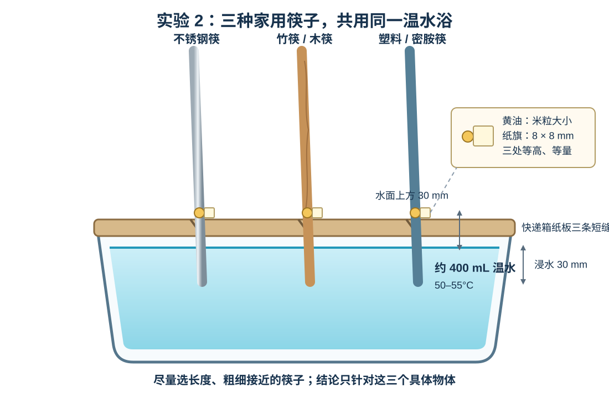
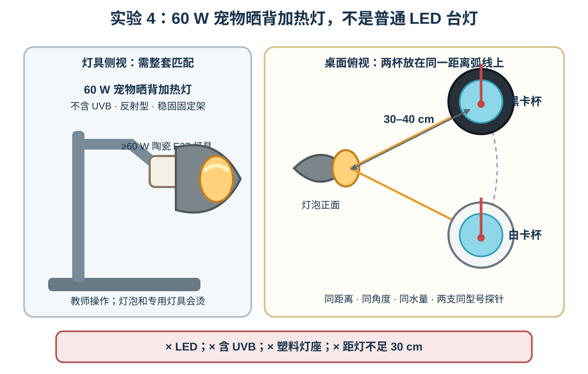

# 第 4 节：热能怎样传递？

**Lesson 4: How Does Thermal Energy Transfer?**

**授课状态**：已完成；实际授课第 4 节。

## 家长课前准备（Materials for Parents）

请按下面一张清单一次备齐；同一种材料不重复列出。

| 环节 | 家长需要准备的材料与数量 |
|---|---|
| 共用 | 清水约 2 L；55–60°C 温水约 1 L（装保温壶）；透明小杯 5 个（150–250 mL）；有边托盘或干净盒盖 3 个；透明胶带 1 卷；学生尺 1 把；剪刀 1 把；吸水布 2 块或厨房纸约 10 张 |
| 导入 | 小橡胶球或弹力球 1 个 |
| 实验 1：冷热水混合 | 使用共用材料，无需另备 |
| 实验 2：传导 | 不锈钢筷、竹/木筷、塑料/密胺筷各 1 根（20–25 cm）；无盐黄油约 2 g；内径约 5 mm 的普通饮料吸管 1 根；牙签 1 根；耐热宽口杯或饭盒 1 个（500–800 mL）；快递箱硬纸板 1 块（约 15 cm × 20 cm）；8 mm × 8 mm 小纸片 3 张 |
| 实验 3：对流 | 透明高杯 2 个（400–600 mL）；红、蓝食用色素各约 5 滴；5–10°C 冷藏水约 100 mL（没有时用 4–6 块冰临时降温） |
| 实验 4：辐射 | 哑光黑卡、白卡各 A4 1 张；相同耐热玻璃杯或金属杯 2 只（100–200 mL）；同型号快速电子探针温度计 2 支（建议 ±0.5°C、0.1°C、响应不超过 5 秒）；60 W E27 白炽或卤素反射型宠物晒背加热灯 1 只（不含 UVB、不是 LED）；额定功率不低于 60 W 的陶瓷 E27 配套灯具 1 套；不能倾倒的固定架 1 套；带开关插线板 1 个；美纹纸胶带约 1 m |

未列入上表的实验室现有器材由教师准备。本课不用化学试剂、酒精或酒精灯。

## 一、课程定位与学习目标

- **主题**：热能的三种传递形式：传导、对流和辐射  
  *Three forms of thermal energy transfer: conduction, convection, and radiation*
- **建议课时**：115–120 分钟
- **核心问题**：热能可以通过哪三种形式传递？每一种是怎样发生的？  
  *What are the three forms of thermal energy transfer, and how does each one work?*

本节的核心不是背诵三个英文词，而是能根据“能量怎样移动”辨认并解释三种形式：

> **传导（conduction）：热能通过接触传递。Conduction transfers thermal energy through direct contact.**  
> **对流（convection）：移动的液体或气体携带热能。Convection carries thermal energy in a moving liquid or gas.**  
> **辐射（radiation）：能量以波传播，不需要物体接触。Radiation transfers energy in waves without direct contact.**

三种形式共同遵守的方向规律是：热能净传递从温度较高处指向温度较低处。

开头用小球和上一节蜡烛现象，用约 10–12 分钟认识一般意义上的**能量（energy）**：能量可以储存、转移和转化。

随后通过四个按时间推进的证据实验研究热能：实验 1 先建立共同的传递方向，实验 2–4 分别研究三种传递形式。

1. 混合温水和冷水，直接测量热源降温、冷处升温。
2. 比较家用金属筷、竹/木筷和塑料/密胺筷中的传导表现。
3. 用有色水观察液体运动怎样传递热能。
4. 用黑、白表面杯比较吸收辐射后水温的变化。

本节结束时，学生应能：

1. 说清传导、对流和辐射各自怎样传递热能。
2. 根据是否接触、物质状态和观察到的运动，辨认课堂现象主要体现哪一种传递形式。
3. 用本课三个实验的证据分别解释传导、对流和辐射。
4. 用箭头表示热能净传递从较高温处指向较低温处。
5. 根据黑、白杯的温升数据，说明不同表面吸收辐射能量的表现可能不同。

## 二、重要概念与教师核心问答

### 重要概念（Key concepts）

- **能量（energy）**：能使物体运动、升温、发光、发声或发生其他变化。我们不能直接“看见能量”，但可以从变化和测量结果推断能量的转移或转化。
- **能量转移（energy transfer）**：能量从一个物体、位置或系统传到另一个物体、位置或系统。
- **能量转化（energy transformation）**：能量从一种形式变为另一种形式。例如蜡烛中储存的化学能转化并转移为光和热。
- **温度（temperature）**：表示物体冷热程度的测量量，本课用摄氏度（degrees Celsius, °C）记录。
- **热能传递（thermal energy transfer）**：由于存在温度差而发生的能量转移。课堂口语中可以说“热从热处传向冷处”，但不要把热说成一种会流出的物质。
- **传导（conduction）**：热能通过接触传递。
- **对流（convection）**：移动的液体或气体携带热能。
- **辐射（radiation）**：能量以波传播，不要求物体接触。
- **导体（conductor）**：能量较容易通过的材料；金属通常是良好的热导体。

### 教师核心问答

**问题：什么是能量？我们能直接看见能量吗？**

**参考回答：** 能量使变化能够发生。我们通常不能直接看见能量，只能看到小球运动、物体升温、灯发光或听到声音，再根据这些变化推断能量发生了转移或转化。

**问题：小球落地并停下来以后，原来的能量消失了吗？**

**参考回答：** 没有。部分能量转移到地面、小球和空气中，成为很小的热运动、声音和形变。五年级只需知道“能量没有凭空消失，而是转移或转化了”。

**问题：热能传递需要什么条件？**

**参考回答：** 需要温度差。热能净传递从温度较高的一方指向温度较低的一方。

**问题：冷水是不是把“冷”传给了温水？**

**参考回答：** 不是。“冷”不是流动的物质。温水把热能传给冷水，所以温水降温、冷水升温。

**问题：温度和热能是不是同一个词？**

**参考回答：** 不是。温度表示冷热程度；热能传递描述能量因为温度差而移动。本节主要用温度变化作为热能传递的证据。

**问题：传导、对流和辐射是不是三种不同方向？**

**参考回答：** 不是。方向仍由温度差决定，都是从较热处传向较冷处；三个词说明的是能量通过什么路径传递。

## 三、实验材料与课前准备

本课不使用现有旧化学试剂，也不需要学生直接接触明火、沸水或未知材料。器材照片中出现酒精灯和灯芯，但没有确认酒精燃料；本课不启用酒精灯。所有用水最高不超过 55°C。器材照片中也没有可确认的辐射热源；60 W 宠物晒背加热灯、配套灯具及两支同型号探针温度计都必须由家长额外准备。

### 器材照片可确认的现有器材

- 上一节蜡烛的照片、课堂记录或已使用的蜡烛 1 支；本课不必重新点燃
- 普通液柱温度计 1 支
- 量筒 1 支
- 塑料滴管、胶头滴管和红胶头
- 烧杯、试管和试管架
- 玻璃搅拌棒
- 铁架台
- 护目镜和橡胶手套
- 电子秤 1 台，可选

器材图片不能确认多套相同杯子、多支温度计、秒表、托盘或三种材质的筷子，因此这些均已列入前面的家长准备。计时可以使用教师手机。

### 教师课前预检

1. **温度计检查**：把所有温度计放进同一杯室温水，等待读数稳定。记录各温度计之间的固定偏差；同一实验中不要中途交换温度计。
2. **传导材料检查**：选择三根长度接近的金属、竹/木和塑料/密胺筷，使用粗端并使浸水深度同为 30 mm。用同一根内径约 5 mm 的吸管制作三枚直径约 5 mm、厚约 4 mm 的黄油圆柱，每枚约 0.06–0.08 g；若使用 0.01 g 电子秤，目标统一为 0.07 g，三份相差不超过 0.01 g。课前用 50–55°C 水测试，确认 6–8 分钟内金属筷上的黄油明显先软化。如果结果不明显，把黄油点从水面上方 30 mm 移到 20 mm，不提高水温。
3. **对流颜色检查**：暖色水温度控制在 40–45°C，冷藏水控制在 5–10°C。确认滴管能把暖色水轻轻送到杯底、把冷色水轻轻放到水面，避免用力喷射造成假流动。室温蓝水不能替代这一小份冷藏水。
4. **辐射检查**：使用 60 W 宠物晒背加热灯时，先把灯泡正面到两杯中心的距离固定为 40 cm；两杯处在同一距离弧线上、角度相同，杯中心间距尽量控制在 8–10 cm，并确认都完整落在光斑内。各装 60 mL 同一批室温水，预试 12 分钟。两杯温升都太小时，断电并等灯泡冷却后依次改为 35 cm、30 cm 再试，**不得小于 30 cm**；若光斑太窄不能均匀覆盖两杯，则应增加距离而不是把其中一杯移到光斑中心。确认两杯都升温且黑杯温升通常更大；若差异仍不稳定，保留真实数据并把结论限定为“本次差异不足以判断”，不临时改变公平条件。
5. 在桌上用胶带标出杯子、筷子定位盖和辐射灯具的位置，减少课堂搭装时间。

## 四、按时间推进的课堂脚本

### 一眼速查（Quick timeline）

| 时间 | 做什么 | 本段只留下的一句话 |
|---:|---|---|
| 0–12 | 小球 + 上节蜡烛，建立 general energy 概念 | 能量可以转移和转化 |
| 12–32 | 实验 1：温水 + 冷水，测量温度 | 三种传递形式都遵守：净传递从高温处到低温处 |
| 32–55 | 实验 2：三种家用筷子的传导比较 | 传导：通过接触，能量沿物质逐步传递 |
| 55–65 | 休息、换水、整理桌面 | — |
| 65–83 | 实验 3：有色暖水和冷水 | 对流：液体或气体整体运动并携带能量 |
| 83–106 | 实验 4：黑白杯完整辐射实验 | 辐射：电磁波传递能量，不要求接触 |
| 106–120 | 比较三种形式、离堂题和口头总结 | 看能量怎样移动：传导 / 对流 / 辐射 |

### 0–12 分钟：用小球建立 general energy 概念

#### 做

1. 教师把小球举到肩部高度，学生预测释放后会发生什么。
2. 松手，让小球落到托盘或地垫上，观察运动、弹起、声音和最后停止。
3. 回看上一节蜡烛：蜡燃烧时除了形成新物质，还发出光并使周围变热。
4. 画两条能量链，指出能量发生了转移和转化。

```text
小球：重力势能 → 动能 → 声音 + 很少的热能
Ball: gravitational potential energy → kinetic energy → sound + a little thermal energy

蜡烛：化学能 → 光能 + 热能
Candle: chemical energy → light energy + thermal energy
```

#### 问

**问题：我们怎样知道蜡烛把能量传到了周围？**

**参考回答：** 我们看见光，也能测到周围物体或空气温度改变。变化是能量转移的证据。

#### 板书与记录

```text
能量 energy：使变化能够发生。
能量可以转移和转化。
Energy can be transferred and transformed.

今天只追踪：热能 thermal energy
```

不安排 general energy 词汇抄写或单独练习，立即进入实验 1。

### 12–32 分钟｜实验 1：温水和冷水混合——热能往哪边走？

**用量**：45–50°C 温水 50 mL；室温水 50 mL。这里把相对较冷的室温水简称为“冷水”，不需要冰水。

#### 做

1. 标记三个透明杯：`W 温水`、`C 冷水`、`M 混合`。
2. 量取温水和冷水各 50 mL。分别测量初温，记为 `T_warm` 和 `T_cold`。
3. 先记录预测：混合温度会高于温水、低于冷水，还是位于二者之间？
4. 把两杯水同时倒入 M 杯，轻轻搅拌 5 秒并开始计时。
5. 在 0、30、60、90 和 120 秒记录 M 杯温度。温度计感温端不碰杯底和杯壁。
6. 画出从温水指向冷水的热能箭头。教师在这里顺带指出：学校讲义把较高温一方叫 **source**、较低温一方叫 **destination**。

**预期结果**：混合温度位于两杯初温之间并逐渐稳定。温水传出能量而降温，冷水接收能量而升温。终温不必恰好等于两个初温的算术平均，因为杯子、温度计和空气也参与能量传递。

#### 记录

| 测量项目 | 温度/°C |
|---|---:|
| 温水初温 `T_warm` |  |
| 冷水初温 `T_cold` |  |
| 预测的混合温度 |  |

| 混合后时间/s | 0 | 30 | 60 | 90 | 120 |
|---:|---:|---:|---:|---:|---:|
| 混合水温度/°C |  |  |  |  |  |

```text
热能方向：__________ → __________
证据：混合温度是__________°C，位于__________°C 和__________°C 之间。
```

#### 问

**问题：热能净传递的箭头应该从哪一杯指向哪一杯？**

**参考回答：** 从初温较高的温水指向初温较低的冷水。

**问题：哪一条数据最能证明热能发生了传递？**

**参考回答：** 混合温度落在 `T_warm` 和 `T_cold` 之间。

**问题：两杯水初温相同时，还会有可测的净热能传递吗？**

**参考回答：** 不会。没有温度差时，不会出现一个方向上的净热能传递。

#### 板书

```text
有温差 → 发生热能传递
较高温一方 → 较低温一方
校内标签（只认读）：source / destination
```

这一段只为后三个实验建立共同的方向规律。后三种形式的比较才是全课主线；若时间不足，精简本段记录点，不删实验 2–4 的核心观察和课末比较。

### 32–55 分钟｜实验 2：传导——能量沿哪种固体传得更快？

**用量**：50–55°C 温水约 400 mL；黄油 3 枚，每枚直径约 5 mm、厚约 4 mm、约 0.06–0.08 g。

#### 家用筷子与装置

使用家里容易找到的三根筷子：不锈钢筷、竹/木筷、塑料/密胺筷各一根。优先选择长度约 20–25 cm、粗细接近、表面没有装饰的筷子；不锈钢筷即使是家用空心筷也可以。三根不必完全同型号，但必须使用粗细较接近的一端，并把实验结论限定在“这三根筷子”。

1. 用快递箱纸板剪一块能盖住杯口的定位盖，平行剪 3 条短缝；缝间距约 30 mm，以刚好卡住筷子为准，不要求量孔径。
2. 把三根筷子的粗端穿过纸板，调节高度，使每根下端都浸入水中 **30 mm**，三根尽量平行。
3. 把同一块黄油放到室温下软化到能切取但不流动。将同一根内径约 5 mm 的吸管垂直压入黄油约 4 mm，用平边刮平吸管口，再用牙签推出；连续制作 3 枚相同圆柱。不要用手把三份分别搓成球，以免大小和温度不同。
4. 若有分辨率 0.01 g 的电子秤，把每枚校到约 0.07 g，三枚相差不超过 0.01 g；没有电子秤时，以同一吸管、同一压入深度和刮平方式控制一致。
5. 从水面向上量 **30 mm**，把三枚黄油分别轻压在三根筷子朝向学生的一侧；只压到能够粘住，避免把某一枚摊得特别薄。
6. 把 8 mm × 8 mm 小纸片同一条边插入每枚黄油约 2 mm，方向和角度相同，让纸片像小旗一样向外伸出。胶带只固定纸板和标记水面线，不用来粘黄油或纸旗。
7. 把三根筷子一起放进同一个 500–800 mL 家用宽口耐热杯或饭盒，加入约 400 mL、50–55°C 温水。共用同一水浴可让三根筷子的下端面对接近的温度条件。



#### 做

1. 预测哪张纸旗最先下垂或掉落，并说明理由。
2. 教师加入温水并立即开始计时；学生每 30 秒观察一次。
3. 记录每个黄油点开始明显变软、纸旗下垂或掉落的时间，不用手触摸筷子上端。
4. 10 分钟内没有变化就如实写 `>600 s`，不能写成“不会传热”。
5. 画能量路径：温水 → 筷子下端 → 筷子上方 → 黄油。

**预期结果**：不锈钢筷上的黄油通常最先软化；竹/木筷和塑料/密胺筷在 10 分钟内可能没有明显变化。三根家用筷子的粗细、空心结构和材质不可能完全一致，因此结论写成“在这套装置中，能量沿这根不锈钢筷传到黄油处最快”，不能把全部差异只归因于材料，也不把秒数当作精确导热系数。

#### 讲

按照学校讲义的判断方法：较热处和较冷处互相接触，而且至少一方是固体，这种传递叫**传导（conduction）**。筷子没有从杯中跑到黄油旁边；是筷子里的粒子在原来的位置附近运动，并把能量一个接一个传给旁边的粒子。金属通常传得较快，所以金属筷上的黄油往往先软化。

#### 记录

| 材料 Material | 黄油软化或纸片滑落时间/s | 10 分钟内未滑落? | 传热快慢判断 |
|---|---:|---|---|
| 金属 metal |  |  |  |
| 木材 wood |  |  |  |
| 塑料 plastic |  |  |  |

```text
路径：__________ → 筷子下端 → 筷子上方 → __________
传热最快的是__________；证据是__________。
```

#### 问

**问题：为什么这个实验主要体现传导？**

**参考回答：** 温水接触筷子下端，能量再沿固体筷子逐步传到上方黄油处；没有观察到筷子整体移动。

**问题：不锈钢筷是在制造热吗？**

**参考回答：** 不是。金属只是让温水中的能量较快传到黄油处。

**问题：一把金属勺放在热汤里，过一会儿勺柄也变热，为什么属于传导？**

**参考回答：** 热汤接触勺子，能量从较热的勺头沿固体金属逐步传到较冷的勺柄；勺子本身没有整体移动。

**问题：三根筷子粗细不完全相同，会带来什么限制？**

**参考回答：** 我们不能证明差异全部来自材料，只能比较这三个具体物体在这套装置中的表现；所以三根仍要尽量选得接近，并保持浸水深度和黄油位置相同。

#### 板书

```text
传导 conduction：
接触时，相邻粒子逐个传递能量；物体不需要整体移动。
材料影响传递速度；金属通常是较好的 conductor。
生活例子 examples：
热汤 → 金属勺柄；热锅 → 接触锅底的食物；手 → 冰块
```

不要让学生靠触摸判断温度；触感受传热速度影响，也不如实验记录可靠。

### 55–65 分钟：休息与换场

学生离开实验桌休息约 8–10 分钟。教师倒掉传导实验温水，擦干桌面，重新准备两杯静止的室温水和红、蓝色水。休息不安排知识讲解。

### 65–83 分钟｜实验 3：对流——水怎样把能量带到别处？

**用量**：两个高杯各装室温水约 300 mL；40–45°C 红色水约 15 mL；5–10°C 蓝色冷藏水约 15 mL。实际只需很少冷藏水，家长准备约 100 mL 是为了方便取用和预试。

#### 做

1. 两个高杯分别装 300 mL 室温水，静置到水面平稳。
2. A 杯：用长滴管把红色暖水缓慢送到杯底，轻轻释放。
3. B 杯：用另一支滴管把蓝色冷水轻轻放在水面附近。
4. 各观察 30–60 秒，先画直接看到的移动路径，再写解释。

**预期结果**：红色暖水通常形成向上的羽流；蓝色冷水通常形成向下的羽流。液体或气体整体运动并携带能量叫**对流（convection）**。

#### 讲

液体和气体能够整体移动。较暖的部分通常密度较小而上升，较冷的部分通常密度较大而下沉；正在移动的流体把热能一起带到别处，这叫**对流（convection）**。红、蓝颜色只是帮助我们看见水的运动路径，不是“热能本身的颜色”。

#### 记录

| 条件 | 直接观察 Observation | 运动方向 | 能量解释 |
|---|---|---|---|
| 红色暖水放在杯底 |  |  |  |
| 蓝色冷水放在水面 |  |  |  |

在表格下画两幅水流箭头图，不能只写“上升”或“下沉”。

#### 问

**问题：为什么不能用滴管用力喷？**

**参考回答：** 喷射本身会推动水流，无法判断运动主要来自温度、密度差还是手的力。

**问题：暖水是否永远在上面、冷水是否永远在下面？**

**参考回答：** 不是绝对位置规则。这里比较的是相对于周围水的温度和密度；温差减小后水流也会减弱。

**问题：对流会改变“高温传向低温”的方向吗？**

**参考回答：** 不会。流体运动改变路径，不改变由温差决定的净能量方向。

**问题：一锅汤从下面加热时，为什么会出现上下循环？**

**参考回答：** 底部较暖的汤相对密度较小而上升，上方较冷的汤相对密度较大而下沉；液体的整体运动携带能量，形成对流。

#### 板书

```text
对流 convection：
移动的液体或气体携带热能。
较暖部分通常上升，较冷部分通常下沉。
生活例子 examples：
锅中水上下循环；暖气附近的暖空气上升；海陆风中的空气运动
```

### 83–106 分钟｜实验 4：辐射——黑色和白色表面吸收辐射一样吗？

本实验同时回答两个问题：辐射不需要接触就能传递能量；在相同照射条件下，不同表面吸收辐射的表现可能不同。

#### 装置规格

- 两只相同的 100–200 mL 玻璃杯或金属杯，外壁分别包等面积的哑光黑卡和哑光白卡；卡纸高度、接缝位置相同。
- 每杯加入 **60 mL 同一批室温水**。
- 使用 **2 支同型号快速电子探针温度计**；探针浸入深度相同，不碰杯底或杯壁。
- 使用 **60 W E27 宠物晒背加热灯 + 整灯额定功率不低于 60 W 的耐热陶瓷 E27 配套灯具 + 不能倾倒的固定架**。灯泡必须是白炽或卤素反射型、明确不含 UVB，不另加金属反射灯罩。
- 从灯泡正面量到两只杯的中心，初始距离均为 **40 cm**；预试现象太弱才依次改为 **35 cm、30 cm**，不得更近。两杯中心间距约 8–10 cm，放在同一距离弧线上、关于光束中心左右对称且都完整落在光斑内，并用胶带标记位置。
- 灯泡、两杯和电线都放在有边托盘之外的干燥桌面；教师可以在远离水杯的位置通过插线板开关断电。



#### 做

1. 把两张等面积卡纸分别包在两只相同耐热杯外，保持卡纸高度和覆盖面积相同。
2. 两杯各加入 60 mL 同一批室温水，把两支同型号探针插到相同深度，确认探针不碰杯底和杯壁。
3. 把黑杯和白杯放在距灯泡正面 40 cm 的同一距离弧线上，杯中心间距约 8–10 cm，检查两杯受光角度相同且都完整落在光斑内。只有课前预试确认现象太弱时才依次使用 35 cm、30 cm。用胶带固定杯子和灯架位置。
4. 移走光束范围内除两只实验杯之外的松散纸张、布和塑料物品。等待读数稳定，同时记录两杯的 0 分钟温度。
5. 教师开灯，学生站在标线外，每隔 3 分钟同时记录一次，直到 12 分钟。若闻到异味、卡纸变色、灯具松动或任一杯温升超过 10°C，立即关灯。
6. 教师关灯并拔下插头。计算两杯的温升：`ΔT = 12 分钟温度 − 初温`。
7. 灯泡、专用灯具和杯子完全冷却前不移动或触摸装置。

**预期结果**：两杯水通常都会升温，黑色表面杯的温升通常更大。真实装置中灯也会加热周围空气，因此结论写成“结果支持黑色表面在本装置中吸收了更多辐射能量”，不能写成“温升只由辐射造成”。

#### 讲

晒背灯和杯子没有接触，但灯发出的能量仍能以波的形式到达杯子，这叫**辐射（radiation）**。辐射不需要空气或其他物质，也能穿过真空；杯子吸收辐射后升温，再通过接触把能量传给水。这里的 radiation 包括可见光和红外线，不等于危险的核辐射。

#### 记录

| 时间 Time/min | 黑色杯温度 Black/°C | 白色杯温度 White/°C |
|---:|---:|---:|
| 0 |  |  |
| 3 |  |  |
| 6 |  |  |
| 9 |  |  |
| 12 |  |  |

| 表面 Surface | 初温/°C | 12 分钟温度/°C | 温升 `ΔT`/°C |
|---|---:|---:|---:|
| 黑色 black |  |  |  |
| 白色 white |  |  |  |

```text
我的结论：在距离、角度、杯子、水量和照射时间相同时，__________杯温升更大。
这支持__________表面在本装置中吸收了更多辐射能量。
```

#### 问

**问题：灯泡没有碰到杯子，杯中的水为什么仍会升温？**

**参考回答：** 灯泡发出的电磁辐射到达杯子并被表面吸收，能量再通过杯壁和水之间的接触传给水。辐射这一段传递不要求灯泡与杯子接触。

**问题：为什么两杯必须离灯一样远、角度相同？**

**参考回答：** 距离和角度都会影响杯子接收到的辐射量。如果不相同，就不能判断温升差异主要与表面颜色有关。

**问题：这个装置中是不是只有辐射？**

**参考回答：** 不是。灯也会加热空气，杯壁还会把能量传给水；真实情境中辐射、对流和传导可以同时发生。本实验通过保持其他条件尽量相同，比较黑、白表面的结果。

**问题：站在没有碰到的篝火旁仍能感到温暖，哪一部分可以用辐射解释？**

**参考回答：** 火发出的电磁辐射穿过空气到达并被皮肤吸收；这段能量传递不要求皮肤接触火焰。周围同时也可能存在暖空气对流。

#### 板书

```text
辐射 radiation：
能量以波传播，不要求接触，也能穿过真空。
物体吸收辐射后可能升温。
生活例子 examples：太阳晒暖地面；站在篝火旁感到热；晒背灯加热杯子
公平比较：same cup / water / distance / angle / time
ΔT = final temperature − initial temperature
```

### 106–120 分钟：比较三种传递形式、离堂题和口头总结

先让学生把实验 2–4 分别归入传导、对流或辐射，再说明判断依据。教师重点听孩子是否说出了“接触并沿物质传递”“流体整体运动”“电磁波、无需接触”，而不只检查三个名词是否背对。

#### 板书

```text
传导 conduction：接触时，相邻粒子逐个传递能量
对流 convection：移动的液体或气体携带能量
辐射 radiation：能量以波传播，不要求接触或物质

共同规律：热能净传递从较高温处 → 较低温处
```

#### 记录

| 传递形式 | 能量怎样移动？ | 关键条件 | 本课证据 | 另一个生活例子 |
|---|---|---|---|---|
| 传导 conduction |  |  |  |  |
| 对流 convection |  |  |  |  |
| 辐射 radiation |  |  |  |  |

#### 做

独立完成四道离堂题。最后不看板书，说出全课最重要的总结：

> 热能可以通过传导、对流和辐射传递：传导时，相邻粒子在接触处逐个传递能量；对流时，移动的液体或气体携带能量；辐射时，能量以波传播，不要求接触或物质。

能用自己的话说清三种形式“怎样传”，并各指出一个课堂证据，才达到本课核心目标。高温到低温是三种形式共同遵守的方向规律。

#### 离堂记录与参考答案

**问题 1：温水接触金属筷下端，黄油在筷子上方软化。这主要是哪种传递形式？为什么？**

**参考答案：** 传导。能量通过接触，从筷子下端沿固体逐步传到上方黄油处。

**问题 2：红色暖水从杯底上升、蓝色冷水从水面下沉。这主要是哪种传递形式？为什么？**

**参考答案：** 对流。液体发生整体运动并携带能量；暖水相对周围水密度较小而上升，冷水相对周围水密度较大而下沉。

**问题 3：辐射灯没有接触杯子，杯中的水为什么仍会升温？**

**参考答案：** 灯发出的电磁辐射到达杯子并被表面吸收，能量再通过杯壁传给水；辐射传递不要求灯和杯子接触。

**问题 4：传导、对流和辐射有什么共同点？**

**参考答案：** 它们都是热能传递的路径；净热能都从较热处传向较冷处。

## 五、教师参考、预期结果与常见误区

### 预期结果速查

| 活动 | 可靠的主要现象 | 不应过度解释的地方 |
|---|---|---|
| 冷热水混合 | 终温在两者初温之间 | 不要求恰好等于算术平均 |
| 筷子传导 | 不锈钢筷端黄油通常先软化 | 家用筷的粗细、空心结构也会影响结果 |
| 液体对流 | 暖色羽流上升，冷色羽流下沉 | 不把颜色扩散全部说成对流 |
| 黑白杯辐射 | 两杯都升温，黑杯温升通常更大 | 空气也被加热；不说成“只有辐射” |

### 常见误区

1. **“冷传进了热水。”**  
   修正：能量从温水传给冷水；冷不是一种流动物质。
2. **“金属本来温度更低，所以摸起来冷。”**  
   修正：室内放置足够久的金属和木材可能温度相近；金属更快从手带走能量，所以感觉更冷。
3. **“黑色表面会自己产生更多热。”**  
   修正：黑色表面没有制造能量；本实验支持它在相同照射条件下吸收了更多辐射能量。
4. **“暖水上升就是热能只往上走。”**  
   修正：暖水上升是流体密度差造成的整体运动；能量仍可向各方向从高温处传向低温处。
5. **“辐射就是危险的核辐射。”**  
   修正：radiation 是能量以电磁波传播的方式；本实验中的可见光和红外线属于非电离辐射。
6. **“三种方式一次只会出现一种。”**  
   修正：真实情境中传导、对流和辐射常同时发生；我们根据研究问题突出其中一种路径。

### 课堂评价标准

- **达到核心目标**：能分别说清传导、对流和辐射怎样传递热能，并为每一种指出本课证据。
- **进一步达到**：能判断真实情境中可能同时存在多种传递形式，并说明哪一种是研究重点。
- **需要继续复习**：只会背三个名词，却不能用“接触传递、流体运动、电磁波”解释；或把三种形式误认为三个传递方向。

## 六、关键术语（Key vocabulary）

- 能量：energy
- 能量转移：energy transfer
- 能量转化：energy transformation
- 化学能：chemical energy
- 光能：light energy
- 热能：thermal energy
- 热能传递：thermal energy transfer
- 温度：temperature
- 摄氏度：degree Celsius, °C
- 温度差：temperature difference
- 较高温一方：source（学校讲义中的方向标签）
- 较低温一方：destination（学校讲义中的方向标签）
- 传导：conduction
- 对流：convection
- 对流循环：convection current
- 辐射：radiation
- 热导体：thermal conductor
- 吸收：absorption
- 控制变量：controlled variable
- 证据：evidence
