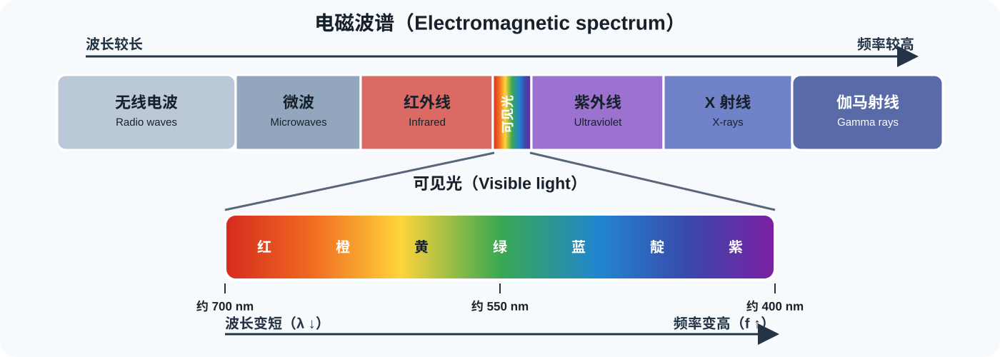
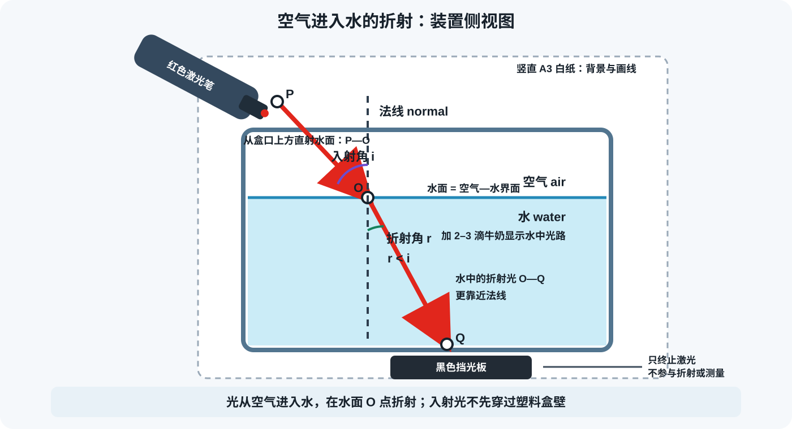
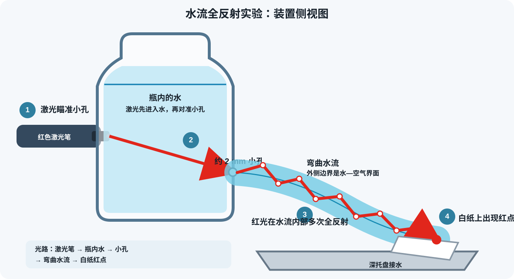

# 第 5 节：光遇到物质会发生什么？

**Lesson 5: What Happens When Light Meets Matter?**

**授课状态**：已完成；实际授课第 5 节。

**同日衔接**：完成本节 60 分钟光学主课后，可继续进行 [第 8 节：显微镜下的生命是什么样？](08-显微镜下的生命是什么样.html)，用 60 分钟观察洋葱表皮与口腔上皮细胞。

## 家长课前准备（Materials for Parents）

### 器材清单

| 器材 | 数量 | 具体要求与来源 |
|---|---:|---|
| 玻璃三棱镜 | 1 个 | 长约 8–10 cm，透明、边缘完整；本节唯一需要专门准备的光学器材 |
| 小平面镜 | 1 面 | 梳妆镜、方形小镜片均可；镜面宽约 5–10 cm，能竖直固定 |
| 红色激光笔 | 1 支 | 普通演示激光笔或宠物激光笔；光点清楚、开关稳定 |
| 黑色绝缘胶带 | 1 卷 | 制作三棱镜实验的窄缝，并固定纸张与器材 |
| 白色 A3 纸 | 4 张 | 接收光谱、绘制反射与折射光路 |
| 黑色卡纸 | 2 张 | 三棱镜实验遮光；激光实验中放在光束终点作挡光板 |
| 红、绿、蓝、白、黑色哑光纸片 | 各 1 张 | 每张裁成约 8 cm × 8 cm；普通彩纸、便签纸或包装纸均可，表面颜色均匀、反光较少 |
| 红、绿、蓝透明片 | 各 1 片 | 每片约 5 cm × 5 cm；可从透明文件袋、糖纸或彩色透明包装片裁取，颜色饱和、透光清楚 |
| 量角器 | 1 个 | 画法线、20°、40°、60°入射线并读取角度 |
| 直尺、铅笔、彩色铅笔 | 各 1 份 | 画光路、标光谱边缘与记录颜色 |
| 长尾夹或橡皮泥 | 4 个或 1 小块 | 竖直固定镜子、白纸和三棱镜 |
| 透明方形保鲜盒 | 1 个 | 盒壁平直，装水深度约 4–6 cm；用于观察折射光路 |
| 透明塑料饮料瓶 | 1 个，500–600 mL | 瓶身平直透明；在靠近底部约 3 cm 处制作直径约 2 mm 的圆孔 |
| 清水 | 约 1 L | 透明方盒和水流全反射实验 |
| 牛奶 | 约 2 mL | 加 2–3 滴显示激光路径；没有牛奶时，可用牙签尖大小的白色水粉颜料、玉米淀粉或普通面粉，先用少量水调开 |
| 深托盘或脸盆 | 1 个 | 接住塑料瓶流出的水 |
| 纸巾或吸水布 | 1 份 | 实验结束后整理桌面 |

### 器材说明

**三棱镜实验中的“单缝”是什么？**

单缝是一条很窄的透光缝。在一小块黑色卡纸上开出光窗口，再把两条黑色绝缘胶带平行贴在窗口两侧，中间留下约 **1–2 mm 宽、10–15 mm 长的竖缝**。实验时把这块“窄缝卡”放在手电筒出光口前方。窄缝把宽光斑变成细长光带，三棱镜展开后的颜色边界会更清楚。

```text
黑胶带 █████│ 1–2 mm 竖缝 │█████ 黑胶带
                    ↓
                  三棱镜
```

**红、绿、蓝纸片有什么标准？**

三张纸片使用哑光、颜色均匀的普通彩纸，裁成相同大小。红色接近正红，绿色接近鲜绿，蓝色接近深蓝；白纸和黑纸用作亮度参照。三张透明片用于把白光变成红、绿、蓝照明光，大小能完整盖住手电筒出光口即可。

**激光笔在本课中做什么？**

激光笔提供细而方向明确的红色光束，用于测量反射角、观察折射方向和演示水流全反射。三棱镜色散使用白光手电筒。

## 一、课程定位与知识主线

- **对应学校单元**：Unit 3 Energy and Its Forms — 03 Electromagnetic Spectrum
- **课时**：60 分钟
- **驱动问题**：白光里有什么？光与物质相遇后，传播方向和进入眼睛的颜色怎样改变？

本节按一条连续主线推进：

```text
电磁波谱中的可见光
        ↓
白光包含多种可见波长——三棱镜色散
        ↓
光源提供的波长不同——物体颜色随照明改变
        ↓
光从界面返回——反射角等于入射角
        ↓
光进入另一介质——折射、临界角与全反射
        ↓
统一模型：reflection / transmission / absorption
```

### 学生应能

1. 把可见光放在电磁波谱中，说明波长与频率的关系，并用“不同频率的光在玻璃中的折射率不同”解释色散。
2. 用三棱镜展开白光，依据光谱说明白光可以包含多种可见波长。
3. 用“白光经透明片选择性透射形成彩色照明，再由彩纸选择性反射进入眼睛”解释物体颜色。
4. 从法线测量三组入射角和反射角，用数据检验反射定律。
5. 观察光跨过空气—水界面时的折射，并用水流中的光路解释全反射。
6. 用“输入光—物质作用—输出光”组织四组实验的证据。

## 二、60 分钟安排

| 时间 | 实验与知识串讲 | 知识落点 |
|---:|---|---|
| 0–20 | 实验 1：光的色散——三棱镜展开白光 | 光谱；波长与频率；折射率与频率 |
| 20–32 | 实验 2：彩色照明改变物体颜色 | 选择性透射；选择性反射；进入眼睛的光 |
| 32–45 | 实验 3：用三组数据检验反射定律 | 法线；入射角与反射角；`i ≈ r` |
| 45–58 | 实验 4：空气进入水的折射与水流全反射 | 空气—水界面；向法线偏折；水—空气全反射 |
| 58–60 | 统一模型与离堂记录 | 输入光—物质作用—输出光 |

## 三、课堂脚本

### 0–20 分钟：实验 1——光的色散

#### 知识点

1. **光谱（spectrum）**：电磁波谱依次包括无线电波、微波、红外线、可见光、紫外线、X 射线和伽马射线。可见光只占其中很窄的一段，位于红外线与紫外线之间；展开后可看到红、橙、黄、绿、蓝、靛、紫等颜色。
2. **波长与频率（wavelength and frequency）**：在真空中，光速 `c` 不变，波长 `λ` 与频率 `f` 满足 `c = λf`；因此波长越短，频率越高，波长越长，频率越低。
3. **折射率与频率（refractive index and frequency）**：同一块玻璃对不同频率的可见光具有不同折射率，因此各颜色的偏折角不同。常见玻璃中，红光偏折较小，紫光偏折较大，这种分开形成光谱的现象叫**色散（dispersion）**。



#### 实验内容

**实验目的**：先把白光展开成可见光谱，直接观察白光中不同颜色的光。

**实验步骤**

1. 在一小块黑色卡纸上用两条黑胶带做出 **1–2 mm 宽的竖缝**，把窄缝卡紧贴在手电筒出光口前方。
2. 调暗实验桌附近的灯光，让手电筒发出的竖直窄光带投到白纸上。
3. 先测量白色窄光带的宽度，作为基线。
4. 把三棱镜放在窄光带中，白色接收纸放在三棱镜后方约 40–80 cm 处。
5. 缓慢转动三棱镜和接收纸，直到纸上出现展开清楚的彩色光带。
6. 用彩色铅笔标出红端、绿区和紫端，写出颜色次序并测量光谱总宽度。
7. 移开三棱镜观察白色窄光带，随后把三棱镜放回原位，再次形成彩色光谱。

**保持相同**：同一白光、同一窄缝、三棱镜到接收纸的距离和房间亮度。  
**改变变量**：三棱镜角度。  
**观察结果**：颜色次序、各颜色位置、光谱宽度。

**预期现象**：白光展开为红、橙、黄、绿、蓝、靛、紫依次排列的光带。常见玻璃中红光偏转较小，紫光偏转较大。

**记录**

| 条件 | 光带外观 | 光带宽度 |
|---|---|---:|
| 白光基线 |  | ____ cm |
| 通过三棱镜 |  | ____ cm |
| 三棱镜放回原位 |  | ____ cm |

```text
偏转较小 → __________________________________ → 偏转较大
证据：白光通过三棱镜后________________________________。
解释：三棱镜对不同________________的折射程度不同。
```

**课堂结论**

```text
白光 white light → 三棱镜 prism → 光谱 spectrum
频率不同 → 玻璃折射率不同 → 偏折角不同 → 色散 dispersion
```

### 20–32 分钟：实验 2——彩色照明改变物体颜色

#### 知识点

1. **光源提供的波长（source wavelengths）**：白光包含多种可见波长；红、绿、蓝透明片会选择性地透过一部分波长，使照到纸片上的光发生改变。
2. **光与物质的三种作用（three interactions of light with matter）**：光到达物质后，可以被**反射（reflection）**、**透射（transmission）**或**吸收（absorption）**。本实验观察的是最终进入眼睛的反射光或透射光。
3. **本实验的光路（light path in this experiment）**：透明片先**选择性透射（selective transmission）**白光中的一部分波长，形成红、绿或蓝照明；彩纸再把其中一部分波长**选择性反射（selective reflection）**进眼睛。因此，观察不透明彩纸时，最后决定所见颜色的是**进入眼睛的反射光**。红纸在红光下通常较亮，在绿光或蓝光下通常较暗；白纸能反射多种可见光，因此会随照明光改变颜色。

#### 实验内容

**实验目的**：比较同一组彩纸在白光、红光、绿光和蓝光下的颜色与亮度，观察光源改变怎样影响所见颜色。

**实验步骤**

1. 把红、绿、蓝、白、黑五张 **8 cm × 8 cm 哑光纸片**并排放在黑色卡纸上。
2. 在白光下先记录五张纸片的颜色和相对亮度。
3. 把红色透明片平整盖在手电筒出光口前，透明片完整覆盖光源；手电筒距纸片约 20 cm。
4. 调暗附近灯光，用红光照亮五张纸片，按 `0–5` 记录相对亮度。
5. 用相同方法依次换成绿色透明片和蓝色透明片；每次保持手电筒位置、纸片位置、透明片层数和房间亮度一致。
6. 把红、绿、蓝透明片分别放在白光与白纸之间，观察透过光的颜色。

**预期现象**：白纸随照明呈现红、绿或蓝；红纸在红光下较亮，在绿光和蓝光下较暗；黑纸在各组中都较暗。红、绿、蓝透明片透过的光分别以相应颜色为主。

**记录**

亮度等级：`0 = 最暗，5 = 最亮`

| 纸片 | 白光下 | 红光下 | 绿光下 | 蓝光下 |
|---|---|---|---|---|
| 红纸 | 颜色___ / 亮度___ | 颜色___ / 亮度___ | 颜色___ / 亮度___ | 颜色___ / 亮度___ |
| 绿纸 |  |  |  |  |
| 蓝纸 |  |  |  |  |
| 白纸 |  |  |  |  |
| 黑纸 |  |  |  |  |

**课堂结论**

```text
光路：白光 → 透明片选择性透射 → 彩色照明光 → 彩纸选择性反射 → 眼睛
结论：观察不透明彩纸时，所见颜色由进入眼睛的反射光决定。
证据：同一张________纸在________光和________光下，
      颜色或亮度________________________________。
```

### 32–45 分钟：实验 3——用三组数据检验反射定律

#### 知识点

1. **法线（normal）**：光射到镜面的点叫入射点；通过入射点、垂直镜面的线叫法线。
2. **两个角的量法**：入射光与法线的夹角叫**入射角（angle of incidence, `i`）**；反射光与法线的夹角叫**反射角（angle of reflection, `r`）**。两个角都从法线量，不从镜面量。
3. **反射定律（law of reflection）**：光被平面镜反射时，反射角等于入射角，即 `i = r`。本实验用 20°、40°和60°三组数据检验这一规律。

#### 实验内容

**实验目的**：改变入射角，测量对应的反射角，用三组数据判断二者是否相等。

**实验步骤**

1. 把一张 A3 白纸铺平，画一条镜面基线，在中点标出入射点，并画一条垂直镜面的法线。
2. 用量角器从法线向同一侧画出 20°、40°、60°三条入射线。
3. 用长尾夹或橡皮泥把小平面镜竖直固定在镜面基线上，使镜面中央正对入射点。
4. 在预计出现反射光的一侧竖直放一张较大的黑色挡光板；它只负责终止光束。
5. 教师把激光笔贴近桌面，让光沿 20°入射线射到入射点。
6. 在镜子与黑色挡光板之间移动一小块竖直白纸，找到反射光点；在桌面 A3 纸上标记白纸所在位置，把该点与入射点连接成反射光线。
7. 从法线量出反射角并记录。再用 40°和60°入射线重复，每次保持镜子和入射点不动。
8. 计算三组 `|i − r|`，比较它们是否接近 0°。

**预期现象**：三组测量中，反射角都与对应的入射角接近相等。

**记录**

| 组次 | 入射角 i | 反射角 r | \|i − r\| |
|---:|---:|---:|---:|
| 1 | 20° |  |  |
| 2 | 40° |  |  |
| 3 | 60° |  |  |

**课堂结论**

```text
规律：反射角等于入射角，即 i = r；两个角都从法线量。
证据：三组测量的 |i − r| 都接近________°。
```

### 45–58 分钟：实验 4——空气进入水的折射与水流全反射

#### 知识点

1. **折射（refraction）**：光从空气斜着进入水时，在空气—水界面改变方向，水中的折射光向法线偏折。
2. **全反射（total internal reflection）**：光从水射向水—空气界面且入射角足够大时，会被反射回水中，因此可以沿弯曲水流传播。



#### 实验内容

**实验目的**：观察空气进入水的折射，以及光沿弯曲水流传播的现象。

**A. 空气进入水**

1. 透明方盒中加入 4–6 cm 深的水和 **2–3 滴牛奶**（没有牛奶时，可用牙签尖大小的**白色水粉颜料、玉米淀粉或普通面粉**，先用少量水调开）；盒后竖直放 A3 白纸，在纸上标出水面和法线。
2. 教师把激光笔放在盒口上方，以约 40° 入射角直接斜射水面，不让激光先穿过塑料盒壁。
3. 标出激光笔出光口 `P`、入水点 `O` 和水中光路点 `Q`，连接 `P—O` 与 `O—Q`，比较它们与法线的夹角；光束终点用黑色挡光板遮挡。

**预期现象**：光进入水后向法线偏折。

**B. 光沿水流传播**



1. 在透明塑料瓶近底部开约 2 mm 小孔，用胶带封住；装满水后放入深托盘。
2. 教师从瓶子另一侧用激光瞄准小孔，使光先进入瓶内的水。
3. 揭开胶带形成弯曲水流，在落点放白纸，观察红光是否随水流到达托盘。

**预期现象**：红光沿弯曲水流传播，水流落点出现红色亮点。

**记录**

| 实验 | 观察到的光路 |
|---|---|
| 空气进入水 |  |
| 光沿水流传播 |  |

**课堂结论**

```text
折射：光从空气进入水时，向法线偏折。
全反射：光在水流内部多次发生全反射，因此能沿弯曲水流传播。
```

### 58–60 分钟：统一模型与离堂记录

| 实验 | 输入光 | 物质怎样作用 | 输出证据 |
|---|---|---|---|
| 三棱镜 | 多波长白光 | 不同波长发生不同程度折射 | 有序彩色光谱 |
| 彩纸与透明片 | 白光、红光、绿光、蓝光 | 透明片选择性透射；彩纸选择性反射 | 进入眼睛的反射光改变，颜色与亮度随之改变 |
| 平面镜 | 红色细光束 | 镜面反射 | 三组 `i ≈ r` |
| 水与弯曲水流 | 红色细光束 | 折射与全反射 | 光路偏折并沿水流传播 |

#### 离堂记录与参考答案

**问题：用一句话概括光与物质相遇后可能发生的变化。**

**参考答案：** 光与物质相遇后可以被反射、透射或吸收；进入另一介质的光会发生折射，材料对不同波长的作用差异还会形成色散和颜色变化。

## 四、教师科学备忘

1. 在真空中，电磁波满足 `c = λf`；波长越短，频率越高。
2. 三棱镜色散来自折射率随波长变化；常见玻璃中紫光偏折通常大于红光。
3. 物体颜色由光源光谱、材料反射谱和视觉系统共同决定。
4. 反射角和入射角都从法线测量；多组数据用于检验 `i = r`。
5. 折射可由 `n₁ sin θ₁ = n₂ sin θ₂` 描述。光从空气进入水时向法线偏折。
6. 全反射发生在光从光学较密介质射向光学较疏介质的过程中，并对应大于临界角的入射角。水—空气临界角约为 49°。

## 五、关键术语（Key Vocabulary）

- 电磁波谱：electromagnetic spectrum
- 可见光：visible light
- 波长：wavelength
- 频率：frequency
- 白光：white light
- 光谱：spectrum
- 色散：dispersion
- 反射：reflection
- 透射：transmission
- 吸收：absorption
- 选择性反射：selective reflection
- 选择性透射：selective transmission
- 法线：normal
- 入射角：angle of incidence
- 反射角：angle of reflection
- 反射定律：law of reflection
- 折射：refraction
- 折射率：refractive index
- 临界角：critical angle
- 全反射：total internal reflection

## 六、教师备课来源

- [学校 03 Electromagnetic Spectrum Notes](../School/02%20Class%20Materials/Unit%203%20Energy%20and%20its%20Forms/01%20Notes/03%20Electromagnetic%20Spectrum%20Notes.pdf)
- [中国科学院物理研究所光学科普活动](https://www.iop.cas.cn/kxcb/kpdt/201312/t20131209_3993013.html)
- [中国科学院长春光机所：从牛顿到三棱镜色散](https://www.ciomp.ac.cn/kxcb/kpzd/shkp_181722/201512/t20151215_4495266.html)
