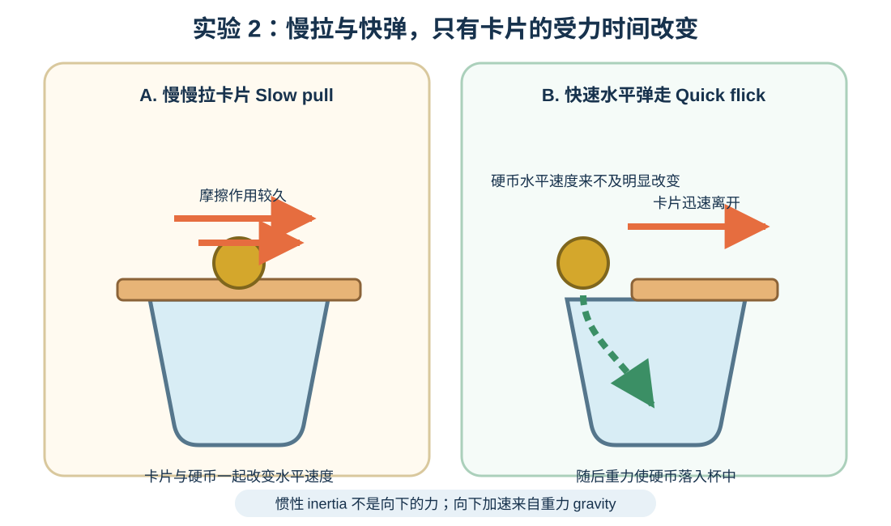
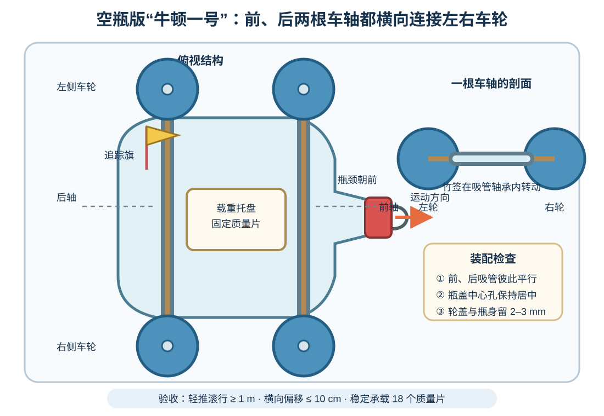
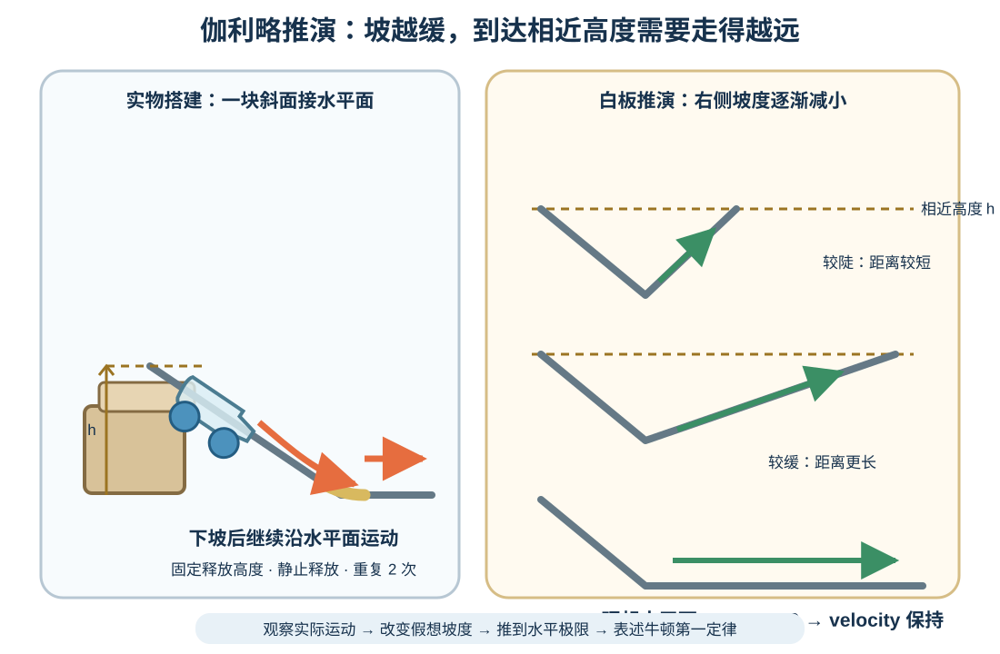
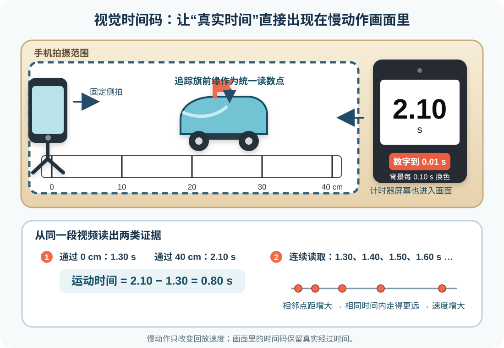
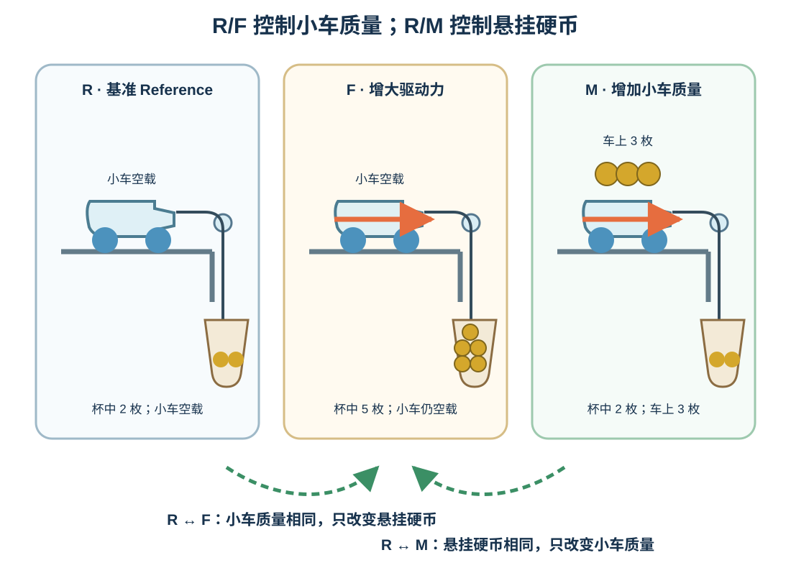
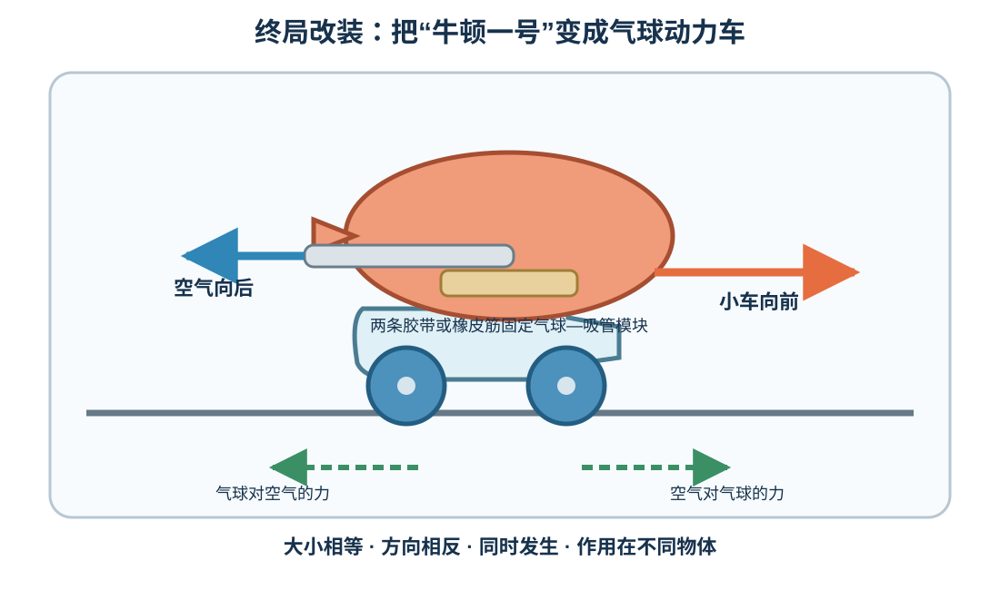

# 第 6–7 节合并课：造一辆车，再用它发现牛顿定律

**Combined Lessons 6–7: Build a Car and Discover Newton's Laws**

**授课状态**：已完成；实际授课第 6 节，共 120 分钟。

## 家长课前准备（Materials for Parents）

本课的小车和视频标尺均由家用材料制作，硬币同时用作悬挂物和小车载荷。学生先完成可测量的小车，再把它改装成气球动力车。以下数量按 **1 辆主车 + 少量备用件** 计算。

### 必须额外准备

| 材料 Material | 建议数量 Amount | 具体要求与用途 |
|---|---:|---|
| 透明空饮料瓶 clear PET bottle | 2 个，350–500 mL | 1 个主用、1 个备用；瓶身较直、无明显凹陷，清洗并晾干 |
| 硬纸板 stiff cardboard | 1 块，约 20 × 10 cm | 制作载重托盘和追踪旗 |
| 平直硬板 rigid board | 1 块，长 60–80 cm、宽至少 15 cm | 课堂搭建伽利略单斜面 |
| 厚书或稳定木块 books / blocks | 2–3 本或块 | 将斜面高端垫至 10–15 cm |
| 塑料文件夹片或薄硬卡 flexible sheet | 1 张，长约 20–30 cm | 铺平坡底与地面的过渡处 |
| 同规格塑料瓶盖 identical bottle caps | 6 个 | 4 个做车轮、2 个备用；尽量圆、无破损、大小相同 |
| 竹签 bamboo skewers | 2 根 | 制作前、后车轴；成人先剪去尖端 |
| 直吸管 straight straws | 3 根 | 2 根做车轴轴承、1 根固定在桌边作导向；选择光滑、硬挺的塑料吸管 |
| 可弯吸管 flexible straw | 1 根 | 连接气球，喷口向后 |
| 气球 balloons | 3 个 | 普通圆气球即可；1 个主用、2 个备用 |
| 橡皮筋 rubber bands | 4–6 根 | 固定气球—吸管模块或车轴备用 |
| 透明胶带、纸胶带 clear / masking tape | 各约 2 m | 固定轴承、桌边导向吸管、模块、标尺与起终点 |
| 回形针或扎带 paper clip / cable tie | 2 个 | 制作车头中央牵引环 |
| 细绳 strong thin string | 约 2 m | 连接小车和悬挂杯；使用无弹性细绳 |
| 小纸杯 small paper cups | 2 个 | 一个做惯性演示接杯，一个做悬挂质量篮 |
| 硬卡片 stiff card | 1 张 | 用于 2 分钟惯性演示；硬币从主实验的 5 枚 1 元硬币中复用 |
| 1 元人民币硬币 1-yuan coins | 5 枚 | R 条件杯中放 2 枚，F 条件杯中放 5 枚；M 条件将其中 3 枚固定放在小车托盘内 |
| 橡皮泥或成人热熔胶 modeling clay / hot glue | 少量 | 把瓶盖固定在竹签上；热熔胶只由成人操作 |
| 直尺、剪刀、黑色粗记号笔 ruler / scissors / marker | 各 1 | 裁载重托盘、制作追踪旗和高对比视频标尺 |
| A4 纸或纸条 A4 paper / paper strips | 8–10 张 | 做 0–40 cm 黑白视频标尺、等时点带和记录纸 |
| 手机及稳定支架 phone and stable stand | 1 套 | 固定侧拍；能拍慢动作并在手机上暂停、拖动回放 |
| 电脑、平板或第二部手机 computer / tablet / second phone | 1 台 | 打开[课堂视觉计时器（显示到 0.01 s）](06-视觉计时器.html)，屏幕与轨道同时进入录像画面 |
| 毛巾 towel | 1 条 | 桌边缓冲悬挂杯与小车 |

### 成人课前完成

1. 成人用手钻或锥子在空瓶前后各制作一对左右对应的吸管孔，并在瓶盖正中心打轴孔；操作时把材料垫在废木板上。
2. 剪去竹签尖端，确认边缘光滑。
3. 把气球套在可弯吸管一端，用橡皮筋扎紧；吹气后捏住喷口，检查连接处密封。
4. 拍摄手机确认可以录制和回放慢动作；第二台设备打开[课堂视觉计时器（显示到 0.01 s）](06-视觉计时器.html)，关闭自动锁屏、调高亮度并完成一次试拍。

## 一、课程定位与学习目标

- **对应学校单元**：Unit 3 Energy and its Forms
- **对应课堂 Notes**：04 Vectors, Velocity, Acceleration；05–07 Newton's Laws 1–3
- **课时**：120 分钟，含 7 分钟休息
- **核心任务**：造出一辆合格小车，用它推演惯性运动、测量加速度，并检验力和质量怎样改变加速度。
  *How can one car reveal inertia, measure acceleration, and test how force and mass change motion?*

全课沿一条连续任务线推进：

```text
5 分钟讲清运动语言 → 2 分钟惯性演示 → 造车并调校 → 伽利略推演
                                      ↓
一套小车—悬挂质量装置：R 基准 → F 增力 → M 增质量
             ↓                           ↓
       视觉时间码等时点带看出加速       两次公平比较解释 F_net = ma
                                      ↓
                         同一辆车改装为气球动力车
```

### 六个实验／任务的目的总览

| 实验／任务 | 目的与证据 |
|---|---|
| 硬币—卡片演示 | 观察硬币保持原运动状态的趋势，区分惯性、摩擦力和重力 |
| 自制空瓶“牛顿一号”小车 | 制作可调校、可载重、可直线滚动的实验车 |
| 伽利略单斜面与水平面推演 | 观察小车下坡后继续运动，并从坡度变化推出惯性运动 |
| 视觉时间码与等时点带 | 用相等时间间隔的位置变化判断小车是否加速 |
| R/F/M 三条件主实验 | 分别检验牵引作用和小车质量对加速度的影响 |
| 气球动力改装 | 找出分别作用在空气和气球上的第三定律力对 |

### 学生应能

1. 口头区分路程（distance）、位移（displacement）、速度（velocity）和加速度（acceleration）。
2. 用空饮料瓶、吸管、竹签和瓶盖制作能直线滚动并承载 3 枚 1 元硬币的小车。
3. 从单斜面实车运动和逐渐放平的假想斜面，表述牛顿第一定律。
4. 用画面内显示到 0.01 秒、每 0.10 秒改变背景的视觉时间码和同平面标尺读取位置，说明点间距增大就是速度增大。
5. 在同一个三条件实验里完成两次公平比较：
   - `R ↔ F`：小车保持空载，悬挂硬币由 2 枚增加到 5 枚；
   - `R ↔ M`：悬挂杯保持 2 枚硬币，小车托盘内固定增加 3 枚 1 元硬币。
6. 用数据支持 `net force ↑ → acceleration ↑` 与 `mass ↑ → acceleration ↓`。
7. 在气球动力车上正确指出牛顿第三定律的一对力作用在不同物体上。


## 二、课堂内容（按时间顺序）

| 时间 | 教学活动 | 本段必须留下的证据 |
|---:|---|---|
| 0–5 | 运动语言概念讲解 | 能区分 distance / displacement 与 velocity / acceleration |
| 5–7 | 硬币—卡片惯性演示 | “惯性是物体的性质；重力使硬币下落” |
| 7–29 | 制作空瓶“牛顿一号”小车 | 空瓶—吸管—竹签—瓶盖结构完成 |
| 29–37 | 1 m 维修站挑战 | 滚行、直线性、承载三项验收记录 |
| 37–45 | 伽利略单斜面与水平面推演 | 实车观察、坡度推演与牛顿第一定律表述 |
| 45–53 | 自制视频标尺、固定桌边导向吸管、手机和计时屏 | 尺、车、计时屏与镜头位置固定 |
| 53–64 | 拍 R 基准试次 1，制作等时点带 | 每 0.10 s 的位置与点距变化 |
| 64–71 | 休息；教师检查绳线与视频 | — |
| 71–78 | 介绍 R/F/M，预测两次比较 | 写下 `R↔F` 与 `R↔M` 的预测 |
| 78–98 | 三条件各 3 次测量 | 起止时间码、运动时间与异常试次记录 |
| 98–108 | 换算时间、比较或估算加速度 | 两个只改一个变量的数据结论 |
| 108–116 | 气球动力车改装与发射 | 正确标出第三定律力对 |
| 116–120 | 离堂短答 | 用一条证据回答核心问题 |

### 0–5 分钟：只讲必要概念

教师用三句话直接讲清概念：

```text
绕操场一圈：distance > 0，displacement = 0
velocity：速度大小 + 方向
acceleration：velocity 随时间的改变；变快、变慢或转弯都可以
```

**讲解落点**：起点与终点重合时位移为 0，实际路径仍计入路程；速度大小保持不变而方向改变时，速度矢量发生变化，因此存在加速度。

### 5–7 分钟：硬币—卡片只演示一次

> **实验目的（先看这一句）**：用一个两分钟的反直觉现象观察物体保持原运动状态的趋势，区分惯性、摩擦力和重力，并建立牛顿第一定律所需的惯性概念。



纸杯上放卡片，卡片中央放一枚 1 元硬币；快速、水平弹走卡片，硬币落入杯中。

**现象解释**：快速弹卡片时，摩擦作用时间很短，硬币基本保持原来的静止状态；卡片离开后，重力使硬币向下加速并落入杯中。惯性描述物体保持原运动状态的性质。


### 7–37 分钟：制作并验收空瓶“牛顿一号”

> **实验目的（先看这一句）**：用空饮料瓶、吸管、竹签和瓶盖快速造出一辆滚动顺畅、能直线行驶、可以承载 3 枚 1 元硬币并从车头中央牵引的实验车，为后面的所有测量提供同一个可靠研究对象。



#### 制作步骤（7–29 分钟）

1. 将晾干的 350–500 mL 空瓶水平放置，瓶颈作为车头；在瓶身前、后位置各标出一条横向车轴线。
2. 成人在每条车轴线的左右两侧制作对应孔，把两根约 9 cm 的直吸管横向穿过瓶身并固定；两根吸管彼此平行。
3. 将两根去尖竹签分别穿过吸管，作为前轴和后轴；竹签在吸管内自由转动。
4. 把 4 个中心已打孔的瓶盖固定在竹签两端；轮盖与瓶身之间留约 2–3 mm。
5. 用硬纸板折出约 `12 × 6 cm` 的浅托盘，以两根橡皮筋或胶带固定在瓶身上方；托盘中心对齐瓶身中线。
6. 在瓶颈下方安装回形针或扎带牵引环；在托盘旁竖起高对比追踪旗，视频统一读取追踪旗前缘。

**教师提示**：吸管孔、瓶盖轴孔和热熔胶固定由成人完成；橡皮泥加胶带可作为车轮固定方式。

#### 赛道验收（29–37 分钟）

小车完成后进行三项工程验收：

| 指标 | 合格线 | 调校重点 |
|---|---:|---|
| 滚行距离 | 轻推后至少滚行 1 m | 轮盖是否蹭车身、竹签是否被胶粘住 |
| 直线性 | 1 m 内横向偏移 ≤ 10 cm | 两根吸管是否平行、轮孔是否明显偏心 |
| 承载 | 托盘内固定放 3 枚 1 元硬币后仍能滚动 | 瓶身是否凹陷、托盘是否居中 |


### 37–45 分钟：伽利略单斜面与水平面推演

> **实验目的（先看这一句）**：让自制小车从斜面进入水平面，观察它在坡底后继续运动；再将假想的右侧斜面逐渐放平，从运动距离的变化推演合力为零时物体保持原有速度和方向。

**牛顿第一定律 Newton’s First Law：只要物体所受的力是平衡的，它就会保持原来的速度。 / As long as the forces on an object are balanced, it will continue at the same velocity.**

> **科学史与思想实验**：伽利略从真实的斜面运动出发，通过逐渐减小坡度、设想没有摩擦的理想情况，帮助人们建立了惯性思想；后来笛卡尔和牛顿继续修正和发展，最终形成牛顿第一定律。思想实验是从真实观察出发，暂时排除干扰，再用有根据的想象和逻辑，让现实中不容易直接看见的规律显现出来。



#### 课堂搭建（37–39 分钟）

1. 在地面铺设 60–80 cm 平直硬板，用厚书或稳定木块把高端垫至 10–15 cm。
2. 用塑料文件夹片或薄硬卡覆盖坡底接缝，形成约 20–30 cm 的平滑过渡。
3. 在斜面上标出固定释放位置，在水平跑道末端放置毛巾软挡板。

#### 实车观察（39–42 分钟）

1. 把小车前缘对齐释放线，从静止状态释放。
2. 观察小车经过坡底后在水平面继续运动，并用纸胶带标出停止位置。
3. 重复 2 次，记录两次水平运动距离。

| 试次 | 释放位置 | 水平运动距离/cm | 观察 |
|---|---|---:|---|
| 1 | 固定刻线 |  |  |
| 2 | 固定刻线 |  |  |

#### 思想推演（42–45 分钟）

1. 在白板上补画右侧上坡，并画出与释放点相同的垂直高度线。
2. 右侧坡度较陡时，到达相近高度所需的轨道距离较短。
3. 右侧坡度变缓时，到达相近高度所需的轨道距离增加。
4. 右侧坡度趋近水平时，所需距离持续增加；理想水平面上 `F_net = 0`，小车保持原来的速度和方向。

#### 板书

```text
Galileo: opposing slope becomes flatter → travel distance increases
Newton’s First Law: balanced forces → same velocity
现实小车的滚动阻力、轮轴摩擦和形变会改变它的速度
```

### 45–64 分钟：视频标尺、视觉时间码与等时点带

> **实验目的（先看这一句）**：在 R 基准条件的一次运动中，每隔相同时间读取一次小车位置，用“后面的点距越来越大”作为小车速度增加、存在加速度的直接证据，并建立后续三条件实验的测量方法。



#### 搭建（45–53 分钟）

1. 用 A4 纸拼成至少 50 cm 长的纸带，在 `0、10、20、30、40 cm` 处画粗线；每 5 cm 交替涂黑，形成高对比标尺。
2. 把标尺粘在赛道旁，标尺刻度面与小车追踪旗处于同一竖直平面。
3. 手机固定在轨道侧面，镜头中央正对 20 cm 刻度，画面同时包含 `0–40 cm`、追踪旗和视觉计时器屏幕。
4. 在电脑、平板或第二部手机上打开[课堂视觉计时器（显示到 0.01 s）](06-视觉计时器.html)，全屏显示并调到录像中能清楚读数的位置。
5. 拍摄手机设为慢动作并全程固定。用闸门或捏住绳子，使小车从静止状态释放。

#### 计时方法

1. 先开始慢动作录像，再启动视觉计时器，随后释放小车。
2. 回放时暂停并拖动进度条，读取追踪旗前缘通过 0 cm 时的画面时间码 `t₀`。
3. 继续拖动，读取追踪旗前缘通过 40 cm 时的画面时间码 `t₁`。
4. 两个读数相减，得到小车通过 40 cm 的真实时间：

```text
运动时间 t = t₁ − t₀
例：1.30 s 通过起点，2.10 s 通过终点，t = 2.10 − 1.30 = 0.80 s
```

计时器数字显示到 0.01 s，并在每个 0.01 s 时刻更新；背景明暗每 0.10 s 切换一次。末位数字为 0 的时刻就是 0.10 s 的整数倍，例如 1.30、1.40、1.50 s。慢动作延长的是回放过程，画面中两个时间码的差仍是实际经过时间。

#### 基准试次同时完成两件事（53–64 分钟）

1. 按 R 条件在杯中放 2 枚 1 元硬币，小车保持空载，拍摄第一次完整运动。
2. 找到追踪旗前缘通过 0 cm 的画面，记录此刻时间码，作为相对时刻 `0.00 s`。
3. 依次找到时间码增加 `0.10、0.20、0.30 s……` 的画面，读出追踪旗前缘相对标尺的位置。
4. 在一条纸带上按同一比例标出这些位置，得到学生自己制作的“等时点带”。
5. 同一段视频读出小车通过 0 cm 和 40 cm 时的时间码，计算运动时间，供后面的三条件比较使用。

| 相对时刻 Time/s | 0.00 | 0.10 | 0.20 | 0.30 | 0.40 | 0.50 | 0.60 |
|---:|---:|---:|---:|---:|---:|---:|---:|
| 画面时间码/s |  |  |  |  |  |  |  |
| 位置 Position/cm | 0 |  |  |  |  |  |  |
| 相邻点距/cm | — |  |  |  |  |  |  |

#### 判读依据

- 每一段都是 0.10 s；相邻位置间距逐渐增大，表示相同时间内路程增加，速度持续增大。
- 标尺刻度面与追踪旗位于同一平面，可减小透视造成的视差误差。

### 64–71 分钟：休息与装置检查

学生休息；教师回看 R 基准视频，检查绳线、吸管导向、起终点和手机画面。

### 71–108 分钟：R/F/M 三条件主实验

> **实验目的（先看这一句）**：用同一辆车完成两次单变量比较——R↔F 保持小车空载，只增加悬挂硬币；R↔M 保持悬挂杯中硬币不变，只给小车增加固定载荷，并用数据比较力和质量对加速度的影响。

**牛顿第二定律 Newton’s Second Law：合力等于质量乘以加速度。 / Net force is equal to mass times acceleration.**



#### 研究对象与施力装置

本实验研究的物体是**自制小车**；细绳、桌边固定吸管和悬挂杯组成施力装置。杯中硬币越多，对小车的牵引作用越强。

用胶带把一小段光滑硬吸管横向固定在圆钝桌边，让细绳从吸管外侧绕过后垂下。

#### 三个条件

| 条件 | 杯中 1 元硬币 | 车上固定载荷 | 变量安排 | 比较对象 |
|---|---:|---:|---|---|
| R · 基准 Reference | 2 枚 | 0 枚 | 小车空载 | 共同基准 |
| F · 增大驱动力 Force | 5 枚 | 0 枚 | 小车仍空载，只增加悬挂硬币 | **R ↔ F** |
| M · 增加小车质量 Cart Mass | 2 枚 | 3 枚 | 杯中仍为 2 枚，只在小车托盘内固定增加 3 枚 1 元硬币 | **R ↔ M** |

R 与 F 使用同一辆空载小车，因此小车质量保持一致；R 与 M 使用同样的 2 枚悬挂硬币，因此施力装置的设置保持一致。

**课前预试规则**：先用 2 枚 1 元硬币悬挂，确认 R 条件能从静止启动。运行顺畅时采用 R=2、F=5；R 启动困难时采用 R=3、F=5，并让 M 与 R 使用相同的 3 枚悬挂硬币。M 条件把 3 枚 1 元硬币平放在托盘中央，用一条胶带跨过硬币固定。

#### 变量

- **R↔F 的自变量 independent variable**：杯中 1 元硬币数量，即悬挂驱动力设置；小车均保持空载。
- **R↔M 的自变量 independent variable**：小车上的固定载荷；杯中 1 元硬币数量保持相同。
- **因变量 dependent variable**：0–40 cm 运动时间，以及由时间估算的加速度。
- **共同控制变量 controlled variables**：同一辆车、同一轨道、同一吸管导向与细绳、同一起终点、同一释放方法、同一手机位置和相同重复次数。

#### 预测（71–78 分钟）

| 比较 | 学生预测 | 预测理由 |
|---|---|---|
| R ↔ F | F 先到终点 | 小车质量相同，F 的悬挂硬币更多，牵引作用更强 |
| R ↔ M | R 先到终点 | 悬挂硬币相同，M 的小车质量更大 |

#### 采集数据（78–98 分钟）

1. 每次把追踪旗前缘对齐 0 cm，小车和悬挂杯都静止，绳子轻轻拉直。
2. 开始录像后释放闸门；释放瞬间双手离开小车和细线。
3. 小车通过 40 cm 后立即用软挡板拦住；纸杯落在毛巾上。
4. 每个条件完成 3 次。基准试次 1 已在休息前拍摄，因此剩余 8 次。
5. 轮子卡住、车上硬币移位、硬币掉出杯子、绳子脱槽、手碰车或纸杯提前落地的试次标记为异常并补测；分析表记录每个条件的 3 次有效数据。

| 条件 | 杯中 1 元 / 枚 | 车上 1 元 / 枚 | 试次 1 时间/s | 试次 2 时间/s | 试次 3 时间/s | 平均时间/s | `a ≈ 2d/t²` /(m/s²) |
|---|---:|---:|---:|---:|---:|---:|---:|
| R |  |  |  |  |  |  |  |
| F |  |  |  |  |  |  |  |
| M |  |  |  |  |  |  |  |

其中 `d = 0.40 m`。从静止释放且加速度近似恒定时：

```text
d ≈ 1/2 at²  →  a ≈ 2d/t²
```

基础版本直接比较同一路程上的平均时间：时间越短，说明加速效果越强；进阶版本再用公式估算加速度。

#### 分析与证据表达（98–108 分钟）

| 比较 | 数据证据 | 结论 |
|---|---|---|
| R ↔ F | F 的平均时间更短、估算加速度更大 | 小车质量相同时，牵引作用增大，加速度增大 |
| R ↔ M | M 的平均时间更长、估算加速度更小 | 悬挂设置相同时，小车质量增大，加速度减小 |

轮轴与桌边吸管处的摩擦、轮孔偏心、起止时间码判断和标尺视差会影响数值比例；三次重复数据用于判断趋势和波动范围。

#### 板书

```text
R ↔ F：same cart mass；pulling force ↑ → acceleration ↑
R ↔ M：same hanging-load setting；cart mass ↑ → acceleration ↓

Newton's second law: F_net = ma
F_net 是同一研究对象所受力的矢量和
```

### 108–116 分钟：同一辆车的气球动力终局

> **实验目的（先看这一句）**：让学生从气球向后排出空气、小车向前运动的现象中找出牛顿第三定律力对，并明确两个力大小相等、方向相反，分别作用在空气和气球上。

**牛顿第三定律 Newton’s Third Law：每一个作用力，都有一个大小相等、方向相反的反作用力。 / For every action, there’s an equal but opposite reaction.**



1. 将课前扎好的气球—可弯吸管模块沿小车中线固定，吸管喷口朝后，并与车轮保持间距。
2. 充气后捏住喷口，把车放在 1.5–2 m 平直跑道上；松开喷口，让气球中的空气驱动车。
3. 第一次跑偏时，调整喷口方向或模块居中位置，再试一次。

#### 证据解释

气球对空气施加向后的力，空气同时对气球施加大小相等、方向相反的向前力；两个力分别作用在空气和气球上。分析气球—小车系统时，空气对气球的向前作用推动小车运动。

### 116–120 分钟：离堂短答

只写 3 句：

1. 点带上哪一项观察说明小车在加速？
2. R↔F 或 R↔M 中，哪一项数据支持哪条结论？
3. 气球动力车的第三定律力对分别作用在哪两个物体上？

## 三、教师参考：严谨性、误差与故障处理

### 视觉时间码法的精度

- 视觉计时器显示到 0.01 s，背景每 0.10 s 切换一次；起点和终点都以追踪旗前缘刚通过粗刻线的画面为准，时间按画面时间码记录到 0.01 s。
- 每个条件完成 3 次并报告平均值和范围；三次差异明显时，先检查装置并补测。
- 录像中同时保留完整标尺、追踪旗和计时器数字，回放时由同一名学生按同一标准读取三种条件。
- 计时器屏幕尽量与轨道处于相近距离，使用大屏设备、全屏显示和较高亮度；课前试拍确认数字边缘与背景明暗变化清楚。

### 常见故障

| 现象 | 最可能原因 | 处理 |
|---|---|---|
| R 条件用 2 枚硬币时小车保持静止 | 静摩擦过大或吸管导向处阻力大 | 调整吸管位置，确认细线能顺畅滑过；随后把 R 和 M 改为 3 枚、F 保持 5 枚 |
| 小车左右蛇行 | 轴线角度偏差、轮孔偏心、牵引点偏心 | 先修轴线，再换备用轮，最后校正牵引环 |
| 纸杯先于小车到终点落地 | 悬挂高度偏小或细线太长 | 缩短跑道或细线，以纸杯全程悬空的试次计时 |
| 视频刻度模糊 | 快门拖影、光线暗或标尺太细 | 增加照明、改粗黑线、镜头靠近但保持完整画面 |
| 时间码模糊或屏幕出现条纹 | 屏幕太小、亮度不足或拍摄角度不合适 | 改用电脑或平板全屏显示，调整亮度与角度后重新试拍 |
| R/F 差异很小 | 轮轴或吸管导向处摩擦波动较大 | 保持 R=2、F=5，先调校轮轴并固定吸管，再补测异常试次 |
| 气球车保持静止 | 喷口碰车身、漏气、车轴摩擦大 | 先验收底盘，再检查密封和喷口方向 |

### 安全边界

- 成人完成切纸板、瓶盖打孔、剪竹签和热熔胶操作；学生组装已经处理好的零件。
- 斜面板用厚书和纸胶带固定，水平跑道前方设置空旷缓冲区与毛巾软挡板。
- 计时统一采用固定手机拍摄视觉时间码；设备电源线贴桌边固定，保持轨道和操作区整洁。
- 小车终点离桌边至少 20 cm并设置毛巾软挡板；学生双脚位于悬挂杯落点之外。
- 气球只充空气；乳胶过敏者使用无乳胶替代品或负责录像。破裂碎片立即装入回收袋。
- 气球车在地面或低桌面发射，方向朝向空旷缓冲区。


### 备用方案

1. 40 分钟验收节点启用教师课前制作的同结构纸板瓶盖备用车，学生车留到课后继续调校。
2. 第二台显示设备临时缺失时，教师提供课前录好的“轨道 + 视觉计时器”视频，学生继续完成读尺、点带和计算。
3. 课堂时间紧张时，优先保留起止时间码、平均时间、重复测量和两次公平比较，加速度公式作为课后延伸。

## 四、来源与延伸

- [Science Buddies：Build a Balloon Car](https://www.sciencebuddies.org/stem-activities/balloon-car)：瓶身、吸管、竹签、瓶盖和气球动力车的常见家用材料结构。
- [NASA JPL：Simple Rocket Science](https://www.jpl.nasa.gov/edu/resources/lesson-plan/simple-rocket-science/)：用气球喷气建立作用—反作用解释。
- [NASA Glenn：Rocket Car](https://www.grc.nasa.gov/www/k-12/TRC/Rockets/rocket_car.html)：气球动力车和牛顿第三定律活动参考。

## 五、核心词汇

| 中文 | English | 本课中的准确含义 |
|---|---|---|
| 路程 | distance | 实际路径总长度，标量 |
| 位移 | displacement | 从起点指向终点的位置变化，矢量 |
| 速度 | velocity | 运动快慢和方向 |
| 加速度 | acceleration | 速度随时间的改变 |
| 惯性 | inertia | 物体保持原有运动状态趋势的性质；其大小与质量相关 |
| 合力 | net force | 同一研究对象所受力的矢量和 |
| 质量 | mass | 物体惯性大小的量度之一 |
| 控制变量 | controlled variable | 公平比较中保持不变的条件 |
| 可视时间码 | visual timecode | 录像画面中显示到 0.01 秒、背景每 0.10 秒切换一次的数字时间标记 |
| 作用—反作用力对 | action–reaction pair | 两物体相互作用时同时产生、大小相等、方向相反且作用在不同物体上的两个力 |
