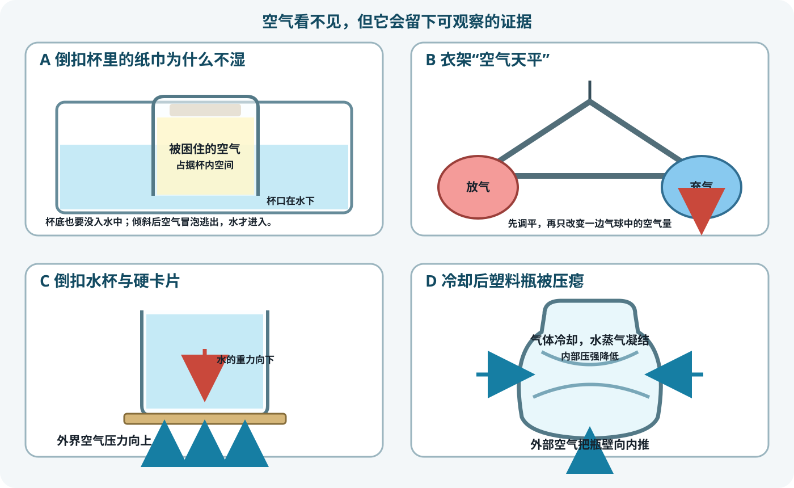
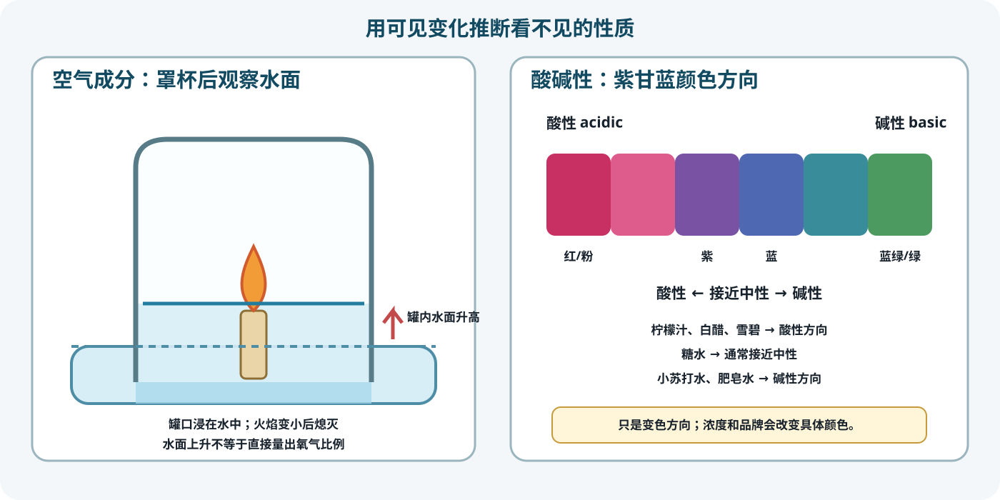

# 第 07 节：看不见的空气，怎样留下证据？

**Lesson 07: How Can Invisible Air Leave Visible Evidence?**

**授课状态**：已完成；实际授课第 7 节，共 120 分钟。

## 家长课前准备（Materials for Parents）

只列需要提前确认、可能需要购买的材料。数量按 1 名孩子并留少量重做余量计算。

| 材料 Material | 建议数量 Amount | 用途与要求 |
|---|---:|---|
| 蜡烛 candle | 2 支 | 短蜡烛或茶蜡；1 支主用、1 支备用 |
| 紫甘蓝 red cabbage | 3–4 片大叶 | 新鲜并提前洗净；制作酸碱指示剂 |
| 白砂糖 white sugar | 约 1 小勺 | 配糖水 |
| 柠檬 lemon | 1 个 | 现挤柠檬汁；成人切开 |
| 食用小苏打 baking soda | 约 1 小勺 | 配小苏打水；不是瓶装“苏打水” |
| 白醋 white vinegar | 约 30 mL | 酸性样品 |
| 雪碧 Sprite | 约 100 mL | 尽量现开；倒出后等大泡沫消失 |
| 原味白色肥皂 plain white soap | 1 小块 | 配肥皂水；可用 2–3 滴透明洗洁精代替 |

气球家中已有，不需另买。清水、热水、冰块、纸巾、胶带、杯碗、水盆、塑料衣架、空饮料瓶、硬卡片、轻卡纸、吸管、线绳、吹风机、剪刀、尺子和点火工具按普通家用品处理，不列为家长专门采购材料。热水和明火由教师负责，不需家长提前送来。

## 一、课程定位与学习目标

- **课时**：120 分钟，含 6 分钟休息。
- **形式**：1 对 1 家庭实验课；孩子完成预测、搭建、充气、调平、取样、观察和记录。
- **对应学校内容**：Unit 2 Properties of Matter 中的气体与混合物；Unit 4 Respiratory System 中吸入氧气、排出二氧化碳。
- **核心问题**：看不见的空气具有什么性质、含有哪些气体？我们怎样让它们留下可见证据？
  *What properties and gases does invisible air have, and how can we make them leave visible evidence?*

全课沿一条证据线推进：

```text
纸巾不湿 → 空气占据空间
气球天平 → 空气是有质量的物质
倒扣水杯 + 压瘪塑料瓶 → 压强差能产生力
弧形纸翼沿线升起 → 流动空气在翼面周围形成压力差
蜡烛罩杯后熄灭、水面上升 → 空气中的氧气支持燃烧
六种液体建立颜色标尺 → 紫甘蓝显示呼出气体中的二氧化碳
```

### 孩子应能

1. 用实验现象说明空气占据空间、具有质量并会产生压力。
2. 分清纸巾被固定靠摩擦或胶带，纸巾不湿则因为杯内空气占据空间。
3. 在倒扣水杯和冷却塑料瓶中画出外界空气压力的方向，不用“吸力”代替压强差。
4. 用纸翼升起说明压力分布不均能形成向上的合力。
5. 说明空气是**均一混合物（homogeneous mixture）**，氧气支持燃烧。
6. 先用六种液体读懂紫甘蓝**酸碱指示剂（acid–base indicator）**，再用颜色变化检测呼出气体中的二氧化碳。
7. 用“观察—证据—解释—边界”表达一个实验结论。

## 二、教师课前准备

1. 确认现场有深水盆、透明杯、轻质塑料衣架、薄壁塑料瓶、硬卡片、轻卡纸、吸管、线绳、吹风机、透明玻璃罐、浅碗、10 个透明小杯、护目镜和吸水布。
2. 预试衣架天平：先让两个未充气气球平衡，再取下一只用嘴吹大并装回原位。若挂钩摩擦大，用细线穿过挂钩悬吊；若没有轻衣架，把 A4 纸沿对角线卷成约 35 cm 的纸棒。
3. 预试塑料瓶：使用 500 mL–1 L 薄壁 PET 瓶；热水约 70–80℃，不用沸水直接软化瓶壁。
4. 预制一个纸翼样品，确认吸管能沿竖直线绳自由滑动；吹风机使用冷风或低温档。确认玻璃罐无裂纹，罐口能浸入浅碗的水中，罐高大于蜡烛。
5. 给 10 个小杯贴标签：原液、糖水、柠檬汁、小苏打水、白醋、肥皂水、雪碧、空气对照、呼气组、备用。
6. 课前预试呼气显色：用低矿物质饮用水把指示剂稀释至浅紫色，吹泡 60–90 秒应能看出呼气组比空气对照偏粉紫；正式课仍由孩子配液和吹气。
7. 明火、热水、切柠檬和移动发热玻璃罐由教师完成，其余步骤默认由孩子操作。

## 三、一眼速查（Quick Timeline）

| 时间 | 活动 | 必须留下的证据 |
|---:|---|---|
| 0–3 | “空杯真的空吗？”预测 | 先写预测，不先讲答案 |
| 3–15 | 实验 1：杯中纸巾不湿 | 空气占据空间；倾斜后气泡逃出 |
| 15–33 | 实验 2：衣架“空气天平”（DK 3） | 未充气时调平；一只吹大并装回原位后平衡改变 |
| 33–45 | 实验 3：倒扣水杯与卡片（DK 2） | 外界空气压力向上托住卡片 |
| 45–59 | 实验 4：冷却后压瘪塑料瓶（DK 1） | 内压降低后，外界空气把瓶壁向内推 |
| 59–71 | 实验 5：让机翼飞起来（DK 7） | 弧形纸翼沿竖线升起 |
| 71–77 | 休息与换台 | 教师收热水并布置耐热托盘 |
| 77–92 | 实验 6：发现空气中的气体（DK 4） | 火焰熄灭，罐内水面上升 |
| 92–117 | 实验 7：紫甘蓝检测呼出二氧化碳 | 六种液体先建立颜色标尺；呼气组是必做结论实验 |
| 117–120 | 证据链收束 | 用一条现象和一句解释回答核心问题 |

## 四、课堂脚本（按时间顺序）

### 0–3 分钟：“空杯”真的空吗？

**做**：把一个看似空的透明杯交给孩子，请孩子写一句预测：“杯里有什么？倒扣进水里会怎样？”

**讲**：今天不以“直接看到物体”为唯一证据，而看它是否造成稳定、可重复的变化。

### 3–15 分钟：实验 1——杯中纸巾不湿

> **实验目的 Objective：空气占据空间。 Air takes up space.**

**重要知识点**：

- **空气占据空间（air occupies space）**：杯口向下竖直入水时，杯内空气被困住，水不能同时占据同一空间。
- 纸巾不掉靠摩擦或胶带；这不是纸巾不湿的原因。
- 杯子倾斜后，空气以气泡逃出，水才进入杯中。

**必要耗材与试剂（Consumables & Reagents）**

| 名称 | 规格或浓度 | 每次用量 | 来源或备注 |
|---|---|---:|---|
| 纸巾 | 干燥，可团成杯底大小 | 2 小团 | 1 团主用，1 团重做 |
| 清水 | 常温 | 约 1.5 L | 水深要能没过杯底 |
| 胶带 | 透明胶带 | 2 小段 | 只防止纸巾掉落 |

**实验工具（Equipment & Tools）**

| 工具 | 数量 | 规格 | 用途 |
|---|---:|---|---|
| 透明塑料杯 | 1 个 | 杯口平整 | 困住空气 |
| 深透明水盆 | 1 个 | 水深至少 12–15 cm | 让杯口和杯底都没入水中 |
| 干毛巾 | 1 条 | 家用 | 擦干杯外侧后检查纸巾 |



**做**：

1. 孩子把干纸巾固定在杯底内侧，倒转检查它不会掉落。
2. 确认纸巾干燥。杯口竖直向下、不倾斜地压入水中。
3. 继续下压，直到杯底也完全没入水中；停留 3 秒后竖直提出。
4. 擦干杯外侧，再取下纸巾检查。
5. 做对照：再次入水后故意倾斜，观察气泡；让水进入，再检查纸巾。

**预期现象**：竖直入水时纸巾干燥；倾斜时气泡逃出，水进入后纸巾变湿。

**失败判据**：若杯底没有没入水中，即使纸巾不湿也不算有效证据；若入水时明显冒泡，该次重做。

#### 记录与板书（Record & Board Notes）

| 条件 | 气泡 | 纸巾结果 | 证据说明什么 |
|---|---|---|---|
| 杯口竖直向下 |  |  |  |
| 杯子在水中倾斜 |  |  |  |

```text
固定纸巾：摩擦或胶带
保持干燥：杯内空气占据空间
关键对照：空气冒泡逃出 → 水进入 → 纸巾变湿
```

### 15–33 分钟：实验 2——衣架“空气天平”（DK 3）

> **实验目的 Objective：空气具有质量。 Air has mass.**

**重要知识点**：

- **质量（mass）**：空气是物质；同种密闭容器含有更多空气时，质量会增加。
- **平衡（balance）**：两边的重量效应和到悬点的距离共同决定横梁是否倾斜。
- 现象很小；装置不灵敏时，失败不能推出“空气没有质量”。

**必要耗材与试剂（Consumables & Reagents）**

| 名称 | 规格或浓度 | 每次用量 | 来源或备注 |
|---|---|---:|---|
| 气球 | 同品牌、同尺寸 | 3 个 | 2 个主用，1 个备用 |
| 胶带 | 透明胶带 | 约 30 cm | 标记挂点、微调平衡 |

**实验工具（Equipment & Tools）**

| 工具 | 数量 | 规格 | 用途 |
|---|---:|---|---|
| 轻质塑料衣架 | 1 个 | 左右尽量对称 | 作天平横梁 |
| 悬挂细线 | 1 段 | 穿过挂钩 | 减少挂钩摩擦 |

**做**：

1. 把两个未充气的气球分别贴在衣架两端。
2. 用细线悬起衣架。轻移一个气球，直到衣架平衡；用胶带标出两个气球的位置。
3. 取下其中一个气球，用嘴把它吹大并系紧气球口。
4. 把吹大的气球贴回刚才的标记处；另一只气球保持未充气。
5. 松开衣架。等摆动停止后，观察哪一边较低。
6. 若结果不清楚，检查悬点能否自由转动、气球是否装回原位，再重做一次。

**预期现象**：吹大的气球一边通常下沉，未充气气球一边上升。

**证据边界**：这是定性比较，不能由倾斜角计算空气质量。充气气球同时排开更多外界空气，装置不够灵敏时现象可能很弱。

#### 记录与板书（Record & Board Notes）

```text
开始：两个未充气气球，衣架已调平并标好位置
只改变：取下一只气球，用嘴吹大，再装回原位置
观察：________________一边更低
结论：空气是物质，具有质量。
边界：结果不明显时先检查灵敏度，不修改真实记录。
```

### 33–45 分钟：实验 3——倒扣水杯与卡片（DK 2）

> **实验目的 Objective：空气向各个方向施加压力。 Air exerts pressure in all directions.**

**重要知识点**：**压强（pressure）**表示单位面积受到的垂直作用；气体向各方向施压。卡片下方的**大气压（atmospheric pressure）**向上作用，水和卡片的重力向下。水封阻止外界空气快速进入。

**必要耗材与试剂（Consumables & Reagents）**

| 名称 | 规格或浓度 | 每次用量 | 来源或备注 |
|---|---|---:|---|
| 清水 | 常温 | 约 250 mL | 加至杯口略溢出 |
| 硬卡片 | 光滑、无折痕 | 2 张 | 比杯口大；1 张备用 |

**实验工具（Equipment & Tools）**

| 工具 | 数量 | 规格 | 用途 |
|---|---:|---|---|
| 透明塑料杯 | 1 个 | 杯口平整 | 装水并倒扣 |
| 水盆 | 1 个 | 沿用实验 1 | 接水 |

**做**：

1. 在水盆上方把杯子加满水。
2. 把卡片平放在杯口，按住卡片，使它贴紧整个杯口。
3. 一手按住卡片，把杯子倒过来。
4. 慢慢松开托住卡片的手，观察卡片和水。

**预期现象**：卡片留在杯口，大部分水不流出。

**失败判据**：杯口不平、水未装满、卡片折弯或倒转时密封破坏，都会让空气进入。

#### 记录与板书（Record & Board Notes）

```text
向上：外界大气压对卡片的作用
向下：水和卡片的重力
压强差产生的向上作用可以托住卡片。
不用“卡片被吸住了”作为最终解释。
```

### 45–59 分钟：实验 4——冷却后压瘪塑料瓶（DK 1）

> **实验目的 Objective：空气内外的压强差能够使物体变形。 A difference in air pressure can deform objects.**

**重要知识点**：

- **气体压强（gas pressure）**来自气体粒子与容器壁碰撞。
- 冷却时粒子平均运动变慢；部分**水蒸气凝结（water vapor condenses）**成液水，瓶内气体粒子数减少，内压下降。
- 瓶子不是被“里面吸瘪”，而是外界大气压把瓶壁向内推。

**必要耗材与试剂（Consumables & Reagents）**

| 名称 | 规格或浓度 | 每次用量 | 来源或备注 |
|---|---|---:|---|
| 薄壁 PET 瓶及原盖 | 500 mL–1 L | 2 个 | 1 个主用、1 个备用 |
| 热水 | 约 70–80℃ | 150–200 mL | 教师操作 |
| 冰水 | 冰块加冷水 | 约 1 L | 孩子淋在密封瓶外 |

**实验工具（Equipment & Tools）**

| 工具 | 数量 | 规格 | 用途 |
|---|---:|---|---|
| 漏斗、保温壶 | 各 1 | 耐热 | 安全倒取热水 |
| 深水盆 | 1 个 | 沿用 | 接水并冷却瓶身 |
| 隔热手套 | 1 副 | 成人使用 | 防烫 |

**做**：

1. 教师把塑料瓶立在水盆里，倒入约 150–200 mL 热水，静置约 30 秒。
2. 不倒出热水，直接拧紧瓶盖。
3. 把密封的瓶子横放在水盆里。孩子把冰水淋在瓶身外侧。
4. 再把瓶子立起来，观察瓶壁怎样变化。

**预期现象**：瓶壁冷却后明显向内瘪陷。

**失败判据**：瓶盖漏气、瓶壁太厚或冷却不足会使现象很弱。若瓶子在加热时已经软化，换备用瓶并降低水温。

#### 记录与板书（Record & Board Notes）

```text
密封冷却：气体冷却 + 水蒸气凝结 → 内压下降
外压 > 内压 → 瓶壁被外界空气向内推
```

### 59–71 分钟：实验 5——让机翼飞起来（DK 7）

> **实验目的 Objective：流动空气能够产生升力。 Moving air can produce lift.**

**重要知识点**：

- **升力（lift）**来自机翼周围不均匀的压力分布和气流偏转。
- 吹风机的气流经过弧形上表面时，纸翼上下形成压力差，合力把纸翼推高。
- 真实机翼还受翼形、迎角等因素影响，本模型只展示其中一部分。

**必要耗材与试剂（Consumables & Reagents）**

| 名称 | 规格或浓度 | 每次用量 | 来源或备注 |
|---|---|---:|---|
| 轻卡纸 | 轻而稍硬 | 约 12 × 20 cm | 做弧形机翼 |
| 吸管 | 普通直吸管 | 约 5–7 cm | 竖直穿过机翼 |
| 胶带 | 透明胶带 | 约 20 cm | 粘合纸翼并固定吸管 |
| 线绳 | 细而光滑 | 约 1 m | 穿过吸管，作竖直轨道 |

**实验工具（Equipment & Tools）**

| 工具 | 数量 | 规格 | 用途 |
|---|---:|---|---|
| 剪刀、尖铅笔 | 各 1 | 成人看护 | 裁纸、打孔 |
| 吹风机 | 1 台 | 冷风或低温档 | 让空气流过机翼上表面 |

**做**：

1. 把纸轻轻对折，不压出死折；让一面稍长、一面稍短。
2. 翻过纸，用胶带粘住两条开口边，做成前端圆弧、后端较尖的机翼。
3. 在机翼中部从上到下打两个对齐的孔。
4. 剪一小段吸管，竖直穿过两个孔，再用胶带固定。
5. 把线绳穿过吸管并竖直拉紧；确认吸管能在线上自由滑动。
6. 用吹风机沿水平方向吹过机翼的弧形上表面，观察机翼沿线升起。

**预期现象**：纸翼沿线绳向上升；关掉吹风机后落下。

**失败判据**：若纸被压成扁片、吸管卡在线上，或风从机翼下方向上直吹，均需调整后重做。

#### 记录与板书（Record & Board Notes）

| 条件 | 纸翼是否升起 | 最高位置/cm |
|---|---|---:|
| 不吹风 |  |  |
| 低档吹上表面 |  |  |
| 较强风吹上表面 |  |  |

```text
纸翼上下压力分布不同 + 气流发生偏转 → 向上的合力 lift
实验 3、4：静态压强差也能推动物体
实验 5：流动空气周围的压力分布也能产生力
```

### 71–77 分钟：休息与换台

孩子休息、喝水。教师收起热水，擦干桌面，在耐热托盘上放好蜡烛，并把玻璃罐置于远离桌边的安全区。

### 77–92 分钟：实验 6——发现空气中的气体（DK 4）

> **实验目的 Objective：空气是混合物，其中的氧气支持燃烧。 Air is a mixture, and its oxygen supports combustion.**

**重要知识点**：

- **空气是均一混合物（air is a homogeneous mixture）**：干燥空气约含 78% 氮气、21% 氧气和约 1% 其他气体；实际空气还含可变的水蒸气。
- **氧气支持燃烧（oxygen supports combustion）**；蜡烛燃烧消耗氧气并产生二氧化碳和水。
- 罐内水面上升还受热空气冷却、水蒸气凝结和二氧化碳溶于水影响，不能简单说成“水只替代了用掉的氧气”。
- 火焰熄灭时罐内仍有氧气；本实验不能精确测出氧气占 21%。

**必要耗材与试剂（Consumables & Reagents）**

| 名称 | 规格或浓度 | 每次用量 | 来源或备注 |
|---|---|---:|---|
| 短蜡烛 | 低于玻璃罐 | 1 支 | 另备 1 支 |
| 清水 | 常温 | 约 150 mL | 有食用色素可滴 1 滴，不必购买 |

**实验工具（Equipment & Tools）**

| 工具 | 数量 | 规格 | 用途 |
|---|---:|---|---|
| 透明玻璃罐 | 1 个 | 罐口平整、罐高大于蜡烛 | 倒扣罩住蜡烛 |
| 浅碗或深盘 | 1 个 | 罐口能完全放入 | 盛水并形成水封 |
| 烛台或少量橡皮泥 | 1 个 | 能固定蜡烛 | 防止蜡烛倾倒 |
| 长柄点火器、隔热手套、金属盖 | 各 1 | 成人使用 | 点火、移罐和紧急盖灭 |



**装置要求**：

- 蜡烛固定在浅碗中央，四周不放纸张、气球或织物。
- 碗内水深约 1 cm；玻璃罐倒扣后，整个罐口都浸在水中。

**做**：

1. 把短蜡烛固定在浅碗中央。
2. 往碗里倒入约 1 cm 深的水。
3. 教师点燃蜡烛。
4. 教师把玻璃罐倒扣在蜡烛上，使罐口完全浸入水中。
5. 观察火焰和罐内水面，直到火焰熄灭、水面停止变化。

**预期现象**：火焰先变小再熄灭；罐内水面比罐外水面高。

**失败判据**：若罐口没有完全浸水、蜡烛太高或玻璃罐漏气，水面变化会很小。

#### 记录与板书（Record & Board Notes）

| 时刻 | 火焰 | 罐内水面 |
|---|---|---|
| 刚罩住 |  |  |
| 火焰熄灭后 |  |  |

```text
air ≈ 78% nitrogen + 21% oxygen + about 1% other gases
oxygen supports combustion
罩住后：可用氧气减少 → 火焰熄灭；冷却等因素 → 罐内水面上升
本实验不能直接测得氧气占 21%。
```

### 92–117 分钟：实验 7——紫甘蓝与六种样品

> **实验目的 Objective：呼出空气含有较多二氧化碳，溶于水会使水变酸。 Exhaled air contains more carbon dioxide, which makes water more acidic.**

**重要知识点**：

- **酸（acid）**的水溶液 pH 通常小于 7，**中性（neutral）**接近 7，**碱（base）**通常大于 7。
- 紫甘蓝在酸性时趋向红或粉，接近中性时趋向紫，碱性时趋向蓝绿或绿。
- 六种样品不保证出现六种完全不同的颜色。
- 呼出的**二氧化碳（carbon dioxide）**溶于水形成弱酸性体系，可能使颜色向酸性方向变化。

**必要耗材与试剂（Consumables & Reagents）**

| 名称 | 规格或浓度 | 每次用量 | 来源或备注 |
|---|---|---:|---|
| 紫甘蓝叶、温水 | 3–4 片；40–50℃ | 水 150 mL | 孩子揉取指示剂 |
| 糖水 | 1/2 小勺糖 + 20 mL 水 | 取 1 mL | 通常接近中性 |
| 柠檬汁 | 新鲜挤汁、过滤 | 取 1 mL | 酸性 |
| 小苏打水 | 1/4 小勺 + 20 mL 水 | 取 1 mL | 碱性 |
| 白醋 | 原液 | 取 1 mL | 酸性 |
| 肥皂水 | 少量肥皂屑 + 20 mL 温水 | 取 1 mL | 通常呈碱性 |
| 雪碧 | 现开，泡沫基本消失 | 取 1 mL | 酸性 |

**实验工具（Equipment & Tools）**

| 工具 | 数量 | 规格 | 用途 |
|---|---:|---|---|
| 厚密封袋 | 2 个 | 不漏水 | 揉压紫甘蓝；1 个备用 |
| 透明小杯 | 9 个 | 30–60 mL | 原液、6 样品、呼气组和备用 |
| 小勺、小滤网 | 3 把、1 个 | 每次取样后冲洗 | 配液、分装和过滤 |
| 白纸 | 1 张 | A4 | 垫杯比较颜色 |
| 干净吸管 | 1 根 | 只用于呼气组 | 成人只向外吹气 |
| 护目镜 | 2 副 | 教师与孩子各 1 | 防液滴入眼 |

**做：92–102 分钟制作指示剂**

1. 孩子戴护目镜，把甘蓝叶撕成 2–3 cm 小片，装入密封袋。
2. 加 150 mL 温水，封严后持续揉压 3–4 分钟，直到水明显变紫。
3. 过滤到“原液”杯。孩子配糖水、小苏打水和肥皂水；教师切柠檬，孩子挤汁并过滤。

**做：102–117 分钟比较样品**

1. 在 6 个标记杯中各加约 10 mL 指示剂，保留原液杯作颜色对照。
2. 分别加入约 1 mL（约 20 滴）相应样品，轻摇。勺子每次冲洗并擦干。
3. 按实际颜色排列，再标记酸性、接近中性或碱性；不按预期修改记录。
4. 有 2–3 分钟余量时，成人用干净吸管向独立的 10 mL 指示剂中缓慢吹泡 30–60 秒，孩子与未吹气原液比色。

**预期现象**：柠檬汁、白醋和雪碧向红/粉紫方向；糖水接近原液紫色；小苏打水和肥皂水向蓝、蓝绿或绿色。呼气组可能轻微向酸性方向变化。

**失败判据**：全部颜色相近时，检查勺子串液、指示剂过浓或样品太少。呼气组无变化时可稀释指示剂并延长吹气，不编造颜色。

**安全边界**：不品尝，不把样品相互混合，不使用消毒水、漂白水、氨水或石灰水。呼气吸管只向外吹，用后丢弃。

#### 记录与板书（Record & Board Notes）

| 样品 | 预测 | 实际颜色 | 酸 / 接近中性 / 碱 |
|---|---|---|---|
| 糖水 |  |  |  |
| 柠檬汁 |  |  |  |
| 小苏打水 |  |  |  |
| 白醋 |  |  |  |
| 肥皂水 |  |  |  |
| 雪碧 |  |  |  |
| 呼气组（若完成） |  |  |  |

```text
acidic → 红 / 粉紫方向
near neutral → 紫色方向
basic → 蓝 / 蓝绿 / 绿色方向
指示剂给出酸碱性的证据，不是精确 pH 仪。
CO₂ + water → weakly acidic system
```

### 117–120 分钟：用证据链收束

**做**：孩子从 7 个实验中选一个，只说两句：“我观察到什么？”“它支持什么解释？”

**讲**：“看不见”不等于“无法研究”。只要它能稳定改变可观察结果，并且能排除其他解释，就可以留下证据。

#### 记录与板书（Record & Board Notes）

```text
observation 观察 → evidence 证据 → explanation 解释 → limitation 边界
我观察到________________________________________。
它支持____________________________________的解释。
这项证据不能直接说明____________________________。
```

## 五、教师故障备用与安全边界

| 现象 | 最可能原因 | 当场处理 |
|---|---|---|
| 纸巾立即变湿 | 杯子倾斜，空气提前逃出 | 换干纸巾，竖直压入并从侧面看杯口 |
| 衣架天平不灵敏 | 挂钩摩擦大、气球小或挂点移动 | 改用细线悬吊，吹大气球并重标挂点 |
| 倒扣水杯失败 | 水未装满或卡片不平 | 换硬卡，加水至略溢出后重做 |
| 塑料瓶不瘪 | 瓶厚、漏气或冷却不足 | 换薄壁瓶，检查原盖，冰水浸没瓶身 |
| 纸翼不升 | 吸管卡线、线不直或风向错误 | 拉直线绳，确认吸管能滑动，让冷风沿弧形上表面通过 |
| 罩杯后水面不升 | 罐口未浸水、罐体漏气或蜡烛太高 | 加水形成完整水封，换矮蜡烛或完好玻璃罐 |
| 紫甘蓝颜色太深 | 指示剂过浓 | 每杯加 5 mL 水；对照杯同样稀释 |
| 所有样品颜色相似 | 串液或样品浓度低 | 换备用杯，先用柠檬汁与小苏打水建两端对照 |

- 热水、明火、刀具和发热玻璃罐只由教师操作。
- 蜡烛周围 30 cm 内不放纸张、气球、酒精、消毒剂或织物；金属盖始终在手边。
- 吹风机只用冷风或低温档；先擦干桌面，并与水盆、湿手和明火保持距离。
- 显色阶段教师和孩子都戴护目镜；所有实验液均不品尝。
- 不使用消毒水、漂白水、氨水和石灰水，不把实验后的六种液体混在一起。
- 玻璃罐有裂纹、缺口或受热后明显变形时立即停用。

## 六、备课依据

- DK《101 个趣味科学实验》实验 1–4 与实验 7；保留原实验的核心装置和动作顺序，并按 1 对 1 家庭课、安全边界与现有材料作适配。
- School Unit 2 *Phases of Matter*：气体无固定形状和体积，可压缩。
- School Unit 2 *Mixtures and Solutions*：空气是均一混合物。
- School Unit 4 *Respiratory System*：呼吸中吸入氧气、排出二氧化碳。
