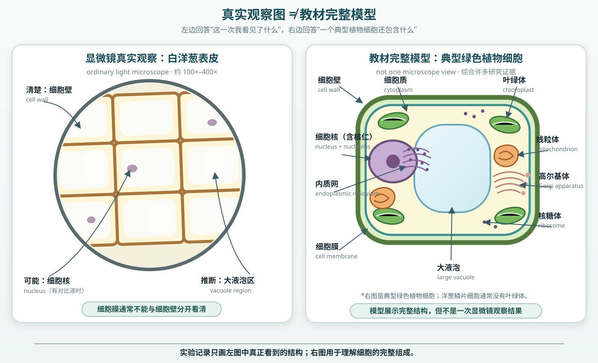

# 第 8 节：显微镜下的细胞——从直接证据到一颗发芽的种子

**Lesson 8: Cells Under the Microscope — From Direct Evidence to a Germinating Seed**

**授课状态**：已完成；实际授课第 8 节，共 105 分钟，含 5 分钟休息。孩子已有显微镜使用经验，本课不再安排练手任务，直接用真实样本完成观察、绘图、标注和一次质壁分离前后对照。装片与操作细节另见[显微镜装片与操作指南](显微镜装片与操作指南.html)。

## 家长课前准备（Materials for Parents）

以下均为生活中容易获得的材料。显微镜与专用玻片由教师准备。

| 材料 Material | 数量 | 要求与用途 |
|---|---:|---|
| 新鲜白洋葱 fresh white onion | 1 个 | 取白色肉质鳞片的透明内表皮，观察一般植物细胞结构 |
| 红／紫洋葱 red / purple onion | 1 个 | 取带紫红色的极薄表皮；利用天然色素观察质壁分离，不加染液 |
| 食盐 table salt | 约 10 g | 配制 5% 盐水；其中 5 g 加水至 100 mL，余量备用 |
| 一次性无菌棉签 sterile cotton swabs | 独立包装 2 支 | 采集孩子自己的口腔上皮；1 支备用 |
| 可发芽黄豆或芸豆 viable soybeans / beans | 约 30 粒 | 完整、未煮熟、未烘烤的生豆 |
| 透明塑料杯 clear plastic cups | 4 个 | 杯壁平直，约 250–500 mL |
| 厨房纸或厚纸巾 paper towels | 8–12 张 | 做杯壁发芽床；无香、无印花 |
| 浅盘 shallow tray | 1 个 | 承托四只杯，防止滴水 |
| 自来水 tap water | 约 450 mL | 制作清水装片、配制 5% 盐水、湿润纸巾和设置萌发对照 |
| 科学笔记本、HB 铅笔、橡皮、直尺 science notebook / pencil / eraser / ruler | 各 1 | 画显微镜真实视野、用直线引线标注；直尺课后继续测根长 |
| 黑色记号笔、标签纸 marker / labels | 各 1 | 给四只萌发杯编号 |
| 手机或平板 phone / tablet | 1 台 | 每天从固定方向拍照 |
| 无香纸巾、小密封袋 tissues / resealable bags | 各 1 份 | 吸引装片液、清理盐水或对比液，密封用过的棉签 |

### 教师课前确认并补齐

| 项目 | 数量 | 课前检查 |
|---|---:|---|
| 复式光学显微镜 compound light microscope | 1 台 | 10×目镜；4×、10×、40×物镜；灯光、粗细准焦正常 |
| 载玻片、盖玻片 slides / coverslips | 各 4–6 片 | 洁净、无缺口；另备 2 组 |
| 可选细胞对比液 optional contrast stain | 约 3 mL | 没有合适染液时用清水观察并调小光圈；若有真正 2% 药用碘酊，由成人按碘酊∶水＝1∶9预配成透明淡茶色。碘伏只作课前预试，不保证细胞核对比 |
| 滴管、尖头镊子、解剖针 droppers / tweezers / needle | 各 1–2 | 清水、5% 盐水和可选对比液的滴管分开贴签 |
| 镜头纸、白托盘、玻片回收盒 | 各 1 | 镜片清洁、承接液滴、回收玻片 |
| 护目镜、一次性手套 goggles / gloves | 师生各 1 套 | 染色和口腔样本阶段使用 |

**教师提前检查**：

1. 取同一袋豆 8–10 粒，用湿纸巾包裹，确认能吸水膨胀；正式萌发通常需要 2–5 天。
2. 按正式方案各做一张白洋葱与口腔预试片：若不用染液，确认调小光圈后仍能找到细胞；若用稀释碘酊，确认视野保持透明淡黄而非整片深褐。
3. 用红／紫洋葱表皮和 5% 盐水预试一次，确认 3–10 分钟内能看见有色细胞内容物缩离细胞壁。
4. 打开或打印[显微镜装片与操作指南](显微镜装片与操作指南.html)放在实验台旁。

## 一、课程定位与学习目标

- **对应学校单元**：Unit 4 Life Science
- **对应材料**：01 Characteristics Notes；02 Cell Structure Notes；03 Cell Supplementary Notes；02 Cell Vocabulary；05 Study Guide for Biology Test
- **核心问题**：肉眼看起来完全不同的洋葱、口腔和种子，能用哪些证据说明它们都由细胞构成并完成生命活动？
  *What evidence shows that onion tissue, cheek tissue, and a seed are made of cells and carry out life processes?*

本课只要求孩子掌握可观察、可解释的核心层，不追求背完学校课件中所有细胞器：

~~~text
显微镜直接证据
洋葱植物细胞 ↔ 口腔动物细胞
共同：细胞膜 cell membrane、细胞质 cytoplasm、细胞核 nucleus
主要差异：植物细胞还有细胞壁 cell wall；成熟植物细胞常有大液泡 vacuole
                 ↓
红洋葱＋5%盐水：水经细胞膜移出，细胞内容物缩离细胞壁
                 ↓
细胞是生命的基本结构和功能单位
                 ↓
种子吸水后发芽：把“细胞完成生命活动”变成一周连续证据
~~~

### 孩子应能

1. 按“低倍找—居中—逐级放大—高倍细调”独立完成一次找像。
2. 制作洋葱内表皮和自己的口腔上皮临时装片，按“先看—自己画—再命名—用引线标注”完成两页显微镜科学绘图。
3. 能在口腔图上标注**细胞膜（cell membrane）**，在洋葱图上标注**细胞壁（cell wall）**，并在确实看见时标注**细胞质（cytoplasm）**、**细胞核（nucleus）** 和**液泡（vacuole）**；看不清的结构不凭想象补画。
4. 用自己的两张图比较植物细胞与动物细胞，并借用学校 Notes 的英文表述说明主要细胞结构的功能；能区分“学校学过的细胞器”和“本节显微镜能分辨的细胞器”。
5. 在同一红洋葱视野中比较清水与 5% 盐水处理前后，指出细胞壁不变而有色细胞内容物缩离细胞壁，并用渗透作用解释水的移动。
6. 建立有重复组和干燥对照的豆类萌发实验，连续记录 5–7 天。

## 二、课堂内容（按时间顺序）

| 时间 | 教学活动 | 必须留下的证据 |
|---:|---|---|
| 0–20 | 实验 1：洋葱内表皮植物细胞 | 笔记第 1 页：一张最佳视野图与结构标注 |
| 20–40 | 实验 2：口腔上皮动物细胞 | 笔记第 2 页：一张最佳视野图与结构标注 |
| 40–50 | 用自己的两张图快速比较细胞，并判断哪些细胞器本节能看见 | 能在图上指出共同结构与主要差异；不把课本模型当成观察结果 |
| 50–65 | 实验 3：红洋葱细胞质壁分离 | 同一视野盐水前后图；指出细胞壁不变、细胞内容物缩离 |
| 65–70 | 休息；教师回收口腔玻片并清洁台面 | — |
| 70–98 | 实验 4：杯壁豆类萌发长期实验 | 湿润重复组、干燥对照、Day 0 数据 |
| 98–105 | 指图复述、细胞学说与课后任务 | 看图指结构、解释质壁分离、一句证据结论与每日记录任务 |

## 三、105 分钟课堂脚本

### 0–20 分钟：实验 1——洋葱内表皮植物细胞

**实验目的**：亲手制作洋葱内表皮装片，先把显微镜中真实看到的排列画进笔记，再根据自己的图指认细胞壁、细胞质和可见的细胞核。

**重要知识点**：**细胞（cell）** 是生物体结构和功能的基本单位。洋葱表皮最清楚的方格边界主要来自**细胞壁（cell wall）**；清水装片即可观察细胞壁。可选对比液只能帮助增加反差，不能代替结构证据。

**必要耗材与试剂（Consumables & Reagents）**

| 材料 | 数量 | 用途 |
|---|---:|---|
| 洋葱内表皮 | 约 5 mm × 5 mm | 植物组织标本 |
| 纯净水 | 1 小滴 | 展平表皮 |
| 清水或可选的淡碘对比液 | 1 小滴 | 清水即可完成；稀释碘酊只用于增加对比 |
| 吸水纸 | 1 小条 | 从盖玻片另一侧引流 |

**实验工具（Equipment & Tools）**

| 工具 | 数量 | 用途 |
|---|---:|---|
| 载玻片、盖玻片 | 各 1 | 制作湿片 |
| 镊子、解剖针、滴管 | 各 1 | 取样、展平、滴液 |
| 显微镜 | 1 台 | 40×→100×→条件合适时400× |
| 护目镜、手套 | 各 1 套 | 染色安全 |

~~~text
侧视：
        盖玻片
           ／  缓慢放下
          ／
---------●--------- 载玻片
      水滴＋薄表皮
~~~

1. 在载玻片中央滴一滴水，放入并展平一小片透明洋葱内表皮，以 45° 缓慢盖上盖玻片。
2. 先观察清水片；需要增加对比时，从盖玻片一侧滴入一滴教师预试过的淡碘对比液，另一侧用吸水纸引流。
3. 从 4×物镜开始找像、居中，再观察 100×和400×，选择边界最清楚的一档。清水片太亮时调小光圈；始终找不到时换教师预试片。
4. 在笔记中画一张最佳视野图：画 3–6 个真实相邻细胞，并记录总放大倍数。
5. 先让孩子指出真实看到的区域，再用不交叉引线标注**细胞壁（cell wall）**；能分辨时再标**细胞质（cytoplasm）**、**液泡（vacuole）**和**细胞核（nucleus）**。
6. 看不清的结构写“未分辨”，不凭模型补画；洋葱鳞片通常看不到叶绿体，细胞膜也常因紧贴细胞壁而无法单独看清。

**结果边界**：标本厚度、对比液深浅和光圈都会改变清晰度。圆而亮的气泡不是细胞。

#### 记录与板书（Record & Board Notes）

~~~text
笔记第 1 页：洋葱内表皮植物细胞
日期：____  装片液：清水 / 稀释碘酊 / 其他____  总放大：____×

只画一张最佳视野：3–6 个相邻细胞；铅笔单线；不涂色。
引线不交叉，末端真正碰到所指结构。
标注：细胞壁 cell wall / 细胞质 cytoplasm（能分辨时） /
      细胞核 nucleus（只在看见时） / 液泡 vacuole（能分辨时）

我直接看到：规则排列 / 清楚边界 / 较深区域 / 其他________
未能单独分辨：细胞膜 cell membrane / 其他________
~~~

### 20–40 分钟：实验 2——口腔上皮动物细胞

**实验目的**：观察自己的口腔上皮细胞，独立完成第二张观察图和结构标注，再与洋葱细胞在同一放大倍数下作公平比较。

**重要知识点**：动物细胞有**细胞膜（cell membrane）**，没有细胞壁，所以形状通常比洋葱表皮更不规则；植物与动物细胞都属于有细胞核的**真核细胞（eukaryotic cells）**。

**必要耗材与试剂（Consumables & Reagents）**

| 材料 | 数量 | 用途 |
|---|---:|---|
| 独立包装无菌棉签 | 1 支 | 只采集孩子本人 |
| 纯净水 | 1 小滴 | 分散样本 |
| 清水或可选的淡碘对比液 | 1 小滴 | 清水可观察轮廓；稀释碘酊可能增加细胞核对比 |
| 纸巾、密封袋 | 各 1 | 清理与密封弃置 |

**实验工具（Equipment & Tools）**

| 工具 | 数量 | 用途 |
|---|---:|---|
| 载玻片、盖玻片 | 各 1 | 制作湿片 |
| 滴管、镊子 | 各 1 | 滴液、放盖玻片 |
| 显微镜 | 1 台 | 与洋葱使用相同倍率 |
| 护目镜、手套、回收盒 | 各 1 | 生物样本与玻璃安全 |

~~~text
清水漱口 → 用棉头贴着口腔内壁滚擦10–15秒 → 小水滴中滚动8–10次
          → 盖片 → 盖玻片一侧滴染液、另一侧用吸水纸引流 → 低倍找像
~~~

1. 孩子用清水漱口，以无菌棉签的棉头贴着一侧口腔内壁轻轻滚擦 10–15 秒；不疼、不出血，不使用木杆一端。
2. 把棉头在载玻片的小水滴中轻压并滚动 8–10 次，随后立即密封弃置。
3. 以 45° 盖上盖玻片，先观察清水片；需要增加对比时，从盖玻片一侧滴入一滴教师预试过的淡碘对比液，另一侧用吸水纸引流。
4. 从 4×物镜开始按行扫描，再观察 100×和400×，选择细胞边界最清楚的一档。清水片太亮时调小光圈；始终找不到时换教师预试片。
5. 在笔记中画一张最佳视野图：画 2–4 个真实的分散细胞，并记录总放大倍数。
6. 用不交叉引线标注**细胞膜（cell membrane）**、**细胞质（cytoplasm）**和确实看到的**细胞核（nucleus）**；图下写“没有细胞壁 no cell wall”。

**预期结果**：细胞较分散，外形近圆或不规则多边形；通常能看见细胞膜围成的边界。使用有效的淡碘对比液时细胞核可能较深，清水片中看不到细胞核也保留真实记录。

#### 记录与板书（Record & Board Notes）

~~~text
笔记第 2 页：口腔上皮动物细胞
日期：____  装片液：清水 / 稀释碘酊 / 其他____  总放大：____×

只画一张最佳视野：2–4 个分散细胞；铅笔单线；不涂色。
引线不交叉，末端真正碰到所指结构。
标注：细胞膜 cell membrane / 细胞质 cytoplasm /
      细胞核 nucleus（只在看见时）
图下写：口腔上皮细胞没有细胞壁 no cell wall

我直接看到：分散 / 扁平 / 不规则边界 / 深色区域 / 其他________
~~~

### 40–50 分钟：用自己的观察图快速比较细胞

孩子把两页图左右摊开，不再另填一张重复的结构表。下列英文尽量沿用学校 Notes；孩子不需要抄两张功能表。

1. 盖住术语，教师说出“细胞壁、细胞膜、细胞质、细胞核”，孩子直接在自己的图上指出；看不清就回答“未直接分辨”。
2. 孩子根据自己的图写两句差异，不抄标准细胞模型。
3. 教师用下表快速配对五个结构及其功能，孩子不抄表。
4. 口头把细胞器分为“通常能看见／可能看见或推断／普通课堂显微镜看不见”。
5. 读三句学校版 Cell Theory，并在两张图上圈出支持第一句的证据。

#### 记录与板书（Record & Board Notes）

~~~text
洋葱细胞：排列较________，有清楚的________；细胞质贴近________内侧。
口腔细胞：排列较________，外形较________，没有________。
~~~

### 核心知识点：细胞结构、细胞器与细胞学说（必须保留）

以下内容沿用学校 Notes 的英文表述，属于本节必须保留的知识区，不随实验步骤精简而删除。

**发音说明**：以下统一采用英式 IPA。`ˈ` 后面的音节读主重音，`ˌ` 后面的音节读次重音；音节之间的点只帮助断开读。**cell /sel/** 与 *sell* 同音，复数 **cells /selz/**，不要读成字母 C 的音 /siː/。

#### 1. 细胞结构、细胞器、功能与本节可见性

| 结构 Structure（英式 IPA） | 类别与出现位置 | 功能或学校描述 Function / Description | 本节普通光学显微镜下 |
|---|---|---|---|
| 细胞膜 cell membrane /sel ˈmem.breɪn/ | 重要细胞结构；植物、动物细胞都有 | 控制物质进出细胞。 *Controls what goes in and out of the cell.* | 口腔细胞通常能看见它围成的边界；洋葱细胞中常因紧贴细胞壁而无法单独分辨 |
| 细胞质 cytoplasm /ˈsaɪ.tə.plæz.əm/ | 细胞组成部分；植物、动物细胞都有 | 由细胞质基质和细胞器组成；细胞质基质是化学反应发生处。 *Cytoplasm consists of cytosol and cell organelles. Cytosol is also where chemical reactions take place.* | 可能看见或根据细胞内部区域推断，透明样本中不一定清楚 |
| 细胞核 nucleus /ˈnjuː.kli.əs/ | **细胞器**；洋葱和口腔细胞都有 | 控制细胞内的化学反应和过程，并含有遗传物质。 *The nucleus controls chemical reactions and processes in the cell. The nucleus also contains the cell's genetic material (DNA molecules).* | 使用有效的淡碘对比液时较容易看见；清水片中可能无法分辨 |
| 细胞壁 cell wall /sel wɔːl/ | 重要细胞结构；植物细胞有，动物细胞没有 | 给植物细胞支撑和稳定，并帮助维持形状。 *Gives plant cell support and stability. Cell wall contains cellulose: helps to keep the shape of the plant cell.* | 洋葱细胞中通常是最清楚的方格边界 |
| 液泡 vacuole /ˈvæk.ju.əʊl/ | **细胞器**；植物细胞中很重要，部分动物细胞也有较小液泡 | 储存液体、食物、废物和其他物质；充盈的液泡帮助植物保持挺立。 *Stores liquid, food, waste and other materials. Full vacuoles help the plant stay rigid.* | 洋葱细胞中央清亮区可能看见或推断，液泡膜通常不清楚 |
| 线粒体 mitochondria /ˌmaɪ.təˈkɒn.dri.ə/ | **细胞器**；植物、动物细胞都有 | 细胞呼吸在这里发生，释放细胞可利用的能量（ATP）。 *Cellular respiration occurs here to release energy (ATP) for the cell to use.* | 看不清 |
| 叶绿体 chloroplast /ˈklɒr.ə.plɑːst/ | **细胞器**；绿色植物细胞中有，洋葱鳞片通常没有 | 含有叶绿素，使光合作用能够发生。 *Contains chlorophyll – enables photosynthesis to take place.* | 洋葱鳞片通常没有；若另用薄的绿色水草叶可看见 |
| 内质网 endoplasmic reticulum /ˌen.dəʊˌplæz.mɪk rəˈtɪk.jə.ləm/（ER /ˌiːˈɑː/） | **细胞器**；植物、动物细胞都有 | 运输物质；粗面内质网制造蛋白质，光面内质网制造脂质。 *Transports materials. Rough ER makes proteins; smooth ER makes lipids.* | 看不清 |
| 核糖体 ribosome /ˈraɪ.bə.səʊm/ | **细胞器**；植物、动物细胞都有 | 构建蛋白质。 *Builds proteins.* | 看不清 |
| 高尔基体 Golgi apparatus /ˈɡɒl.dʒi ˌæp.əˈreɪ.təs/ | **细胞器**；植物、动物细胞都有 | 储存、修改并包装蛋白质。 *Stores, modifies and packages proteins.* | 看不清 |
| 溶酶体 lysosome /ˈlaɪ.sə.səʊm/ | **细胞器**；属于学校 Notes 的细胞器范围 | 含有能够分解废物的消化酶。 *Contains digestive enzymes that break down waste.* | 看不清 |
| 核仁 nucleolus /njuːˈkliː.ə.ləs/ | 细胞核内部的结构 | 学校 Notes 在此只给出位置描述：核仁位于细胞核内。 *Nucleolus is inside the nucleus.* | 若细胞核内恰好出现更深的小点，可记作“可能的核仁”，但不作为本课必找目标 |
| 纤毛／鞭毛 cilium /ˈsɪl.i.əm/；flagellum /fləˈdʒel.əm/ | 某些细胞具有的运动结构 | 帮助单细胞生物移动。 *Help single-celled organisms move.* | 需要合适的活体微生物样本；洋葱和口腔装片中不要求观察 |

> **注—细胞器 organelle /ˌɔː.ɡəˈnel/**：*Organelle = “little organ”. Each organelle has a special job that helps the cell function.*（细胞器像“小器官”，每个细胞器都有帮助细胞运作的特定工作）；细胞膜、细胞壁和细胞质不属于 organelles。

#### 2. 真实观察图与教材完整模型对比

> **画图规则**：实验记录只画左图所代表的“这一次真正看见的结构”，看不清就写“未分辨”；右图是综合许多研究证据形成的教材模型，用于理解细胞的完整组成，不能照着它补画观察结果。右图代表典型绿色植物细胞，洋葱鳞片细胞通常没有叶绿体。

#### 3. Cell Theory /ˈsel ˌθɪə.ri/ 细胞学说

~~~text
Cell Theory 细胞学说（沿用学校 Notes）
1. All living organisms are made of cells.
   所有生物都由细胞构成。
2. Cells are the basic unit of living things.
   细胞是生物的基本单位。
3. All cells come from other cells.
   所有细胞都来自其他细胞。
~~~

### 50–65 分钟：实验 3——红洋葱细胞质壁分离

**实验目的**：在同一组红洋葱细胞中先观察清水状态，再从盖玻片边缘引入 5% 盐水，直接看见细胞壁轮廓保持不变，而有色细胞内容物缩离细胞壁。

**重要知识点**：盐水比细胞内部溶液更浓，水通过选择性透过的**细胞膜（cell membrane）**由细胞内向外移动，这种水的移动叫**渗透作用（osmosis）**。液泡和细胞质随之缩小，细胞膜与刚性的细胞壁分离，称为**质壁分离（plasmolysis）**。

本实验使用红／紫洋葱的天然色素，不加亚甲蓝、碘酊、碘伏或食用色素。

**必要耗材与试剂（Consumables & Reagents）**

| 材料 | 数量 | 用途 |
|---|---:|---|
| 红／紫洋葱有色表皮 | 约 3–5 mm 见方 | 天然紫红色帮助看见有色细胞内容物 |
| 清水 | 2–3 小滴 | 建立盐水前状态；必要时冲回盐水 |
| 5% 食盐水 | 约 2 mL | 使水由细胞内移出 |
| 吸水纸 | 2–3 小条 | 把清水、盐水依次引过盖玻片下方 |

**5% 盐水配法**：称取食盐 5 g，加水至总体积 100 mL并充分溶解；没有秤时可用约 1 平茶匙食盐加入 100 mL 水作家庭近似。贴“5% 盐水，不可饮用”标签。

**实验工具（Equipment & Tools）**

| 工具 | 数量 | 用途 |
|---|---:|---|
| 载玻片、盖玻片 | 各 1 | 制作活体清水装片 |
| 镊子、滴管 | 各 1 | 撕取表皮、分别滴清水和盐水 |
| 显微镜、手机 | 各 1 | 找同一视野并拍摄处理前后 |
| 纸巾、白托盘 | 各 1 | 引流并承接盐水 |

~~~text
盖玻片左侧：滴 1–2 滴 5% 盐水
                 ↓
───────────盖玻片───────────
      红洋葱表皮＋原来的清水
──────────────────────────
                               右侧：纸巾轻触并吸引 →
~~~

1. 从红／紫洋葱有色肉质鳞片上撕一小片极薄表皮，在清水滴中展平并盖片；不加任何染液。
2. 在 100×下找到并居中一组 3–6 个颜色清楚的细胞，拍照或画 2–3 个相邻细胞，留下“盐水前”记录。
3. 保持盖玻片不动，在一侧滴 1–2 滴 5% 盐水，另一侧用纸巾轻触，让盐水穿过样本。
4. 先在 100×下连续观察 3–7 分钟；看见透明间隙后再用 400×细看。若视野移动，按照片中的细胞排列重新定位。
5. 画同一组细胞的“盐水后”状态，表示不变的细胞壁和缩小的有色内容物，并用箭头标出水向外移动。

**预期结果**：方形或长方形细胞壁轮廓基本不变；紫红色的液泡和周围细胞质向内收缩，原生质体边缘与细胞壁之间出现透明间隙。不同细胞开始变化的时间可能不同。

**失败边界**：

- 只有白洋葱时也可尝试，但细胞内容物透明，必须调小光圈，现象较难判断。
- 10 分钟仍无明显变化：再引流一次新鲜 5% 盐水；不要立刻使用饱和盐水。
- 整片组织同时漂移或折叠，不算质壁分离证据，应重新固定表皮或换片。
- 可选复原：若时间充足，从一侧连续滴清水、另一侧吸走盐水 2–3 次，等待 5–10 分钟，观察部分细胞是否重新贴近细胞壁，记作**质壁分离复原（deplasmolysis）**。

#### 记录与板书（Record & Board Notes）

~~~text
笔记第 3 页：红洋葱质壁分离 plasmolysis
总放大：____×   盐水浓度：5%

同一组细胞：
清水中：细胞壁形状________；紫色区域________________。
盐水后：细胞壁形状________；紫色区域________________；
        细胞壁与有色内容物之间出现________________。

标注：cell wall / protoplast boundary / vacuole /
      transparent gap / water moves out
说明：只看见整体边界时，不单独声称直接看清 cell membrane。

The salt solution causes water to leave the cell by osmosis.
The cell membrane and cell contents pull away from the cell wall.
盐水使水通过渗透作用离开细胞，细胞膜和细胞内容物缩离细胞壁。
~~~

### 65–70 分钟：休息与显微镜、生物样本收尾

孩子洗手、休息；教师密封弃置棉签，把口腔玻片和洋葱玻片放入带盖回收盒，擦净载物台。显微镜转回 4×物镜并关闭光源。

### 70–98 分钟：实验 4——杯壁豆类萌发长期实验

**实验目的**：建立有重复组和干燥对照的长期观察，检验水是否是豆类种子开始萌发的必要条件之一。

**重要知识点**：**萌发（germination）** 是种子胚恢复生长的过程；通常需要水、适宜温度和氧气。先出现的白色结构是**胚根（radicle）**，之后可见**胚芽（plumule）**。水是自变量，是否萌发与根长是因变量。

**必要耗材与试剂（Consumables & Reagents）**

| 材料 | 数量 | 用途 |
|---|---:|---|
| 可发芽豆类 | 24 粒 | 每杯 6 粒，降低个别坏种影响 |
| 厨房纸 | 每杯 2–3 张 | 贴住杯壁形成发芽床 |
| 水 | 约 150 mL | 湿润 A1、A2；B1、B2保持干燥 |
| 标签纸 | 4 张 | 标记组别、日期 |

**实验工具（Equipment & Tools）**

| 工具 | 数量 | 用途 |
|---|---:|---|
| 透明杯 | 4 个 | 两个湿润重复组、两个干燥重复组 |
| 浅盘 | 1 个 | 防漏水 |
| 量杯或同一小杯 | 1 个 | 湿润组加入相同水量 |
| 直尺、手机 | 各 1 | 根长与固定角度照片 |

~~~text
A1 湿润        A2 湿润        B1 干燥        B2 干燥
│纸 豆 豆│     │纸 豆 豆│     │纸 豆 豆│     │纸 豆 豆│
│豆     豆│     │豆     豆│     │豆     豆│     │豆     豆│
└───────┘     └───────┘     └───────┘     └───────┘
  重复组1        重复组2        对照重复1      对照重复2
~~~

1. 四杯贴签：A1 湿润、A2 湿润、B1 干燥、B2 干燥。
2. 每杯沿内壁放入同样厚度纸巾，把 6 粒豆分散夹在纸巾与杯壁之间。
3. A1、A2各加入同体积水，使纸巾完全湿润但杯底不积深水；B1、B2不加水。
4. 四杯放在同一浅盘、同一室温和散射光位置。不要密封，避免缺氧和霉菌。
5. 记录 Day 0：每杯豆粒数、已裂开数、最长根长，并从固定方向拍照。
6. 孩子写预测，并解释为什么两只湿润杯可能不同、为什么仍需要重复组。
7. 课后每天同一时间检查。湿润组将干未干时，每杯补相同少量水；干燥组始终不加水。

**公平比较**：豆的来源、数量、杯型、纸巾、温度、光照和观察时间相同；只改变是否加水。

#### 记录与板书（Record & Board Notes）

| 天数 | A1 萌发数/6 | A2 萌发数/6 | B1 萌发数/6 | B2 萌发数/6 | 湿润组最长根/mm | 照片编号 |
|---:|---:|---:|---:|---:|---:|---|
| 0 |  |  |  |  |  |  |
| 1 |  |  |  |  |  |  |
| 2 |  |  |  |  |  |  |
| 3 |  |  |  |  |  |  |
| 4 |  |  |  |  |  |  |
| 5–7 |  |  |  |  |  |  |

~~~text
自变量 independent variable：是否加水
因变量 dependent variables：萌发数、胚根长度
重复 replicates：A1/A2 与 B1/B2
水是萌发的必要条件之一，但不是唯一条件。
~~~

### 98–105 分钟：指图复述，再把四类证据连起来

孩子先合上术语表，教师随机说出“细胞壁、细胞质、细胞核、细胞膜”中的一个；孩子必须在自己的观察图上指到相应位置，或准确说明“这张图中未直接分辨”。然后完成三句离堂记录：

~~~text
显微镜证据：洋葱和口腔组织都由重复的________构成；
两类细胞共同有________________________________。

质壁分离证据：加入 5% 盐水后，________形状基本不变，
而________________缩离它，说明水通过细胞膜向________移动。

长期实验预测：如果水是萌发的必要条件，那么到第____天，
湿润组会________________，干燥组会________________。
~~~

**参考落点**：显微镜让孩子直接看到两种组织的细胞单位；质壁分离把细胞膜控制物质移动、细胞壁维持形状变成动态证据；豆类实验再把“细胞会生长、分裂并完成生命活动”转化成几天内可追踪的证据。下一节先读取豆类数据，再拆开浸泡种子并研究植物分类、运输水和形成果实。

## 四、安全、误差与现场备用

- 口腔棉签只采集孩子本人；口腔溃疡、出血或不愿采样时，改用教师预制口腔装片。
- 稀释碘酊仅由成人配制和滴加，远离火源，不入口、不接触眼睛和衣物；若没有合适对比液就用清水，不临时混用食用色素或不明染液。
- 5% 盐水贴签并与清水滴管分开，不饮用；质壁分离装片不加入任何染液。
- 玻片有裂口立即停用；盖玻片只用镊子取放。
- 40×物镜下只用细准焦；胶带装片不使用40×物镜。
- 豆杯出现明显霉斑或异味时戴手套密封丢弃，不凑近闻、不食用。
- 洋葱片看不清：优先换更薄表皮、减少褶皱并调整光圈或对比液，而不是直接增加倍率。
- 口腔片细胞太少：换到低倍按行扫描；太密则重新做薄涂片。
- 豆不萌发：检查是否为熟豆、温度是否过低、纸巾是否过湿缺氧；保留失败记录并换新批次。

## 五、关键术语与英式音标（Key Vocabulary & British IPA）

**读音约定**：`ˈ` 表示其后的音节是主重音，`ˌ` 表示次重音，音节间的点只帮助断读。**cell /sel/** 与 *sell* 同音；**cells /selz/** 的词尾读 /z/。

### 细胞、细胞结构与细胞器

- 细胞：cell /sel/；复数 cells /selz/
- 细胞学说：cell theory /ˈsel ˌθɪə.ri/
- 植物细胞／动物细胞：plant cell /plɑːnt sel/；animal cell /ˈæn.ɪ.məl sel/
- 真核细胞：eukaryotic cell /ˌjuː.kær.iˈɒt.ɪk sel/
- 细胞膜：cell membrane /sel ˈmem.breɪn/
- 细胞质／细胞质基质：cytoplasm /ˈsaɪ.tə.plæz.əm/；cytosol /ˈsaɪ.tə.sɒl/
- 细胞核／核仁：nucleus /ˈnjuː.kli.əs/；nucleolus /njuːˈkliː.ə.ləs/
- 细胞壁：cell wall /sel wɔːl/
- 液泡：vacuole /ˈvæk.ju.əʊl/
- 线粒体：mitochondrion /ˌmaɪ.təˈkɒn.dri.ən/（单数）；mitochondria /ˌmaɪ.təˈkɒn.dri.ə/（复数）
- 叶绿体：chloroplast /ˈklɒr.ə.plɑːst/
- 内质网：endoplasmic reticulum /ˌen.dəʊˌplæz.mɪk rəˈtɪk.jə.ləm/；ER /ˌiːˈɑː/
- 核糖体：ribosome /ˈraɪ.bə.səʊm/
- 高尔基体：Golgi apparatus /ˈɡɒl.dʒi ˌæp.əˈreɪ.təs/
- 溶酶体：lysosome /ˈlaɪ.sə.səʊm/
- 纤毛／鞭毛：cilium /ˈsɪl.i.əm/；flagellum /fləˈdʒel.əm/
- 细胞器：organelle /ˌɔː.ɡəˈnel/

### 本节功能句和实验中出现的生物学词汇

- 生物体：organism /ˈɔː.ɡən.ɪ.zəm/；复数 organisms /ˈɔː.ɡən.ɪ.zəmz/
- 上皮：epithelium /ˌep.ɪˈθiː.li.əm/
- 遗传物质：genetic material /dʒəˈnet.ɪk məˈtɪə.ri.əl/
- 脱氧核糖核酸：DNA /ˌdiː.enˈeɪ/
- 分子：molecule /ˈmɒl.ɪ.kjuːl/
- 纤维素：cellulose /ˈsel.jə.ləʊs/
- 细胞呼吸：cellular respiration /ˈsel.jə.lə ˌres.pəˈreɪ.ʃən/
- 三磷酸腺苷：ATP /ˌeɪ.tiːˈpiː/
- 叶绿素：chlorophyll /ˈklɒr.ə.fɪl/
- 光合作用：photosynthesis /ˌfəʊ.təʊˈsɪn.θə.sɪs/
- 蛋白质／脂质：protein /ˈprəʊ.tiːn/；lipid /ˈlɪp.ɪd/
- 消化酶：digestive enzyme /daɪˈdʒes.tɪv ˈen.zaɪm/
- 渗透作用：osmosis /ɒzˈməʊ.sɪs/
- 质壁分离／质壁分离复原：plasmolysis /plæzˈmɒl.ə.sɪs/；deplasmolysis /diːˌplæzˈmɒl.ə.sɪs/
- 原生质体：protoplast /ˈprəʊ.tə.plɑːst/
- 高浓度溶液：hypertonic solution /ˌhaɪ.pəˈtɒn.ɪk səˈluː.ʃən/
- 萌发：germination /ˌdʒɜː.mɪˈneɪ.ʃən/
- 胚根／胚芽：radicle /ˈræd.ɪ.kəl/；plumule /ˈpluː.mjuːl/
- 自变量／因变量：independent variable /ˌɪn.dɪˈpen.dənt ˈveə.ri.ə.bəl/；dependent variable /dɪˈpen.dənt ˈveə.ri.ə.bəl/
- 重复组：replicates /ˈrep.lɪ.kəts/

### 显微镜观察常用词

- 显微镜：microscope /ˈmaɪ.krə.skəʊp/
- 标本：specimen /ˈspes.ɪ.mən/
- 载玻片／盖玻片：slide /slaɪd/；coverslip /ˈkʌv.ə.slɪp/
- 物镜：objective lens /əbˈdʒek.tɪv lenz/
- 放大倍数：magnification /ˌmæɡ.nɪ.fɪˈkeɪ.ʃən/
- 染液／染色：stain /steɪn/

## 六、教师备课来源

- [学校 01 Characteristics of Living Things Notes](../School/02%20Class%20Materials/Unit%204%20Life%20Science/01%20Notes/01%20Characteristics%20of%20Living%20Things%20Notes.pdf)
- [学校 02 Cell Structure Notes](../School/02%20Class%20Materials/Unit%204%20Life%20Science/01%20Notes/02%20Cell%20Structure%20Notes.pdf)
- [学校 03 Cell Supplementary Notes](../School/02%20Class%20Materials/Unit%204%20Life%20Science/01%20Notes/03%20Cell%20Supplementary%20Notes.pdf)
- [学校 02 Cell Vocabulary](../School/02%20Class%20Materials/Unit%204%20Life%20Science/03%20Homework/02%20Cell%20Vocabulary.pdf)
- [学校 05 Study Guide for Biology Test](../School/02%20Class%20Materials/Unit%204%20Life%20Science/03%20Homework/05%20Study%20Guide%20for%20Biology%20Test.pdf)
- [STEM Learning: Plasmolysis in Plant Cells](https://www.stem.org.uk/system/files/elibrary-resources/2018/07/STEM_SECONDARY_09_v6_HIRES.pdf)
- [Science World: Bean Garden](https://www.scienceworld.ca/resource/bean-garden/)
- [Penn State Extension: Seed and Seedling Biology](https://extension.psu.edu/seed-and-seedling-biology)
