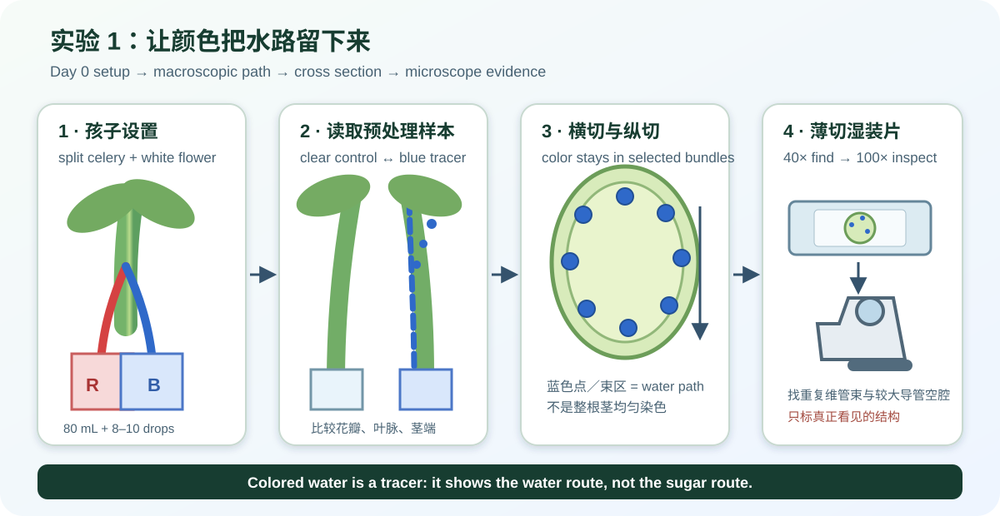
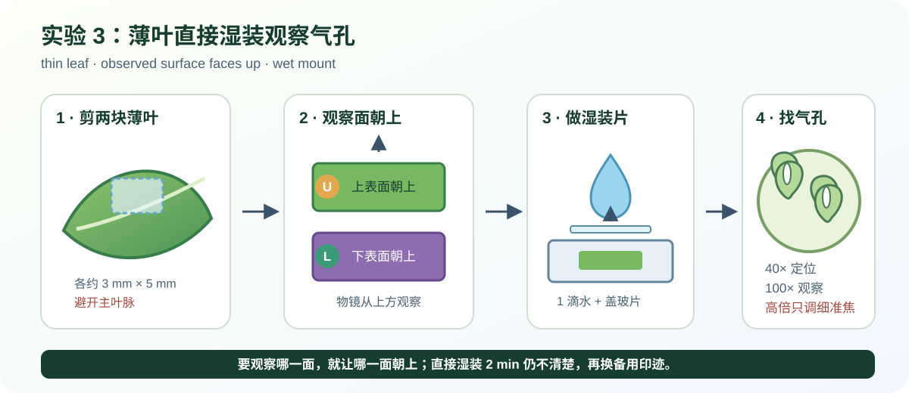

# 第 9 节：植物怎样运输水和糖？

**Lesson 9: How Do Plants Transport Water and Sugar?**

**授课状态**：已完成；实际授课第 9 节，共 60 分钟。

## 课前材料与准备

### 材料清单

| 材料 | 数量 | 用途 |
|---|---:|---|
| 新鲜带叶西芹 | 2 根 | 1 根提前染色；1 根课堂染色 |
| 白色康乃馨 | 1 枝 | 课堂染色并课后观察 |
| 吊竹梅等薄而透光的叶片 | 2 片 | 上、下表面直接湿装；1 片备用 |
| 健康带叶盆栽 | 1 盆 | 蒸腾套袋实验 |
| 蓝色液体食用色素 | 1 小瓶 | 显示水的运输路径 |
| 透明杯 | 3 个 | 提前染色西芹、课堂西芹、白花 |
| 清水 | 约 500 mL | 配制蓝色水和湿装片 |
| 透明速干指甲油、透明胶带（备选） | 各 1 份 | 直接湿装失败时制作叶表印迹 |
| 透明保鲜袋 | 2 个 | 有叶袋与空袋对照 |
| 橡皮筋或扎带 | 2 个 | 扎紧袋口 |
| 厨房纸、标签、记号笔 | 各 1 份 | 防洒、标记样本 |
| 显微镜 | 1 台 | 40×、100×观察 |
| 载玻片、盖玻片 | 各 4 张 | 制作装片 |
| 滴管、镊子、塑料刀 | 各 1 | 取水、移片、粗切 |
| 锋利小刀、白托盘、护目镜 | 各 1 | 修剪和制作薄切片 |
| 手机、笔记本、铅笔 | 各 1 | 拍照、记录、绘图 |

### 今晚完成

1. 将一根西芹底端切去约 `1 cm`，立即放入 `100 mL 水 + 10–15 滴蓝色色素`。
2. 标记“提前染色西芹”和开始时间，静置 `6–12 h`。
3. 给盆栽浇水，保持叶面干燥。
4. 白花和另一根西芹保持原样，课堂再染。

### 上课前 30–60 分钟完成

1. 横切提前染色西芹的底端，确认横切面出现蓝点；保留其余部分课堂使用。
2. 从吊竹梅等薄叶上剪一块约 `3 mm × 5 mm` 的小片，下表面朝上做湿装，确认 `100×` 能找到气孔。另留一片备用叶；若有透明指甲油，在该叶上、下表面各预制一处印迹并完全晾干。
3. 检查显微镜、玻片、刀具和手机。
4. 将两个保鲜袋擦干。

### 课前约 2 分钟：回应绿豆问题

绿豆幼苗死亡可能有几个原因：

- **水太多 / Too much water**：纸巾一直泡在水里，根缺少氧气，可能腐烂。
- **水太少 / Too little water**：纸巾变干，根无法吸收足够的水。
- **光照或温度不合适 / Unsuitable light or temperature**：光太弱、阳光暴晒或温度变化太大，都会影响幼苗生长。
- **空间和养分不足 / Not enough space or nutrients**：纸巾适合观察萌发，但不适合长期生长；种子里的养分逐渐用完后，幼苗还需要更多空间和矿物质。

绿豆死亡通常不是一个原因造成的。没有连续记录，我们只能找出可能的原因，不能确定唯一死因。  
*A seedling may die for more than one reason. Without regular observations, we cannot know the exact cause.*

随后进入本课问题：植物怎样把水送到叶片，又怎样把糖送到其他部位？

## 一、课程定位与主线

- **对应学校内容**：Unit 4 Life Science — 06 Vascular and Non-Vascular Plants
- **课时**：60 分钟
- **驱动问题**：水和矿物质怎样到达叶片？叶片制造的糖怎样送到其他部位？

~~~text
有色水进入西芹和白花
        ↓
颜色沿茎内特定路径上升
        ↓
木质部 xylem 运输水和矿物质
        ↓
叶片通过气孔 stomata 散失水蒸气
        ↓
蒸腾 transpiration 帮助水向上运输
        ↓
韧皮部 phloem 把糖送到植物其他部位
~~~

### 学习目标

1. 区分<strong>维管植物（vascular plants）</strong>和<strong>非维管植物（non-vascular plants）</strong>：前者有 xylem 和 phloem，后者没有。
2. 说明<strong>木质部（xylem）</strong>运输水和矿物质，<strong>韧皮部（phloem）</strong>运输糖。
3. 用西芹染色、横切和显微观察说明水沿特定结构向上运输。
4. 用薄叶湿装和套袋实验解释<strong>蒸腾作用（transpiration）</strong>。

## 二、一眼速查

| 时间 | 课堂内容 | 课后继续 |
|---:|---|---|
| 0–6 | 启动西芹和白花染色 | 2–4 h、睡前、次日拍照 |
| 6–10 | 启动有叶袋与空袋对照 | 1–4 h 拍最终照片并拆袋 |
| 10–30 | 观察提前染色西芹：横切、纵切、显微镜 | 课堂完成 |
| 30–43 | 薄叶湿装与气孔观察 | 课堂完成 |
| 43–50 | 连接 xylem、phloem、stomata、transpiration | 课堂完成 |
| 50–56 | 第一次读取套袋结果 | 课后完成最终读取 |
| 56–60 | 总结并安排课后观察 | 按记录表回传照片 |

## 三、60 分钟课堂时间线

### 0–6 分钟：实验 1A——启动西芹和白花染色

今天我们要找出：水怎样到达叶和花？水从叶片离开后，怎样帮助更多水向上移动？ Today we will find out: How does water reach the leaves and flowers? How does water leaving the leaves help pull more water up?

**重要知识点**：食用色素随水移动，是本实验的<strong>示踪物（tracer）</strong>。它显示水经过的路线，不是植物产生的新颜色。

**必要耗材与试剂（Consumables & Reagents）**

| 名称 | 规格 | 用量 |
|---|---|---:|
| 新鲜带叶西芹 | 底端新切 | 1 根 |
| 白色康乃馨 | 花茎新切 | 1 枝 |
| 清水 | 室温 | `160 mL` |
| 蓝色液体食用色素 | 水溶性 | 20–30 滴 |
| 标签、厨房纸 | — | 各 1 份 |

**实验工具（Equipment & Tools）**

| 工具 | 数量 | 用途 |
|---|---:|---|
| 透明杯 | 2 个 | 分装蓝色水 |
| 量杯、滴管 | 各 1 | 量水、加色素 |
| 小刀、托盘 | 各 1 | 修剪茎端 |
| 手机 | 1 台 | 拍起始照片 |

1. 两个杯分别标记 `celery`、`flower`。
2. 每杯加入 `80 mL` 水和 `10–15 滴`蓝色色素。
3. 将西芹和花茎底端各切去约 `1 cm`，立即插入对应杯中。
4. 记录开始时间、液面高度，拍摄 `0 h` 照片。
5. 放在明亮散射光处继续吸色。

先拍照，稍后再比较颜色的变化。 Take a photo now. Later, compare how the color changes.

#### 记录与板书（Record & Board Notes）

| 样本 | 开始时间 | 起始颜色 | 预测最先变色的位置 |
|---|---|---|---|
| 西芹 |  |  |  |
| 白花 |  |  |  |

### 6–10 分钟：实验 2A——启动蒸腾套袋

**重要知识点**：水蒸气看不见，遇到袋壁后凝结成可见水滴。若有叶袋比空袋水滴更多，就支持叶片发生了<strong>蒸腾作用（transpiration）</strong>。

**必要耗材与试剂（Consumables & Reagents）**

| 名称 | 规格 | 用量 |
|---|---|---:|
| 健康带叶盆栽 | 土壤湿润、叶面干燥 | 1 盆 |
| 透明保鲜袋 | 内壁干燥、同规格 | 2 个 |
| 橡皮筋或扎带、标签 | — | 各 2 个 |

**实验工具（Equipment & Tools）**

| 工具 | 数量 | 用途 |
|---|---:|---|
| 手机 | 1 台 | 拍摄对照照片 |

1. 一只袋套住一簇叶片并扎紧，标记 `leaf`。
2. 另一只空袋装入少量同房间空气并扎紧，标记 `empty`。
3. 两袋并排放置，拍摄 `0 min` 照片。
4. 放在明亮处，不在烈日下暴晒。

#### 记录与板书（Record & Board Notes）

| 时间 | 有叶袋 | 空袋 |
|---|---|---|
| 0 min |  |  |
| 40–50 min | 稍后填写 | 稍后填写 |
| 1–4 h | 课后填写 | 课后填写 |

### 10–30 分钟：实验 1B——观察西芹中的水路

**重要知识点**：<strong>木质部（xylem）</strong>是由多种细胞组成的运输组织；<strong>木质部导管（xylem vessel）</strong>是其中一种输水结构。蓝色区域定位木质部，较大的空腔可能是导管腔。

**必要耗材与试剂（Consumables & Reagents）**

| 名称 | 规格 | 用量 |
|---|---|---:|
| 提前染色西芹 | 已吸色 `6–12 h` | 1 根 |
| 新鲜西芹小片 | 未染色 | 1 片 |
| 清水 | 湿装片 | 1–2 滴 |
| 厨房纸 | — | 1 份 |

**实验工具（Equipment & Tools）**

| 工具 | 数量 | 用途 |
|---|---:|---|
| 塑料刀、镊子 | 各 1 | 粗切、分离纤维束 |
| 锋利小刀、托盘 | 各 1 | 纵切、制作薄切片 |
| 载玻片、盖玻片、滴管 | 各 1 | 制作湿装片 |
| 显微镜、手机 | 各 1 | 40×、100×观察和拍照 |

#### 10–18 分钟：横切与纵切

1. 比较新鲜西芹和提前染色西芹。
2. 横切 `3–5 mm` 厚的西芹片，寻找蓝点或蓝色束区。
3. 纵切约 `3 cm`，寻找向上的蓝色线条。
4. 用镊子分离一束蓝色纤维。

#### 18–28 分钟：显微观察

1. 切取薄横片，放入载玻片中央的一滴清水。
2. 盖上盖玻片。
3. 用 `40×` 找到重复分布的维管束。
4. 用 `100×` 观察蓝色区域和较大的导管轮廓。
5. 拍摄最佳视野，画出 2–4 个维管束的位置。

#### 28–30 分钟：记录与板书（Record & Board Notes）

| 观察位置 | 看见的颜色与形状 | 结论 |
|---|---|---|
| 粗横切 |  |  |
| 纵切 |  |  |
| 40× |  |  |
| 100× |  |  |

蓝色出现在木质部。这说明水沿木质部向上运输。 The blue color appears in the xylem. This shows that water moves up through the xylem.

~~~text
xylem 木质部：运输 water + minerals
蓝色沿特定束区上升，显示水的运输路径。
~~~

### 30–43 分钟：实验 3——观察叶片气孔

我们来找气孔，看看水蒸气从哪里离开叶片。 Let’s find the stomata and see where water vapor leaves the leaf.

**重要知识点**：<strong>气孔（stoma；复数 stomata）</strong>由一对保卫细胞围成。二氧化碳经气孔进入，水蒸气主要经气孔离开；这种失水过程叫蒸腾。

**必要耗材与试剂（Consumables & Reagents）**

| 名称 | 规格或浓度 | 每次用量 | 来源或备注 |
|---|---|---:|---|
| 吊竹梅等薄而透光的叶片 | 新鲜、无明显叶毛 | 1 片 | 避开主叶脉取样 |
| 清水 | 湿装片 | 2 滴 | 上、下表面各 1 滴 |
| 标签 | `U`、`L` | 2 张 | 区分上、下表面 |

**实验工具（Equipment & Tools）**

| 工具 | 数量 | 规格 | 用途 |
|---|---:|---|---|
| 载玻片、盖玻片 | 各 2 张 | 清洁、完整 | 制作上、下表面湿装片 |
| 镊子、剪刀、滴管 | 各 1 | 小型 | 剪取、移动叶片和加水 |
| 显微镜、手机 | 各 1 | `40×`、`100×` | 观察和拍照 |

1. 将两张玻片标为 `U` 和 `L`。
2. 避开主叶脉，剪两块约 `3 mm × 5 mm` 的薄叶小片。
3. `U` 片上表面朝上，`L` 片下表面朝上；各加 1 滴水并盖上盖玻片。
4. 用 `40×` 找到朝上表面的表皮纹理，再用 `100×` 寻找气孔。
5. 两个表面各观察两个视野，计数并拍照。

**备选方案：透明指甲油印迹**

直接湿装 `2 min` 仍看不清表皮时，改用课前完全晾干的印迹。在叶片上、下表面各涂约 `1 cm × 1 cm` 透明指甲油；干后用透明胶带揭起薄膜，直接贴在 `U`、`L` 载玻片上。不加水，不加盖玻片；课堂不等待指甲油干燥。

**预期现象**：下表面的气孔通常较多。

气孔是叶片上的小开口。水蒸气主要从这里离开。 Stomata are small openings in a leaf. Most water vapor leaves through them.

#### 记录与板书（Record & Board Notes）

| 叶面 | 视野 1 | 视野 2 | 平均数 |
|---|---:|---:|---:|
| U · upper |  |  |  |
| L · lower |  |  |  |

~~~text
stomata 气孔：CO₂ enters；water vapor exits
transpiration 蒸腾：水从叶片散失为水蒸气
~~~

### 43–50 分钟：连接学校 Notes

木质部向上运输水。水蒸气从气孔离开叶片，这叫蒸腾作用。它能帮助更多水向上移动。 Xylem transports water up. Water vapor leaves the leaf through the stomata. This is transpiration. It helps pull more water up.

1. **Vascular plants transport materials using special structures.**
2. **Non-vascular plants do not contain xylem and phloem.**
3. **Xylem transports water and minerals from the roots to the stalks and leaves.**
4. **Phloem transports sugars made in photosynthesis to the rest of the plant.**
5. **Evaporating water from the leaves (transpiration) makes a difference in pressure**, helping pull water up the xylem.

**关键易错点**：有色水显示木质部的水路；韧皮部运输糖来自学校 Notes，本实验不直接追踪糖。

#### 记录与板书（Record & Board Notes）

| 结构或过程 | 运输什么 | 方向 |
|---|---|---|
| xylem |  |  |
| phloem |  |  |
| stomata / transpiration |  |  |

### 50–56 分钟：实验 2B——第一次读取蒸腾结果

1. 比较有叶袋和空袋。
2. 记录雾气、水滴数量和位置。
3. 拍摄两袋同框照片。
4. 保留装置，课后继续观察。

#### 记录与板书（Record & Board Notes）

~~~text
有叶袋：________________
空袋：________________
证据：有叶袋出现更多水滴，支持叶片释放水蒸气。
~~~

### 56–60 分钟：总结与课后观察

木质部向上运输水。韧皮部把糖从叶片运到植物的其他部分。 Xylem transports water up. Phloem transports sugar from the leaves to the rest of the plant.

完成三句：

1. 木质部运输________________。
2. 韧皮部运输________________。
3. 蒸腾作用是________________。

#### 课后观察与回传

| 样本 | 观察时间 | 拍什么 | 记录什么 |
|---|---|---|---|
| 课堂染色西芹 | 2–4 h、次日 | 叶脉、茎外观、次日横切面 | 蓝色最先出现的位置和路径 |
| 白色康乃馨 | 2–4 h、睡前、次日 | 同角度拍花瓣 | 第一处颜色、颜色范围 |
| 有叶袋与空袋 | 1–4 h | 两袋同框 | 哪一袋水滴更多 |
| 套袋实验结束 | 最迟 4 h | 最终照片 | 拆袋时间 |

## 四、关键提醒

- 仅启用备选方案时使用透明指甲油；在通风处操作，远离火源，完全干燥后再揭取。
- 锋利小刀在托盘内使用；戴护目镜，手指离开刀路。
- 食用色素和实验后的植物不入口。
- 载玻片或盖玻片破损时立即更换。
- 套袋植物不在烈日下暴晒，最迟 4 小时拆袋。

## 五、核心词汇（Key Vocabulary）

| 中文 | English | 含义 |
|---|---|---|
| 维管植物 | vascular plant | 含木质部和韧皮部 |
| 非维管植物 | non-vascular plant | 不含木质部和韧皮部 |
| 维管组织 | vascular tissue | 植物体内的运输组织 |
| 木质部 | xylem | 运输水和矿物质 |
| 韧皮部 | phloem | 运输糖 |
| 气孔 | stoma / stomata | 叶表进行气体交换的小孔 |
| 蒸腾作用 | transpiration | 水从叶片散失为水蒸气 |

## 六、备课来源

- [学校 05 Plant and Animal Characteristics Notes](../School/02%20Class%20Materials/Unit%204%20Life%20Science/01%20Notes/05%20Plant%20and%20Animal%20Characteristics%20Notes.pdf)
- [学校 06 Vascular and Non Vascular Plants](../School/02%20Class%20Materials/Unit%204%20Life%20Science/01%20Notes/06%20Vascular%20and%20Non%20Vascular%20Plants.pdf)
- [学校 07 Gymnosperms and Angiosperms](../School/02%20Class%20Materials/Unit%204%20Life%20Science/01%20Notes/07%20Gymnosperms%20and%20Angiosperms.pdf)
- [University of Georgia: Moving Fluid in Plants](https://extension.uga.edu/content/dam/extension/programs-and-services/science-behind-our-food/documents/movingfluidplantscelery.pdf)
- [NASA/JPL: Transpiration Demo](https://www.jpl.nasa.gov/edu/resources/lesson-plan/transpiration-demo/)
