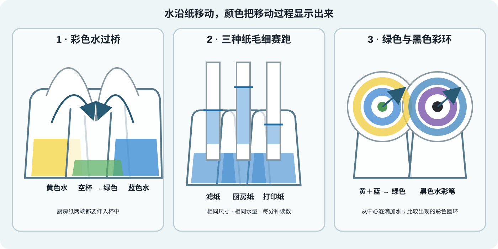
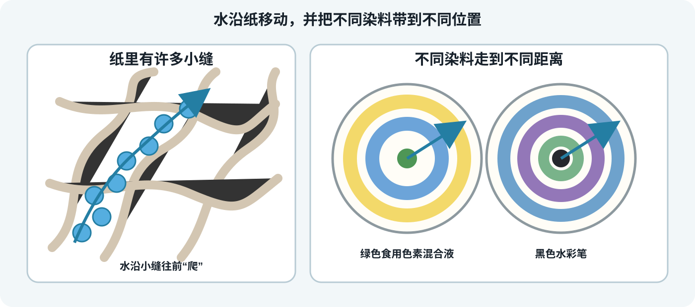

# 第 10 节：会爬的水与墨水指纹

**授课状态**：已完成；实际授课第 10 节。

**建议用时**：三个主实验约 40–45 分钟；任选一个备用实验后约 45–55 分钟。彩色水过桥先启动，在做另外两个实验时继续变化；若颜色移动较慢，可课后继续观察。

## 家长课前准备（Materials for Parents）

| 材料 | 数量 | 要求 |
|---|---:|---|
| 黑色水彩笔 | 1 支 | 普通水性毡尖笔；不用油性、酒精或丙烯马克笔 |
| 黄色、蓝色食用色素 | 各 1 瓶 | 液体色素 |
| 白色咖啡滤纸或实验滤纸 | 6 张 | 无蜡、无印花 |
| 白色厨房纸 | 3 张 | 无印花 |
| 白色打印纸 | 1 张 | 普通复印纸 |
| 透明杯 | 6 个 | 3 个做过桥，3 个做毛细赛跑；赛跑后复用 2 个 |
| 清水 | 约 1 L | 三个实验共用 |
| 长尾夹 | 3 个 | 固定毛细赛跑纸条 |
| 竹筷或木棒 | 1 根 | 悬挂毛细赛跑纸条 |
| 铅笔、直尺、剪刀 | 各 1 | 画线、测量、裁纸 |
| 量杯、手机计时器 | 各 1 | 量水、计时 |
| 滴管、干净小瓶盖 | 各 1 | 滴水、混合食用色素 |
| 牙签 | 8 根 | 2 根点混合色素；5 根做牙签星星；1 根撑开透明片 |
| 可选：透明硬塑料片 | 2 张 | 备用实验；大小相同，至少约 8 × 10 cm |
| 深托盘、吸水布 | 各 1 | 防洒与清理 |
| 浅盘或大碗 | 1 个 | 牙签星星和水上纸花；可与透明片实验复用 |

无需准备实验室试剂。

## 教师课前准备（约 10–15 分钟）

1. 把滤纸、厨房纸和打印纸各裁一条，均为 2 × 15 cm。
2. 再剪 2 张直径约 10–12 cm 的圆形滤纸。
3. 预试圆形彩环：
   - 一张使用黑色水彩笔；
   - 一张使用黄色、蓝色食用色素的混合液。
4. 黑色水彩笔若完全不分色，可改用同一盒彩笔中的深紫、棕或深绿色，不需要另买其他品牌。
5. 预试彩色水过桥。若杯沿过高导致 30 分钟内仍不滴水，换矮杯或将左右杯垫高 1–2 cm。
6. 所有湿实验放在托盘中；先不加水。

## 先知道两件事

纸里有许多肉眼看不见的小缝。水会沿着这些小缝往上或往前“爬”，这叫**毛细作用（capillary action）**。

水彩笔墨水和食用色素都含有**染料（dyes）**。水移动时会带着染料一起走；不同染料走得远近不同，就可能分开成几种颜色。

三个实验按下面的顺序进行。实验 1 的等待时间与实验 2、3 重叠，不需要停下来等。

### 实验 1：彩色水过桥（搭建约 7 分钟；等待 20–40 分钟）

**要点**：厨房纸里的小缝让彩色水自己“爬”过杯沿；黄色水和蓝色水在中杯混成绿色。

**必要耗材与试剂（Consumables & Reagents）**

| 名称 | 用量 | 备注 |
|---|---:|---|
| 清水 | 200 mL | 左、右杯各 100 mL |
| 黄色食用色素 | 2 滴 | 左杯 |
| 蓝色食用色素 | 2 滴 | 右杯 |
| 厨房纸 | 2 条，约 4 × 25 cm | 纵向折成约 2 cm 宽 |

**实验工具（Equipment & Tools）**

| 工具 | 数量 | 用途 |
|---|---:|---|
| 透明杯 | 3 个 | 左杯、空杯、右杯 |
| 量杯 | 1 个 | 量水 |
| 深托盘 | 1 个 | 防洒 |
| 手机计时器 | 1 个 | 记录等待时间 |

1. 三杯排成一列，杯间距约 2 cm。
2. 左杯加入 100 mL 水和 2 滴黄色色素；右杯加入 100 mL 水和 2 滴蓝色色素；中杯保持空杯。
3. 两条厨房纸按相同方法折叠。
4. 第一条连接左杯和中杯，第二条连接右杯和中杯。纸条在外杯中浸入约 3 cm，在中杯中接近杯底。
5. 启动计时器，记录开始水位和纸条状态，然后继续做实验 2。

**等待与现象**

- 约 1–3 分钟：纸条开始湿润，颜色前沿向上移动。
- 约 10–20 分钟：彩色水通常越过杯沿并向中杯移动。
- 约 20–40 分钟：中杯开始积水，黄色和蓝色逐渐混成绿色。
- 实际速度受纸张、杯高、纸条长度和室内湿度影响。

#### 记录与板书（Record & Board Notes）

| 等待时间 | 左杯水位 | 右杯水位 | 中杯液体量与颜色 | 纸条变化 |
|---:|---|---|---|---|
| 0 分钟 |  |  |  |  |
| 约 20 分钟 |  |  |  |  |
| 约 40 分钟 |  |  |  |  |

### 实验 2：三种纸的毛细赛跑（约 10 分钟；连续观察 5 分钟）

**要点**：不同纸里的小缝和纤维不一样，所以水爬得有快有慢。

**必要耗材与试剂（Consumables & Reagents）**

| 名称 | 用量 | 备注 |
|---|---:|---|
| 蓝色水 | 90 mL | 三杯各 30 mL；同一批溶液 |
| 滤纸 | 1 条，2 × 15 cm | 纸条 1 |
| 厨房纸 | 1 条，2 × 15 cm | 纸条 2 |
| 打印纸 | 1 条，2 × 15 cm | 纸条 3 |

**实验工具（Equipment & Tools）**

| 工具 | 数量 | 用途 |
|---|---:|---|
| 透明杯 | 3 个 | 盛相同体积蓝色水 |
| 长尾夹 | 3 个 | 固定纸条 |
| 竹筷或木棒 | 1 根 | 悬挂纸条 |
| 直尺、计时器 | 各 1 | 量高度、统一读数 |
| 深托盘 | 1 个 | 防洒 |

1. 三条纸距底端 1 cm 处各画一条铅笔线。
2. 三杯各加入 30 mL 同一批蓝色水。
3. 三条纸垂直悬挂，铅笔线刚好与水面重合；纸条不要贴杯壁。
4. 同时开始计时。
5. 第 1、2、3、4、5 分钟，量出彩色前沿距铅笔线的高度。
6. 第 5 分钟同时取出三条纸。
7. 倒掉蓝色水，擦干其中两个杯子，留给实验 3 使用。

**等待与现象**

彩色前沿通常在 1 分钟内开始移动。整个观察等待 5 分钟，不需要额外延长。哪种纸最快由实际数据决定。

#### 记录与板书（Record & Board Notes）

| 纸张 | 1 分钟/cm | 2 分钟/cm | 3 分钟/cm | 4 分钟/cm | 5 分钟/cm |
|---|---:|---:|---:|---:|---:|
| 滤纸 |  |  |  |  |  |
| 厨房纸 |  |  |  |  |  |
| 打印纸 |  |  |  |  |  |

结论：本次实验中，彩色前沿在________纸中移动最快，在________纸中移动最慢。

### 实验 3：绿色和黑色里藏着哪些颜色（约 10–15 分钟；等待 3–8 分钟）

**要点**：做**纸色谱（paper chromatography）**时，水从中心向外爬并带着染料走；不同染料走得远近不同，就会形成彩色圆环。

**必要耗材与试剂（Consumables & Reagents）**

| 名称 | 用量 | 备注 |
|---|---:|---|
| 圆形滤纸 | 2 张，直径约 10–12 cm | 标记“绿色”“黑色” |
| 黄色食用色素 | 1 滴 | 与蓝色混合 |
| 蓝色食用色素 | 1 滴 | 与黄色混合 |
| 黑色水彩笔 | 1 支 | 普通水性毡尖笔 |
| 清水 | 约 12–16 滴 | 每张滤纸使用相同滴数 |

**实验工具（Equipment & Tools）**

| 工具 | 数量 | 用途 |
|---|---:|---|
| 擦干的透明杯 | 2 个 | 从实验 2 复用，支撑滤纸 |
| 干净小瓶盖 | 1 个 | 混合黄色、蓝色色素 |
| 牙签 | 2 根 | 混色和点样 |
| 滴管 | 1 个 | 从中心逐滴加水 |
| 铅笔 | 1 支 | 在滤纸边缘标记样本 |
| 深托盘 | 1 个 | 防洒和防染色 |

1. 两张圆形滤纸边缘分别标记“绿色”“黑色”。
2. 小瓶盖中加入 1 滴黄色和 1 滴蓝色色素，轻轻混匀，得到绿色。
3. 用牙签蘸混合绿色，在第一张滤纸中心点出约 5–7 mm 的小圆点；晾干后再点一次。
4. 用黑色水彩笔在第二张滤纸中心画一个约 5–7 mm 的实心圆点。
5. 两张滤纸分别平放在两个空杯杯口，中心位置悬空。
6. 每张先在圆点中心加 1 滴清水。等水被吸收后再加下一滴。
7. 两张使用相同滴数，约 6–8 滴；不要一次倒成水洼。
8. 观察颜色从中心向外移动，比较出现的颜色和圆环顺序。

**等待与现象**

- 约 1–2 分钟：彩色区域开始向外扩大。
- 约 3–8 分钟：通常能看到颜色分开或出现深浅不同的圆环。
- 绿色混合液可能重新显出偏黄、偏蓝的区域。
- 黑色水彩笔能否分出多种颜色取决于墨水配方；若只出现黑灰色，也按真实结果记录。

#### 记录与板书（Record & Board Notes）

| 样本 | 原来颜色 | 分开后看见的颜色 | 从内到外的颜色顺序 | 是否明显分开 |
|---|---|---|---|---|
| 黄色＋蓝色混合 | 绿色 |  |  |  |
| 黑色水彩笔 | 黑色 |  |  |  |

结论：绿色混合液________________________________；黑色水彩笔________________________________。

## 备用实验（任选一项）

三个主实验提前完成时，只选一项。

### 备用 1：牙签自动变星星（约 5 分钟；等待 1–3 分钟）

**材料**：5 根干燥木牙签、小盘、滴管、清水。

1. 每根牙签从中间折弯，但不要完全折断，保持 V 形相连。
2. 将 5 个折口朝向中心摆成一圈，让相邻牙签的尖端靠近。
3. 在中心滴约 5 滴水，确保水接触所有折口。
4. 等待 1–3 分钟，观察牙签自己慢慢张开成星形。

**解释**：水沿木纤维里的小缝进入牙签，这是**毛细作用（capillary action）**。折口吸水后膨胀、逐渐伸直，于是把星形撑开。

### 备用 2：水上纸花（约 5–10 分钟；等待 1–3 分钟）

**材料**：普通打印纸、铅笔、剪刀、浅盘、清水。

1. 画一朵有 6–8 片花瓣的花并剪下。
2. 将花瓣逐片向花心折叠，盖住中间。
3. 折面朝上，把纸花轻轻放在水面。
4. 等待 1–3 分钟，观察花瓣自动打开。

**解释**：水沿纸里的小缝进入花瓣。纸纤维吸水后膨胀，折痕慢慢松开，花就“开放”了。

### 备用 3：V 形透明片水墙（约 10 分钟；等待 1–3 分钟）

**材料**：两张平整透明硬塑料片、1 根牙签、2 个长尾夹、浅盘、清水、白纸。旧光学彩色片只有足够硬、能保持平整时才使用。

1. 两张硬片叠齐，一侧直接夹紧。
2. 另一侧夹入牙签再固定，形成一边窄、一边宽的 V 形缝。
3. 将底边浸入约 5 mm 深的水中，后面垫白纸。
4. 等待 1–3 分钟，比较窄端和宽端的水位。

**解释**：水在窄缝里爬得更高，在宽缝里爬得较低，这是**毛细作用（capillary action）**。

### 汇总与收尾（约 5 分钟）

1. 回看彩色水过桥，补记约 20 或 40 分钟的现象。
2. 将毛细赛跑纸条按 5 分钟高度排序。
3. 将两张彩环滤纸平放晾干，标注日期并保留。
4. 写两句：
   - 水能沿纸上升，因为________________________________。
   - 绿色或黑色能分出不同颜色，因为______________________。
5. 有色水倒入水槽并用清水冲洗。
6. 擦干桌面和地面，洗手。

## 故障与安全

| 情况 | 处理 |
|---|---|
| 过桥纸湿了但中杯没有水 | 将纸条中杯端压低；外杯垫高 1–2 cm；继续等待 |
| 毛细赛跑纸碰到杯壁 | 标记该次异常，换备用纸重新测 |
| 彩环中心形成水洼 | 每次只加 1 滴，等吸收后再加 |
| 绿色没有明显分出黄、蓝 | 课前调整黄、蓝比例；仍不分开就记录真实结果 |
| 黑色水彩笔没有分色 | 改试同一盒彩笔中的深紫、棕或深绿；不用另买品牌 |
| 颜色扩散太淡 | 原色点晾干后再补点一次 |

- 三个主实验和备用实验都在托盘中进行，手机放在托盘外。
- 折牙签时远离眼睛；断裂碎片立即收好。
- 剪纸时将纸平放在桌面。
- 透明片实验优先使用边缘光滑的硬塑料片；不把玻璃片交给孩子操作。
- 食用色素和水彩笔墨水不入口、不画皮肤。
- 不使用油性笔、酒精马克笔、丙烯马克笔或其他溶剂。
- 泼洒后立即擦干，避免地面湿滑和家具染色。

## 科学边界

- 彩色前沿是液体移动的可见线索，不一定与真正的水前沿完全重合。
- 不同纸张同时改变多项结构。本实验比较的是纸张整体表现，不能只根据排名反推出单一孔径规律。
- 黄色、蓝色色素不一定完全分开；黑色水彩笔也不一定含有多种能被清水分开的染料。课前预试决定是否使用。

## 备课依据

- [正课后备选实验课程：C8 纸色谱](../arxiv/%E8%AF%BE%E7%A8%8B%E8%A7%84%E5%88%92%E9%98%B6%E6%AE%B5/01-%E6%9A%91%E6%9C%9F%E4%B8%8E%E5%A4%87%E9%80%89%E8%A7%84%E5%88%92/%E6%AD%A3%E8%AF%BE%E5%90%8E%E5%A4%87%E9%80%89%E5%AE%9E%E9%AA%8C%E8%AF%BE%E7%A8%8B.md)
- [旧课程方案：家庭微量实验中的纸色谱](../arxiv/旧课程方案/化学与生物实验栏目-详细方案.md)
- [Science World：Toothpick Stars](https://www.scienceworld.ca/resource/toothpick-stars/)
- [NUSTEM：Floating Flowers](https://nustem.uk/activity/floating-flowers/)
- [美国化学会：Mystery Markers](https://www.acs.org/education/activities/mystery-markers.html)
- [英国皇家化学会：Kitchen roll chromatography](https://edu.rsc.org/primary-science/kitchen-roll-chromatography/4012057.article)
- DK《101 个趣味科学实验》的短装置、强现象组织方式；项目中未保存本书相关毛细实验页面，因此不引用具体实验编号。
