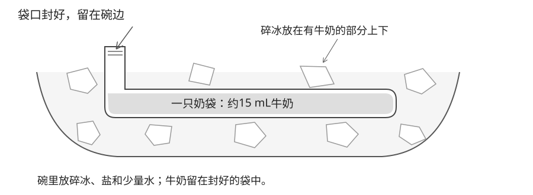
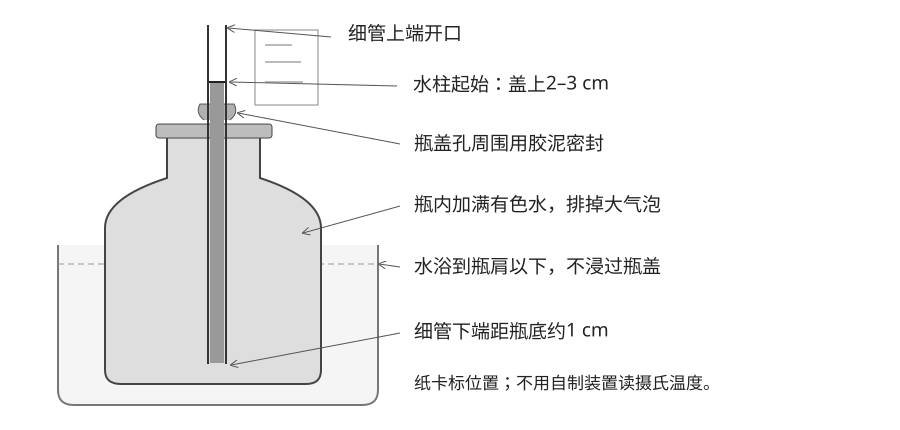

# 第13节：温度与水的变化

**实验材料与试剂**

| 名称 | 本课使用规格与用量 | 备量 |
|---|---|---:|
| 原味纯牛奶 | 先冷藏；取1汤匙，约15 mL | 15 mL |
| 冰 | 几块敲碎，够夹住奶袋中有牛奶的部分；另留1块钓冰 | 按小碗取用 |
| 食盐 | 奶冰先用1平茶匙，约5 g；钓冰另留一小撮 | 约1–2茶匙 |
| 食用色素 | 2滴加入约150 mL室温水 | 1小瓶 |
| 清水 | 奶冰用约1茶匙凉水（5 mL）；另备温度计和钓冰用水 | 共约1 L |

**需要准备或核对的工具**

| 工具 | 关键要求 | 数量 |
|---|---|---:|
| 奶袋 | 食品用、封口不漏水，能把牛奶铺平 | 1只 |
| 小碗或小饭盒 | 刚好放下奶袋和碎冰即可 | 1个 |
| 玻璃瓶 | 带盖、硬质透明；50–100 mL | 1只 |
| 透明细管 | 内径约3–4 mm，长约20 cm | 1根 |
| 密封胶泥 | 不干型，能封严瓶盖孔 | 1小块 |
| 参考温度计 | 用现有的，能测凉水、室温水和温水 | 1支 |
| 棉线或毛线 | 能吸水 | 约40 cm |

1. **少量纯牛奶＋冰盐浴 → 出现奶冰薄片或冰粒。** 
   牛奶把热传给较冷的冰盐浴，其中部分水凝固（freezing）。

2. **满水瓶＋细管，放进温水和凉水 → 水柱升降。** 
   水受热后占的空间变大，沿细管上升；冷却后回落，可以显示冷热变化。

3. **湿棉线＋冰块＋少量盐 → 棉线提起冰块。** 
   接触处的冰先局部熔化，再重新凝固；新形成的冰把线固定住。

4. **湿纸包住温度计感温端＋扇风 → 读数下降。** 
   水蒸发（evaporation）时吸热，可以使周围降温。

### 课前准备

1. 冷藏牛奶。冰临开始时取出，留1块完整冰给钓冰，其余敲成小块。
2. 教师给温度计瓶盖打孔、处理毛刺，试好细管与胶泥的密封；课堂重新组装。
3. 备有色水，以及温水、凉水各约250 mL。

### 0–6分钟：把牛奶放进冰盐小碗

**预期现象**：牛奶逐渐变冷，开始出现奶冰薄片或冰粒。

<strong>原理：</strong>冰加盐后可以变得更冷。冰融化时吸热，把牛奶的热带走；牛奶中的部分水便凝固成冰。

1. 把**1汤匙冷牛奶（约15 mL）**倒入一个密封袋，挤出空气、封好，把牛奶铺成薄薄一层。
2. 用碎冰**铺满小碗底一层**，撒半茶匙盐，加**约1茶匙凉水（5 mL）**，拌几下，让碎冰湿润。
3. 放上奶袋，再用碎冰盖住有牛奶的部分，撒上余下的半茶匙盐。**上下两层盐合计约1平茶匙（5 g）**；袋口留在碗边。
4. 每隔几分钟翻一下奶袋，用勺子拨一拨周围的冰，让冰和融水贴住袋子。
5. 看到奶冰薄片或冰粒，就取出来观察，不等全部冻硬。

**水量看状态**：碗里以碎冰为主，冰缝里有少量盐水即可；不用加到冰块漂起来。

**加快的方法**：牛奶先冷藏、量少、铺薄；选小碗，让有限的冰贴紧有牛奶的位置。奶冰等待时做下面的温度计，过程中顺手查看、翻面。

### 6–26分钟：制作满水瓶温度计

**预期现象**：瓶子放入温水后，细管里的水柱上升；移入凉水后回落。稳定后，可对照正式温度计标出参考温度。

<strong>原理：</strong>在本次温度范围内，水变暖后占据的空间稍大，叫热膨胀（thermal expansion）。瓶内已经装满，增加的体积使水沿细管上升。细管很窄，小小的变化也能看清楚。

1. 把细管穿过瓶盖，让下端距瓶底约1 cm。用胶泥封严孔周围，管口保持畅通。
2. 向瓶中加入室温有色水，加到瓶口。拧紧瓶盖，尽量排掉瓶肩处的大气泡。
3. 从细管上端补水，让水柱停在盖上约2–3 cm。贴好纸卡，标记起始位置。
4. 将整套装置放入水浴，**瓶内的水不倒掉、不更换**。正式温度计放在外部水浴、靠近瓶身，感温端不碰瓶壁或盆底。
5. 先标室温点，再移入35–40℃温水。轻轻搅匀水浴，等水柱和参考读数基本稳定，标出位置及当时的温度。标温度需要比只看升降等得更久。
6. 移入15–20℃凉水，观察回落。先只标实际测到的点，不把间距直接等分为每1℃。

若水柱不动，先检查漏水、堵管和大气泡。到本段结束仍未稳定，只记升降方向，不写温度数值。测试结束后擦净正式温度计，放在室温处，留给蒸发实验。

#### 记录与板书

| 水浴 | 水柱变化 | 稳定后的参考温度／℃ |
|---|---|---:|
| 室温 | 起始位置 | ____ |
| 温水 | __________ | ____／未稳定 |
| 凉水 | __________ | — |

细管水柱能显示冷热变化；实际温度要用参考温度计标定。

### 26–34分钟：棉线钓冰块

**预期现象**：湿线与冰接触处重新冻结，轻提棉线时能带起冰块。

<strong>原理：</strong>少量盐使接触处的冰先局部熔化。局部温度和盐分分布继续变化，条件合适时水又结成冰，把线冻住。熔化吸热，重新凝固放热；固定棉线的是冰。

1. 在小杯中加入**约50 mL冷水和预留的1块冰**，让冰浮起来。
2. 打湿一段20 cm棉线，一端平搭在冰面，接触长度约2–3 cm。
3. 接触处撒一小撮盐。静置约3分钟，再提线。
4. 慢慢提线，让冰离开水面约2 cm，再放回杯中。
5. 没有固定时，调整接触位置，再等约2分钟；不另开多杯对照。

#### 记录与板书

| 等待时间 | 是否提起冰块 |
|---|---|
| 第一次____分钟 | __________ |
| 调整后____分钟（如有） | __________ |

重新凝固的冰，可以把棉线固定住。

### 34–40分钟：观察奶冰

奶冰提前出现时，先观察，再接着做其他实验。

1. 取出奶袋，擦净袋外盐水，再打开。
2. 用小勺取出奶冰薄片或冰粒，观察牛奶从液态到部分凝固的变化；可以品尝。
3. 若仍是液体，先把牛奶重新铺薄、贴紧剩余碎冰。继续做后面的短实验，结束前再看一次。

#### 记录与板书

| 开始时 | 后来看到什么 |
|---|---|
| 液态牛奶 | 奶冰薄片／冰粒／仍是液体 |

外面的冰融化吸热；牛奶中的部分水凝固放热。

### 40–45分钟：湿纸扇风降温

**预期现象**：湿纸包住感温端后，扇风使读数下降；干燥时变化较小。

<strong>原理：</strong>水变成水蒸气需要吸热。湿纸里的水蒸发时，从纸和感温端带走热，所以读数下降。扇风带走附近的水蒸气，让水继续蒸发。

1. 确认正式温度计已回到室温，读数稳定。给干燥感温端扇风约1分钟，读数。
2. 用室温水打湿小纸条，包住感温端，湿润但不滴水。
3. 用近似距离和速度扇风约2分钟，再读数。

#### 记录与板书

| 条件 | 扇风后温度／℃ |
|---|---:|
| 干燥感温端 | ______ |
| 湿纸包住感温端 | ______ |

水蒸发吸热，可以使周围降温。

### 45–50分钟：记录与收拾

1. 最后看一次奶冰，指出哪一部分冰在熔化、哪一部分水在凝固。
2. 保存温度计纸卡，收回细管和玻璃瓶，倒掉冰盐水。
3. 清洗食品器具，擦干桌面、洗手。全部观察在本节内结束。

### 教师参考

- **DK原法**：少量奶料装在杯里，杯外围上冰和盐，约一小时内间歇搅拌；没有给出固定的冰奶重量比。本稿只用纯牛奶，把杯子换成薄袋、减小奶量，以便更快看到部分结冰。
- **本稿用量**：一汤匙牛奶、几块冰和一茶匙盐，是便于起步的小量改法。备课时尚无实物预试记录，实际课堂现象待补。冰块大小不同，不能仅凭块数保证冻结时间。课堂以看到奶冰为目标，不测起始温度或要求达到某个负温数值。
- **用时**：正文按约50分钟安排，另外10分钟留给制作和奶冰观察的实际进度；不留课后等待任务。
- **温度计**：采用PBS的满水瓶版本；正式温度计放在外部水浴，等待接近平衡后再标参考温度。

**参考**：[DK实验32](https://fliphtml5.com/qjtrd/bblt/101_Great_Science_Experiments/) · [PBS满水瓶温度计](https://www.pbs.org/wgbh/nova/teachers/activities/3501_zero_01.html) · [PBS标定方法](https://www.pbs.org/wgbh/nova/teachers/activities/3501_zero_02.html) · [棉线钓冰块](https://www.sciencebuddies.org/stem-activities/lift-ice-cubes) · [ACS蒸发测温](https://highschoolenergy.acs.org/how-can-energy-change/energy-of-evaporation.html)
